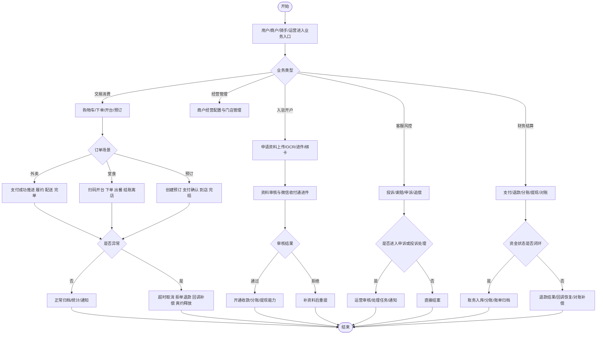

# 项目业务流程全景梳理

日期：2026-03-27

## 1. 文档定位

这份文档不是接口清单，而是“项目中已经落地、能从代码和测试中确认的业务流程地图”。

优先使用以下事实来源：

1. `locallife/integration/takeout_journey_integration_test.go` 中的端到端旅程与异常链路。
2. `locallife/worker/processor.go` 中已注册的异步任务。
3. `locallife/docs/PAYMENT_FLOW_CHANGE_SUMMARY_2026-03-27.md` 中已落地的支付整改说明。
4. `weapp/docs/merchant/MERCHANT_BACKEND_ALIGNMENT_MATRIX_2026-03-26.md` 中商户侧能力矩阵。
5. 相关 API/logic/store 文件中可确认的领域能力。

## 2. 覆盖边界

本次梳理覆盖：

- 用户交易主链路：外卖、堂食、包间预订。
- 交易资金链路：支付、退款、分账、提现、对账、补偿。
- 履约链路：商户接单、厨房出餐、骑手抢单配送、用户确认。
- 售后风控链路：索赔、申诉、追偿、投诉。
- 商户/运营商/骑手入驻与开户链路：资料上传、OCR、进件、绑卡。
- 商户经营后台链路：商品、库存、桌台、营销、设备、财务。
- 共用能力链路：媒体上传、OCR、通知推送。

本次不展开：

- 单纯配置型 CRUD 的逐接口穷举。
- 登录鉴权、RBAC 中间件的内部实现细节。
- 前端页面视觉结构与组件组织。

## 3. 总体业务域

项目当前可以归纳为 8 条业务主线：

1. 外卖交易与配送履约。
2. 堂食开台、下单、结账。
3. 包间预订与到店履约。
4. 支付、退款、分账、结算与补偿。
5. 索赔、申诉、追偿与核销。
6. 商户经营后台。
7. 商户/运营商/骑手入驻开户。
8. 投诉、媒体、OCR、通知等共用支撑链路。

## 4. 用户交易主链路

### 4.1 外卖链路

已确认落地的主流程：

1. 用户加购购物车并试算。
2. 用户提交外卖订单。
3. 创建支付单或合单支付。
4. 支付成功后由同步事务或异步任务推进订单状态。
5. 商户接单。
6. 商户标记出餐完成。
7. 骑手看到待配送池与推荐订单。
8. 骑手抢单。
9. 骑手开始取餐、确认取餐、开始配送、确认送达。
10. 用户确认完成，订单归档。

已确认落地的异常/补偿流程：

- 支付单超时后自动关闭支付单并取消待支付订单。
- 订单创建后长时间未支付，触发 `order:payment_timeout` 自动取消。
- 商户拒单后触发退款链路。
- 支付回调丢失时，由 payment recovery scheduler 扫描已支付未推进支付单并补入队。
- 合单支付支持创建、查询与关闭。

代码证据：

- `locallife/integration/takeout_journey_integration_test.go` 中 B0、B1、B4、B5、B6、B7 旅程。
- `locallife/worker/task_order_timeout.go`
- `locallife/worker/task_combined_payment_timeout.go`
- `locallife/worker/payment_recovery_scheduler.go`

### 4.2 堂食链路

已确认落地的主流程：

1. 用户扫码进入桌台入口，拿到商户与桌台信息。
2. 开台或基于场景创建堂食会话。
3. 用户在堂食会话下单。
4. 创建支付单。
5. 支付回调入队，worker 推进支付成功后置处理。
6. 厨房制作与出餐。
7. 商户结账离店，堂食闭环。

已确认落地的异常/约束流程：

- 桌台码错误时拒绝开台。
- 商户无有效预订时不能代客开台。
- 非商户用户尝试结账会被拒绝。
- 堂食订单支付超时后自动取消。
- 代码审查范围已覆盖换桌、关台、账单组等链路，说明这些流程已实现，但部分逻辑仍待持续治理。

代码证据：

- `locallife/integration/takeout_journey_integration_test.go` 中 A0、A1、A2、A3、A4、A5 旅程。
- `review_report_order_flow_20260326.md`

### 4.3 包间预订链路

已确认落地的主流程：

1. 查询营业时段内可预订时段与可用桌台。
2. 创建预订。
3. 创建预订支付单，走收付通合单支付。
4. 支付回调入队并处理支付成功后置逻辑。
5. 商户确认预订。
6. 顾客签到。
7. 商户完结预订。

已确认落地的扩展流程：

- 商户对已确认预订发送起菜通知。
- 商户查看今日预订列表。

已确认落地的异常/补偿流程：

- 未支付预订签到被拒绝。
- 未支付预订确认被拒绝。
- 支付超时后自动取消预订。
- 商户标记爽约后释放桌台。
- 用户在退款截止前取消预订，触发退款。
- 退款截止后取消会被拒绝。
- 退款回调通知入队退款结果处理。

代码证据：

- `locallife/integration/takeout_journey_integration_test.go` 中 C1、C2、C3、C-CheckIn-Pending、C-Confirm-Pending、C-Timeout、C-NoShow、C-Cancel、C-Cancel-Deadline、C-Refund-Notify。

## 5. 交易资金链路

### 5.1 支付创建与成功推进

已确认落地：

1. 为外卖、堂食、预订等订单创建支付单或合单支付单。
2. 接收微信支付回调。
3. 校验回调归属，如 `mchid`、`appid`、`combine_mchid`、`sp_mchid`、`sub_mchid`。
4. 认领通知并做幂等处理。
5. 将支付成功任务入队。
6. 由 worker 推进本地订单、配送、预订等业务状态。

已确认落地的异常/补偿：

- ownership mismatch 统一返回 FAIL 并告警。
- 回调未找到本地支付单时返回 FAIL 并释放认领。
- stale notification 可被 recovery scheduler 释放，等待微信重试。
- 合单仅在所有子单真实成功时才推进主单 paid。

代码证据：

- `locallife/docs/PAYMENT_FLOW_CHANGE_SUMMARY_2026-03-27.md`
- `locallife/api/payment_callback.go`
- `locallife/worker/wechat_notification_recovery_scheduler.go`

### 5.2 退款链路

已确认落地：

1. 订单取消、商户拒单、金额异常等场景可触发退款申请。
2. 本地创建或复用 `refund_order`。
3. 走直连退款或收付通退款。
4. 接收退款回调并入队退款结果任务。
5. worker 更新退款结果与业务状态。

已确认落地的异常/补偿：

- 金额异常回调优先建退款单后再走自动退款。
- payment recovery scheduler 会排除已有退款活动的支付单，避免误推进。
- 对无 `order_id` 的会员充值、骑手押金等场景也已接入异常退款闭环。
- 已有 `refund recovery scheduler` 扫描已取消但未退款订单并补触发退款。

代码证据：

- `locallife/docs/PAYMENT_FLOW_CHANGE_SUMMARY_2026-03-27.md`
- `locallife/worker/refund_recovery_scheduler.go`
- `locallife/worker/task_process_payment.go`
- `locallife/worker/task_process_payment_mismatch_test.go`

### 5.3 分账、分账回退、提现、对账

已确认落地：

1. 支付成功后可发起分账。
2. 支持查询分账结果。
3. 支持分账完结。
4. 支持分账接收方管理。
5. 支持分账回退及其结果处理。
6. 商户提现、运营商提现已落地。
7. 对账调度器会每日拉取微信账单并写入差异报告。

已确认落地的补偿/监控：

- 商户提现 pending 状态可被恢复调度器轮询结果。
- 多次查询失败会告警并标记 failed，要求人工介入。
- 对账按直连交易、普通退款、收付通退款分别比对。

代码证据：

- `locallife/worker/task_process_payment.go` 中的分账、分账结果、分账回退实现与入队逻辑。
- `locallife/worker/task_merchant_withdraw_result.go`
- `locallife/worker/merchant_withdraw_recovery_scheduler.go`
- `locallife/worker/bill_reconciliation_scheduler.go`
- `locallife/api/operator_finance.go`
- `weapp/docs/merchant/MERCHANT_BACKEND_ALIGNMENT_MATRIX_2026-03-26.md` 财务域能力矩阵。

### 5.4 骑手押金链路

已确认落地：

1. 骑手押金支付成功。
2. 骑手提现时冻结余额。
3. 退款结果任务成功后完成押金退款落账。

代码证据：

- `locallife/integration/takeout_journey_integration_test.go` 中“骑手押金退款回调落账链路”。

## 6. 售后、风控与客服链路

### 6.1 索赔链路

已确认落地：

1. 完成订单后提交索赔。
2. 索赔落库。
3. 已批准索赔可进入商户或骑手申诉。

### 6.2 申诉链路

已确认落地：

1. 商户对索赔发起申诉。
2. 骑手对索赔发起申诉。
3. 运营商审核申诉并写入结果。
4. 审核动作可直接执行，也可入队异步后处理任务。
5. 审核通过时回滚追偿并发送通知。
6. 审核驳回时恢复追偿并发送通知。

已确认落地的控制规则：

- 已审核申诉不能再次提交。
- 同一索赔重复申诉会被拒绝。
- 非所属商户、非所属骑手、跨区域运营商访问详情会被拒绝或返回 404/403。
- 列表支持按状态筛选、分页、空结果与非法参数校验。

### 6.3 追偿链路

已确认落地：

1. 商户创建追偿支付单。
2. 商户支付成功后完成追偿。
3. 骑手创建追偿支付单。
4. 骑手支付成功后恢复接单能力。
5. 运营商核销追偿单。
6. 商户、骑手、运营商可分别查看追偿单详情与状态。

代码证据：

- `locallife/integration/takeout_journey_integration_test.go` 中 D1 至 D43 系列旅程。
- `locallife/worker/task_claim_refund.go`
- `locallife/worker/processor.go` 中 appeal/claim payout 任务注册。

### 6.4 微信投诉链路

已确认落地：

1. 定时同步微信投诉单。
2. 查询投诉单列表。
3. 查询投诉单详情。
4. 回复投诉，状态进入 processing。
5. 问题解决后完结投诉。
6. 支持投诉通知解密与状态变更处理。
7. 支持补差取消。

代码证据：

- `locallife/worker/processor.go` 中 `TaskSyncComplaints`。
- `locallife/wechat/complaint.go`

## 7. 商户经营后台链路

这部分后端能力主要由小程序商户侧对齐矩阵给出，说明这些流程已在后端落地，并已有部分或全部前端承接。

### 7.1 工作台与经营分析

已落地：

- 今日订单/收入统计。
- 经营概览。
- 热销菜、日统计、小时统计。
- 复购率、类目销售分析、客户分析。

### 7.2 商户订单与后厨

已落地：

- 商户订单列表、详情。
- 接单、拒单、标记制作完成、完成订单。
- 后厨 KDS 订单列表、详情、开始制作、标记出餐。

### 7.3 商品、套餐、库存、分类

已落地：

- 菜品 CRUD、上下架、定制项/规格、推荐标签。
- 套餐 CRUD、上下架、关联菜品。
- 分类管理与全局类目库。
- 库存创建、查询、更新、统计。

### 7.4 桌台、预订、设备与营销

已落地：

- 桌台 CRUD、状态维护、标签、图片、二维码。
- 商户预订列表、今日预订、菜品摘要、统计。
- 商户代客创建预订、修改预订、确认预订、完成预订、标记爽约。
- 打印机管理、测试打印、展示配置。
- 配送优惠创建、更新、删除、列表。

### 7.5 商户资料与财务

已落地：

- 当前商户资料读取与更新。
- 商户营业状态、营业时间、会员设置。
- 商户财务概览、订单明细、服务费、营销支出、日报、结算记录、结算时间线。
- 账户余额、提现申请、提现记录。

代码证据：

- `weapp/docs/merchant/MERCHANT_BACKEND_ALIGNMENT_MATRIX_2026-03-26.md`

## 8. 入驻、开户与证照处理链路

### 8.1 商户申请与进件

已确认落地：

1. 获取或创建商户申请草稿。
2. 更新基础信息。
3. 更新图片资料。
4. 提交申请。
5. 重置申请。
6. 查询进件状态。
7. 绑定银行账户。
8. 异步处理进件结果。

### 8.2 运营商申请与进件

已确认落地：

1. 运营商申请资料管理。
2. 调用收付通进件。
3. 查询进件状态。
4. 绑定银行卡。
5. 运营商提现。

### 8.3 骑手申请

已确认落地：

1. 骑手申请草稿。
2. 身份证正反面上传。
3. 健康证上传。
4. OCR 识别并回填。

### 8.4 OCR 异步处理链路

已确认落地的 OCR 任务类型：

- 商户营业执照 OCR。
- 商户食品经营许可证 OCR。
- 商户身份证 OCR。
- 运营商营业执照 OCR。
- 运营商身份证 OCR。
- 骑手身份证 OCR。
- 骑手健康证 OCR。
- 集团营业执照 OCR。

OCR 路由能力：

- 优先使用阿里云 OCR 能力。
- 未启用阿里云时可走微信 OCR。
- 支持营业执照、身份证、通用印刷体等不同证照能力。

代码证据：

- `locallife/worker/processor.go`
- `locallife/wechat/interface.go`
- `locallife/wechat/ocr.go`
- `locallife/api/operator_application.go`
- `locallife/api/rider_application.go`
- `weapp/docs/merchant/MERCHANT_BACKEND_ALIGNMENT_MATRIX_2026-03-26.md`

## 9. 共用支撑链路

### 9.1 媒体上传与访问控制

已确认落地：

1. 创建上传会话。
2. 基于幂等键复用未完成上传会话。
3. 完成上传并登记媒体资产。
4. 查询媒体资产。
5. 对私有媒体申请临时访问。
6. 删除媒体资产。

媒体能力已服务于：

- 菜品图片。
- 桌台图片。
- 商户/运营商/骑手证照与身份证件。
- OCR 内部读取场景。

代码证据：

- `locallife/api/media_test.go`
- `locallife/media/registry.go`
- `locallife/media/storage.go`

### 9.2 通知与实时推送

已确认落地：

1. 任务型通知发送。
2. 根据用户角色将消息推送给骑手或商户。
3. 可尝试通过 WebSocket/Redis PubSub 推送。
4. 申诉处理、提现异常、支付异常等任务会触发通知或告警。

代码证据：

- `locallife/worker/task_send_notification.go`
- `locallife/websocket/*`

### 9.3 微信发货信息上报

已确认落地：

- 已注册微信发货信息上报异步任务，用于支付合规链路。

代码证据：

- `locallife/worker/processor.go`

## 10. 当前可视为“已实现”的流程清单

如果按业务闭环计数，当前项目中已能明确识别出的流程簇如下：

1. 外卖正常交易履约。
2. 外卖购物车与试算。
3. 外卖合单支付创建/查询/关闭。
4. 外卖支付超时取消。
5. 外卖订单支付超时取消。
6. 外卖商户拒单退款。
7. 外卖支付回调丢失补偿。
8. 堂食扫码开台与结账。
9. 堂食异常权限与超时校验。
10. 包间预订创建、支付、确认、签到、完结。
11. 包间预订起菜通知与今日列表。
12. 包间预订超时、爽约、取消退款、退款回调处理。
13. 微信支付回调处理与幂等认领。
14. 退款发起与退款结果处理。
15. 分账、分账回退与结果处理。
16. 商户提现与提现结果轮询恢复。
17. 运营商提现。
18. 微信账单对账。
19. 骑手押金退款落账。
20. 索赔提交。
21. 商户申诉。
22. 骑手申诉。
23. 运营商审核申诉。
24. 申诉后处理任务与通知。
25. 商户追偿支付与完成。
26. 骑手追偿支付与恢复接单。
27. 运营商核销追偿单。
28. 微信投诉同步、查询、回复、完结。
29. 商户经营后台全套核心经营流程。
30. 商户/运营商/骑手资料上传、OCR、进件开户。
31. 媒体上传、私有访问与删除。
32. 任务通知与实时推送。

## 11. 仍建议后续继续拆分的文档

当前这份文档适合作为“总览目录”，但如果要进入设计评审或培训，建议继续拆成 6 份子文档：

1. 外卖与配送流程图。
2. 堂食与桌台流程图。
3. 预订与收付通流程图。
4. 支付退款分账补偿流程图。
5. 索赔申诉追偿流程图。
6. 商户入驻 OCR 进件流程图。

## 12. 本次额外补充的推断说明

这份文档以代码事实为主，但有两类归纳属于“整理性推断”，不是某一条测试名的原句：

1. 我将分散在 API、worker、前端对齐矩阵中的能力，合并成了“商户经营后台”这一条业务主线。
2. 我将媒体、OCR、通知归类为“共用支撑链路”，用于说明它们服务于多个业务域，而不是单独作为前台业务闭环。

如果后续要把这份总览继续落成 Mermaid 子图，最适合优先拆成带 `subgraph` 的 6 个模块，而不是在一张图里继续堆节点。