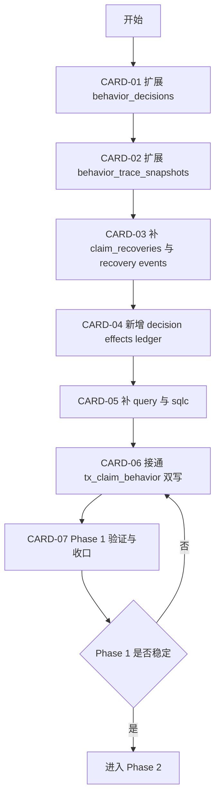

# Phase 1 开发顺序图与依赖图

日期：2026-03-27

本文把异常订单主判 Phase 1 拆成可执行的数据库骨架建设顺序，目标是在不切旧主判的前提下，先完成 V2 正式落库能力。

## Phase 1 总图

## 为什么按这个顺序

1. 先建主判主表和快照表，再补 recovery 和净值账本，避免 query 生成前结构还在变化。
2. query 和 sqlc 必须在 schema 基本冻结后统一做，避免来回重生成。
3. tx 双写只能放在 schema 和 query 就绪之后。
4. 最后统一做验证，保证 Phase 1 结束时仓库处于稳定可停留状态。

## 单线程推荐顺序

1. CARD-01
2. CARD-02
3. CARD-03
4. CARD-04
5. CARD-05
6. CARD-06
7. CARD-07

## 可有限并行的部分

在真实开工时，只允许如下并行：

1. CARD-03 和 CARD-04 可以在 CARD-01、CARD-02 基本冻结后并行起草 migration。
2. CARD-07 的测试清单可以提前准备，但不能在 CARD-06 完成前宣称阶段结束。

## 里程碑

### M1 结构冻结

- [ ] CARD-01 完成
- [ ] CARD-02 完成
- [ ] CARD-03 完成
- [ ] CARD-04 完成

目标：

- V2 落库骨架完成，不再频繁改表意图。

### M2 代码生成与双写

- [ ] CARD-05 完成
- [ ] CARD-06 完成

目标：

- 现有 claim 事务可写 V2 字段和新账本。

### M3 Phase 1 评审

- [ ] CARD-07 完成

目标：

- 确认可以进入 Phase 2，而不是带着半成品 schema 往前推进。

## 最低验证要求

- [ ] migration 可执行
- [ ] make sqlc 成功
- [ ] tx_claim_behavior 相关测试或最小回归通过
- [ ] 现有 claim 主链路未被破坏

## 风险备注

- behavior_decisions 和 behavior_trace_snapshots 字段改动面最大，最容易带来 query 和 sqlc 连锁修改。
- claim_recoveries 如果不同时补 decision_id，后续 rollback 链路会继续靠 snapshot 猜来源。
- 若 CARD-06 双写做得过早，容易在 query 还未稳定时造成大量返工。