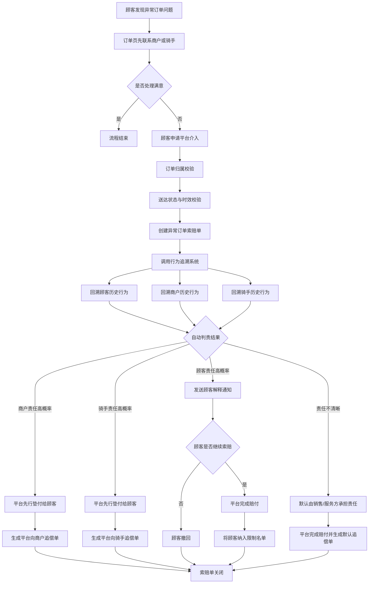
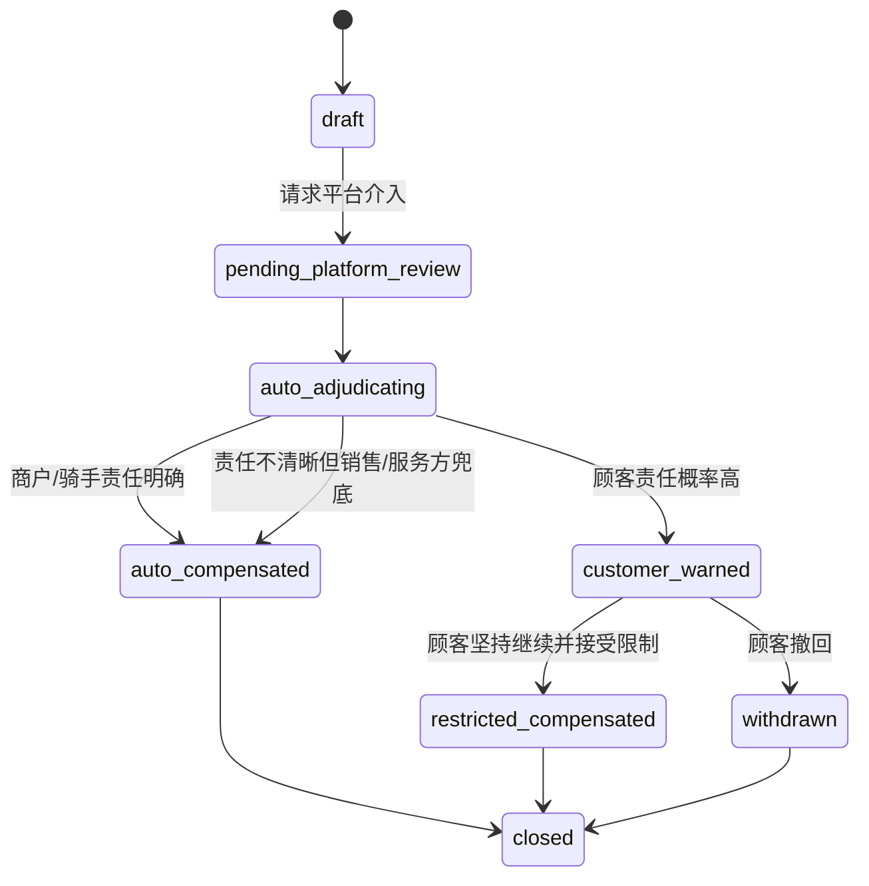

# 异常订单顾客索赔业务链设计

## 1. 目标

本文只定义一件事：

异常订单场景下，顾客发起平台介入索赔时，平台应该如何形成一条完整、可执行、可审计的业务链。

本文关注的是目标设计，不审计当前代码实现。

这条链要解决四个核心问题：

1. 顾客不能一上来就向平台要赔付，必须先经过商户或骑手协商处理。
2. 平台介入后，不靠主观拍脑袋判责，而是调用行为追溯系统形成责任判断依据。
3. 如果商户或骑手责任概率高，平台先行垫付给顾客，再向责任方生成追偿单。
4. 如果顾客责任概率高，先向顾客展示行为追溯原因并提醒其谨慎继续；若顾客坚持，则仍赔付给他，但将其纳入限制名单，平台后续不再继续提供服务。

风险等级判断：`G2`

原因：

1. 平台会直接做先行赔付，涉及真实资金支出。
2. 平台会向商户或骑手生成追偿责任，涉及经营主体责任判定。
3. 顾客被判断为高风险时，会影响索赔处理路径和用户体验。

## 2. 业务范围

本文覆盖的异常订单类型包括：

1. 配送导致的破损、撒漏、明显不可食用。
2. 商户导致的异物、异味、包装污染、商品异常。
3. 其他已履约送达但顾客认为存在明显异常，需要平台介入判责的订单问题。

本文不覆盖：

1. 单纯退款链路。
2. 纯支付争议链路。
3. 群体食安事件熔断链路。
4. 申诉复议的详细运营 SOP。

## 3. 角色与权责

### 3.1 顾客

顾客只能对属于自己的已送达订单发起异常订单索赔。

顾客在业务上应优先自行联系商户或骑手处理。

但这一步不是平台可验证能力，因为现实中顾客可能通过电话等站外方式沟通，平台无法校验。

因此本文约定：

1. “先协商、后介入”是业务倡导，不是系统硬门槛。
2. 平台不要求顾客提交可验证的前置协商记录。
3. 平台介入入口不以前置协商记录校验作为阻断条件。

### 3.2 商户

商户是订单商品质量、包装完整性、异物异味等问题的主要责任主体候选方。

在平台介入后，商户承担两类后果：

1. 若被判定为高责任概率主体，平台先赔后向商户生成追偿单。
2. 若责任不清晰但按销售侧责任兜底规则处理，商户承担默认销售责任。

### 3.3 骑手

骑手是配送破损、撒漏、明显配送过程导致的异常的主要责任主体候选方。

在平台介入后，骑手承担两类后果：

1. 若被判定为高责任概率主体，平台先赔后向骑手生成追偿单。
2. 若责任不清晰但按服务侧责任兜底规则处理，骑手承担默认服务责任。

### 3.4 平台

平台承担四项职责：

1. 审核顾客是否满足平台介入条件。
2. 调用行为追溯系统，对顾客、商户、骑手的过往行为做证据化回溯。
3. 在责任明确时先行垫付给顾客。
4. 在责任不明确时由销售/服务方承担责任，在顾客高风险但仍坚持索赔时赔付并执行服务限制。

## 4. 设计原则

### 4.1 平台介入倡导晚于一轮前置协商，但不做系统校验

顾客不能跳过商户/骑手直接要求平台赔付。

但由于电话等站外沟通不可验证，平台不应把“已协商”设计为可执行校验条件。

推荐处理原则：

1. 产品文案应引导顾客优先联系商户或骑手。
2. 平台介入入口可以提示“请先尝试与商户或骑手协商处理”。
3. 系统不因缺少协商记录而拒绝顾客发起平台介入。

### 4.2 行为追溯是证据系统，不是黑盒分数系统

行为追溯系统输出的应当是：

1. 责任候选主体。
2. 支撑该判断的事实与原因码。
3. 是否满足自动赔付条件。
4. 是否需要触发顾客限制动作。

行为追溯不应以“一个总分”作为最终业务权威，而应以可解释的证据组合驱动业务决策。

### 4.3 自动赔付只在责任足够明确时触发

平台自动赔付不是默认动作，而是责任清晰时的加速动作。

只有在以下条件满足时，平台才自动赔付：

1. 顾客提交的平台介入申请满足基础订单条件。
2. 订单与异常类型匹配。
3. 行为追溯结果指向商户或骑手为高责任概率主体。
4. 顾客侧未命中高风险信号。

### 4.4 顾客高风险时，先提醒，再由顾客自行承担继续索赔后果

如果行为追溯显示顾客责任可能性高，平台应走“提醒 + 二次确认 + 赔付后限制服务”的路径。

推荐机制：

1. 平台先展示判责原因。
2. 顾客可以选择撤回索赔。
3. 顾客若坚持继续，平台仍完成赔付。
4. 赔付完成后，平台将顾客纳入限制名单，停止继续向其提供服务。

### 4.5 责任不清晰时，默认由销售/服务方承担责任

异常订单场景下，平台不再引入人工调查兜底。

当行为追溯无法形成明确单方责任时，系统按“销售/服务方承担责任”的原则自动处理。

推荐规则：

1. 商品质量、异物、异味、包装污染等销售侧问题，默认由商户承担责任。
2. 配送破损、撒漏、超时导致的异常等服务侧问题，默认由骑手承担责任。
3. 无法进一步拆分时，优先由更接近成交与交付的一侧承担责任，并由平台保留后续内部调账能力。

## 5. 权威业务对象

推荐把这条链拆成四个权威对象。

### 5.1 异常订单索赔申请

这是顾客请求平台介入后的主对象。

建议命名：`customer_claim_cases`

它记录：

1. 订单 ID
2. 顾客 ID
3. 异常类型
4. 平台介入原因
5. 申请状态
6. 自动判责结果
7. 最终处理结果

### 5.2 行为追溯决策记录

这是自动判责的事实对象。

建议命名：`claim_trace_decisions`

它记录：

1. 责任候选主体
2. 原因码列表
3. 顾客行为摘要
4. 商户行为摘要
5. 骑手行为摘要
6. 是否允许自动赔付
7. 是否需要限制顾客服务能力
8. 面向顾客的解释文案

### 5.3 平台追偿单

这是平台先赔后追的责任对象。

建议命名：`claim_recovery_orders`

它记录：

1. 来源索赔单
2. 被追偿主体：商户 / 骑手
3. 追偿金额
4. 追偿依据
5. 支付状态
6. 关闭状态

### 5.4 顾客限制名单

这是顾客在收到风险提醒后仍坚持索赔时的处置对象。

建议命名：`customer_claim_restriction_list`

它记录：

1. 顾客 ID
2. 来源索赔单 ID
3. 限制原因
4. 触发时的行为追溯摘要
5. 限制生效时间
6. 限制状态

## 6. 目标业务链

## 6.1 主链分五段

### 阶段 A：顾客发现异常

订单已经送达，顾客发现存在破损、异物、异味等异常。

顾客此时不能直接进入“平台赔付”，只能进入“异常反馈”。

### 阶段 B：顾客可先联系商户或骑手

顾客在订单页选择：

1. 联系商户处理，或
2. 联系骑手处理。

这是业务上推荐的优先路径，但平台不把它设计成可验证前置条件。

原因是：

1. 顾客可能通过电话沟通。
2. 顾客可能在线下或站外渠道沟通。
3. 平台无法可靠核验是否真的发生过协商。

### 阶段 C：顾客请求平台介入

顾客提交平台介入申请后，系统做两类校验：

1. 订单归属校验：订单必须属于当前顾客。
2. 状态校验：订单必须已送达且在索赔时效内。

校验通过后，创建异常订单索赔单。

### 阶段 D：平台自动判责

平台调用行为追溯系统，形成本次自动判责结论。

行为追溯至少应回溯三类主体：

1. 顾客
2. 商户
3. 骑手

应输出三类结果之一：

1. 商户责任高概率
2. 骑手责任高概率
3. 顾客责任高概率或责任不清晰

### 阶段 E：按结果执行处理

#### 路径 E1：商户责任高概率

平台立即先行垫付给顾客，然后生成平台向商户的追偿单。

#### 路径 E2：骑手责任高概率

平台立即先行垫付给顾客，然后生成平台向骑手的追偿单。

#### 路径 E3：顾客责任高概率

平台先向顾客发送解释通知，展示本次判责依据。

顾客可以：

1. 撤回索赔，流程结束。
2. 继续坚持索赔，平台仍赔付，但将顾客纳入限制名单并停止后续服务。

#### 路径 E4：责任不清晰

不进入人工调查，而是默认由销售/服务方承担责任并完成自动赔付。

## 7. 行为追溯系统设计

## 7.1 行为追溯的输入

行为追溯至少要读取以下事实：

### 顾客侧

1. 最近若干笔相似订单的索赔次数。
2. 相同异常类型的索赔分布。
3. 最近索赔的时间集中度。
4. 对手方是否普遍无异常记录。
5. 是否存在明显重复、集中、针对性索赔模式。

### 商户侧

1. 最近若干笔同类订单是否有相似异常投诉。
2. 其他顾客是否也对该商户提出过相似问题。
3. 商户在相似问题上的历史成立率。
4. 商户近期是否存在异常聚集。

### 骑手侧

1. 近期是否有多笔破损、撒漏、超时导致的异常。
2. 是否在相近时间段出现重复配送异常。
3. 该骑手历史成立率是否显著异常。

## 7.2 行为追溯的输出

行为追溯不直接输出“赔不赔”，而是输出决策建议。

建议结构如下：

1. `responsible_party_candidate`：merchant / rider / customer / unclear
2. `decision_mode`：auto_compensate / warn_customer_then_compensate / seller_or_service_fallback
3. `reason_codes`
4. `reason_summary`
5. `customer_notice_text`
6. `recovery_required`
7. `recovery_target`
8. `recovery_amount`
9. `restriction_required`

## 7.3 顾客高风险通知示例

当顾客责任可能性高时，通知文案应可解释。

示例：

1. 您最近 5 笔相似订单中已有 3 笔发起索赔。
2. 本次关联商户最近同期没有其他同类索赔记录。
3. 平台认为本次顾客责任风险较高，建议您谨慎决定是否继续索赔。
4. 如果您仍坚持继续索赔，平台将完成本次赔付，但会停止后续向您继续提供服务。

## 8. 状态机设计

## 8.1 顾客索赔主状态机

建议状态如下：

1. `draft`
2. `pending_platform_review`
3. `auto_adjudicating`
4. `auto_compensated`
5. `customer_warned`
6. `restricted_compensated`
7. `withdrawn`
8. `closed`

其中关键约束是：

1. 自动赔付只能从 `auto_adjudicating` 进入 `auto_compensated`。
2. 顾客高风险路径必须先进入 `customer_warned`。
3. 顾客继续索赔后直接进入 `restricted_compensated`，不能再进入人工调查分支。

## 8.2 平台追偿单状态机

建议状态如下：

1. `created`
2. `pending_payment`
3. `paid`
4. `waived`
5. `overdue`
6. `closed`

## 9. 端到端流程图

## 10. 状态机图

## 11. 决策矩阵

| 追溯结果 | 自动动作 | 顾客结果 | 平台后续动作 |
| --- | --- | --- | --- |
| 商户责任高概率 | 自动赔付 | 顾客立即获赔 | 生成向商户追偿单 |
| 骑手责任高概率 | 自动赔付 | 顾客立即获赔 | 生成向骑手追偿单 |
| 顾客责任高概率 | 发送解释通知 | 顾客可撤回，也可继续索赔后获赔 | 若顾客坚持，则纳入限制名单并停止服务 |
| 责任不清晰 | 销售/服务方兜底赔付 | 顾客获赔 | 生成默认追偿单 |

## 12. API 与异步边界建议

### 12.1 顾客前台接口

建议最少需要以下接口：

1. 发起平台介入申请
2. 查看平台判责结果
3. 顾客确认继续索赔
4. 顾客撤回索赔

### 12.2 平台侧同步边界

同步接口只做：

1. 请求校验
2. 创建索赔主对象
3. 触发自动判责任务
4. 返回“处理中”或“已自动处理”的结果

### 12.3 平台侧异步边界

异步任务负责：

1. 拉取行为追溯证据
2. 形成自动判责结论
3. 触发自动赔付
4. 生成追偿单
5. 发送顾客解释通知
6. 写入顾客限制名单

## 13. 关键审计要求

这条链必须保证可解释、可回放、可追责。

至少要记录：

1. 顾客何时发起平台介入。
2. 行为追溯时读取了哪些事实。
3. 自动判责输出了哪些原因码。
4. 顾客看到的解释文案是什么。
5. 顾客是否选择继续索赔。
6. 顾客是否被纳入限制名单。
7. 自动赔付和追偿单是否成功落地。

## 14. 建议的落地顺序

第一阶段：

1. 固定平台介入入口条件。
2. 固定索赔主状态机。
3. 固定行为追溯输出结构。

第二阶段：

1. 打通商户责任自动赔付。
2. 打通骑手责任自动赔付。
3. 打通平台追偿单。

第三阶段：

1. 打通顾客高风险解释通知。
2. 打通顾客继续索赔确认。
3. 打通顾客限制名单与停服能力。

## 15. 一句话结论

异常订单顾客索赔的目标链路，不应该是“顾客一提交，平台就赔”，而应该是：

顾客先协商 -> 协商失败后请求平台介入 -> 平台调用行为追溯自动判责 -> 商户/骑手责任明确则先赔后追 -> 责任不清晰则销售/服务方兜底 -> 顾客高风险若仍坚持索赔则赔付并停服。