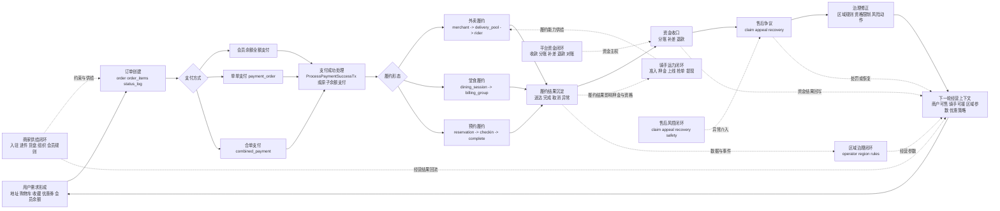

# 后端端到端业务闭环图

## 1. 目标

这份文档不是再增加一个新的业务分类，而是把这个后端真正的经营主链和五个回流侧环固定成一个统一视角。

配套的代码审查结果见：

- [artifacts/backend-business-closed-loop-audit-2026-04-17.md](artifacts/backend-business-closed-loop-audit-2026-04-17.md)

它要回答的是：

1. 这个后端的真正主链是什么。
2. 哪些流程是主链两侧的闭环侧环。
3. 这些侧环如何不断回流，影响下一轮交易与经营。

结论先说：

这个系统的核心不是“运营后台能做什么”，也不是“订单状态怎么跳”，而是一个由交易主链驱动、由供给、运力、资金、售后和治理持续回流修正的多闭环经营系统。

## 2. 一句话总图

主链只有一条：

用户需求形成 -> 订单创建 -> 支付入账 -> 履约交付 -> 结算分配 -> 售后追责 -> 规则修正 -> 下一轮交易

围绕主链有五个闭环侧环：

1. 商家供给闭环
2. 骑手运力闭环
3. 平台资金闭环
4. 售后风控闭环
5. 区域治理闭环

这些闭环都不是独立产品，而是围绕主链提供约束、放大、补偿和纠偏。

## 3. 主链定义

## 3.1 主链起点：消费意图形成

这里对应的是“用户增长与消费域”。

用户通过地址、购物车、收藏、优惠券、会员余额等对象，形成一次具体消费意图。此时系统还没有真正收钱，也没有开始履约，但已经把交易上下文准备好了。

主对象：

- user_addresses
- carts / cart_items
- favorites
- vouchers
- merchant_memberships

它对主链的贡献是：把“可能消费”推进到“可以创建订单”。

## 3.2 主链中段：交易对象成立

这里对应“交易与门店履约域”的前半段。

CreateOrderTx 把用户意图转成 order、order_items、status_log，并在需要时原子使用优惠券和会员余额。订单一旦成立，主链就从“意图系统”切换到“交易系统”。

主对象：

- orders
- order_items
- order_status_log
- dining_sessions
- billing_groups
- table_reservations

它对主链的贡献是：把消费意图变成真实交易锚点。

## 3.3 主链拐点：支付入账

这里对应“支付清结算与平台资金域”的前半段。

payment_order 或 combined_payment_order 把交易送入微信支付系统。资金一旦 paid，就不再只是业务承诺，而成为真实资金事件。ProcessPaymentSuccessTx 是整个主链的关键闸门。

主对象：

- payment_orders
- combined_payment_orders
- combined_payment_sub_orders

它对主链的贡献是：把“待支付订单”变成“已到账交易”。

## 3.4 主链下游：门店履约与配送交付

这里对应“交易与门店履约域”的后半段，以及“骑手运力与配送资金域”的执行部分。

支付成功后，订单进入门店履约。堂食走 session/billing，预约走 reservation/check-in，外卖走 delivery/delivery_pool/rider 状态推进。交付完成后，系统获得可结算、可评价、可售后的最终履约结果。

主对象：

- deliveries
- delivery_pools
- dining_sessions
- billing_groups
- table_reservations

它对主链的贡献是：把资金已到账的交易兑现成真正交付结果。

## 3.5 主链收口：分账、退款、索赔、治理回流

履约并不是终点。这个系统的真实闭环来自交付之后的几条回流链路：

- 正常交易进入分账和补差
- 异常交易进入退款
- 争议交易进入 claim / appeal / recovery
- 区域与平台根据结果调整规则、资格和经营参数

这意味着系统最终不是停在“订单完成”，而是停在“经营模型被再次修正”。

## 4. 统一业务闭环图

## 5. 这张图应该怎么读

## 5.1 中间横向链是“收入主链”

从 A 到 G 的横向链，描述的是平台如何完成一次交易闭环：

1. 用户产生需求。
2. 平台形成订单。
3. 资金真正到账。
4. 平台组织交付。
5. 最后收口到结算、退款和财务结果。

这是最接近“平台靠什么赚钱、怎么把钱和服务兑现”的主链。

## 5.2 H 到 J 是“纠偏与再生产链”

很多系统把售后当尾巴，但这个系统不是。

这里的 claim、appeal、recovery、区域规则、资格限制、补差和风控动作，会真实改变下一轮交易：

- 商户可能被暂停外卖
- 骑手可能被暂停接单
- operator 规则可能调整配送费或押金阈值
- 平台可能新增补差、减免或赔付

所以 H 到 J 其实是下一轮交易的生产准备链。

## 5.3 左右五个侧环不是边角料，而是主链的供给条件

### 商家供给闭环

它解决的是：谁可以卖、卖什么、以什么组织结构卖、有没有收款资格。

没有 merchant_application、ecommerce_applyment、merchant_payment_config、dish/inventory/group/membership，这条主链连订单都没法稳定成立。

### 骑手运力闭环

它解决的是：谁能接单、谁有押金资格、谁在线、能不能配送、能不能提现。

没有 rider、deposit、delivery_pool、delivery 状态推进，外卖主链无法落地。

### 平台资金闭环

它解决的是：钱进来之后怎么拆、怎么退、怎么补、怎么对账。

没有这个闭环，系统就只能“收钱”，不能“经营”。

### 售后风控闭环

它解决的是：异常责任如何归属、损失如何回收、平台如何补偿、谁被恢复、谁被限制。

这决定了平台不是一个只做成交的系统，而是一个能持续收敛损失的系统。

### 区域治理闭环

它解决的是：平台不是全国单一规则，而是把经营参数、责任主体和治理权限下放到区域 operator。

这让系统从单店交易系统变成区域化经营系统。

## 6. 从用户视角看，这个后端到底在经营什么

如果用一句更业务的话来描述，这个后端经营的不是“订单接口集合”，而是六类可持续循环的经营能力：

1. 把用户需求转成交易。
2. 把交易兑现成履约。
3. 把履约结果沉淀成资金分配。
4. 把异常和损失变成可追偿、可补偿、可治理的对象。
5. 把商户、骑手、组织和区域不断补充进系统，维持供给。
6. 把上一轮交易结果反向写回下一轮经营参数。

这六条放在一起，才是你这个后端真正的业务运营模型。

## 7. 如果继续往下收敛，最值得做的不是再加概念，而是补三层标注

下一步最有价值的是在这张闭环图上继续补三层信息：

1. 每条箭头对应的真实代码入口或事务名。
2. 每个节点的核心监控指标。
3. 每个回流点的人工介入角色和损失风险。

这样最终就会得到一份真正可用于产品、运营、风控、财务和技术对齐的系统经营蓝图。