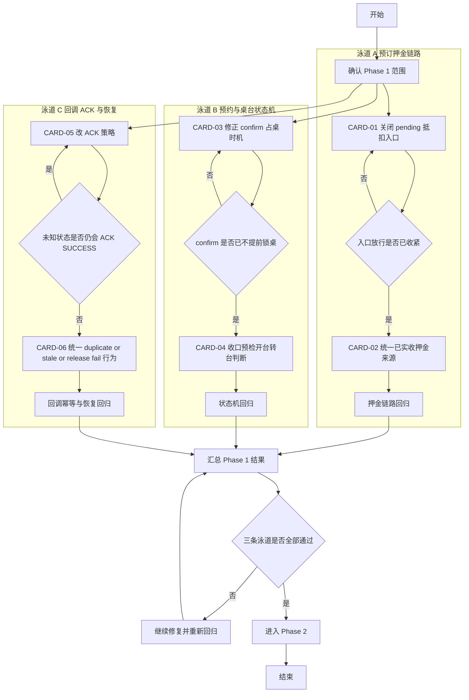

# Phase 1 开发顺序图与并行依赖图

日期：2026-03-27

本文将 Phase 1 的 6 张 P0 任务卡继续拆成可排期的开发泳道、依赖顺序和子任务包，方便直接分配给后端开发、测试与评审。

## Phase 1 总图

## 推荐并行方式

### 方案 A：3 人并行

- 开发 1：CARD-01 + CARD-02
- 开发 2：CARD-03 + CARD-04
- 开发 3：CARD-05 + CARD-06
- 测试或评审支持：穿插验证 3 条泳道回归结果

### 方案 B：2 人并行

- 开发 1：CARD-01 + CARD-02 + CARD-05
- 开发 2：CARD-03 + CARD-04 + CARD-06
- 原因：CARD-05 改动集中在 handler 和回调幂等，和桌台状态机冲突较小

### 方案 C：单线程推进

1. CARD-01
2. CARD-02
3. CARD-03
4. CARD-04
5. CARD-05
6. CARD-06

适用场景：

- 只有 1 名熟悉后端主链的开发可用
- 希望先清掉资金风险，再处理状态机风险

## 泳道 A：预订押金链路

### A1 CARD-01 子任务包

- [x] A1-1 明确 deposit 模式允许建单的 reservation 状态集合
- [x] A1-2 修改 reservation 下单会话校验
- [x] A1-3 补充错误文案与错误码校验
- [x] A1-4 增加 pending deposit 拒绝下单测试
- [x] A1-5 增加 paid deposit 允许下单测试

建议改动点：

- [locallife/logic/order_session.go](locallife/logic/order_session.go)
- [locallife/logic/order_service.go](locallife/logic/order_service.go)

交付判断：

- [x] 入口已被收紧
- [x] 现有 full payment 预订未受影响

### A2 CARD-02 子任务包

- [x] A2-1 梳理 deposit_amount、prepaid_amount 及已支付状态语义
- [x] A2-2 抽出统一的 deposit deduction 计算入口
- [x] A2-3 替换 order_service 中直接使用 deposit_amount 的逻辑
- [x] A2-4 增加抵扣封顶测试
- [x] A2-5 增加已收押金不足和等于订单金额测试

建议改动点：

- [locallife/logic/order_service.go](locallife/logic/order_service.go)
- [locallife/logic/order_payment.go](locallife/logic/order_payment.go)
- [locallife/logic/reservation.go](locallife/logic/reservation.go)

交付判断：

- [x] 抵扣金额来源统一
- [x] 没有“配置金额当实收金额”的路径残留

## 泳道 B：预约与桌台状态机

### B1 CARD-03 子任务包

- [x] B1-1 确认 confirm reservation 是否必须写 table.status
- [x] B1-2 优先实现 confirm 只改 reservation 状态
- [x] B1-3 检查 complete/cancel 是否依赖 confirm 写入的 current_reservation_id
- [x] B1-4 增加 future reservation confirm 测试
- [x] B1-5 增加临近预约 confirm 测试

建议改动点：

- [locallife/logic/reservation.go](locallife/logic/reservation.go)
- [locallife/db/sqlc/tx_reservation.go](locallife/db/sqlc/tx_reservation.go)

交付判断：

- [x] future reservation confirm 不再提前锁桌
- [x] 后续 check-in 仍可正常工作

### B2 CARD-04 子任务包

- [x] B2-1 统一“桌台被预约占用”的判断口径
- [x] B2-2 收口预检、开台、转台三处逻辑
- [x] B2-3 检查 current_reservation_id 的清理时机
- [x] B2-4 增加 transfer 与 precheck 回归测试
- [x] B2-5 增加 check-in 后转台/关台回归测试

建议改动点：

- [locallife/logic/dining_session.go](locallife/logic/dining_session.go)
- [locallife/logic/dining_session_precheck.go](locallife/logic/dining_session_precheck.go)
- [locallife/db/sqlc/tx_dining_session_transfer.go](locallife/db/sqlc/tx_dining_session_transfer.go)

交付判断：

- [x] 预检、开台、转台对同一桌台判断一致
- [x] 不再因 future reservation 造成当前桌台误阻塞

## 泳道 C：回调 ACK 与恢复

### C1 CARD-05 子任务包

- [x] C1-1 找出 duplicate claim lookup failed 的所有入口
- [x] C1-2 将 ACK SUCCESS 改为 FAIL
- [x] C1-3 增加该分支告警
- [x] C1-4 增加 lookup failed 单测
- [x] C1-5 增加微信重试再次进入处理测试

建议改动点：

- [locallife/api/payment_callback.go](locallife/api/payment_callback.go)
- [locallife/api/payment_callback_test.go](locallife/api/payment_callback_test.go)

交付判断：

- [x] 未知状态不再提前 ACK
- [x] 重试路径幂等可恢复

### C2 CARD-06 子任务包

- [x] C2-1 盘点 tryClaim、release、stale claim、scheduler 的失败分支
- [x] C2-2 统一 reason label 和告警模板
- [x] C2-3 校验 release fail 后不会被误判为 processed
- [x] C2-4 增加 stale claim recovery 测试
- [x] C2-5 增加 release fail 与 scheduler 联动测试

建议改动点：

- [locallife/api/payment_callback.go](locallife/api/payment_callback.go)
- [locallife/db/sqlc/tx_notification.go](locallife/db/sqlc/tx_notification.go)
- [locallife/worker/wechat_notification_recovery_scheduler.go](locallife/worker/wechat_notification_recovery_scheduler.go)

交付判断：

- [x] duplicate、stale、release fail 行为一致
- [x] recovery scheduler 真正承担兜底职责

## 里程碑建议

### M1 第一轮止血

- [x] CARD-01 完成
- [x] CARD-03 完成
- [x] CARD-05 完成

目标：

- 先关掉最危险的错误行为，不要求第一轮就把模型完全收口。

### M2 模型收口

- [x] CARD-02 完成
- [x] CARD-04 完成
- [x] CARD-06 完成

目标：

- 让资金、桌台状态机、回调恢复逻辑在模型上闭环。

### M3 Phase 1 评审

- [ ] 3 条泳道回归完成
- [ ] 输出 Phase 1 评审结论
- [ ] 决定是否进入 Phase 2

## 测试建议汇总

- [ ] `go test ./logic` 覆盖 reservation、order、dining_session 相关测试
- [ ] `go test ./api` 覆盖 payment_callback 相关测试
- [ ] `go test ./db/sqlc` 覆盖 reservation、dining_session_transfer 相关事务测试
- [ ] 如有 worker 改动，执行 `go test ./worker`

## 风险备注

- 若 CARD-03 改动较大，CARD-04 可能需要重写部分现有测试断言。
- 若 CARD-05 调整 ACK 语义，需关注测试桩是否仍假设 duplicate lookup fail 会返回 SUCCESS。
- 若 CARD-02 发现现有字段无法准确表达“已实收押金”，应先采用保守策略，并记录为后续结构优化项。