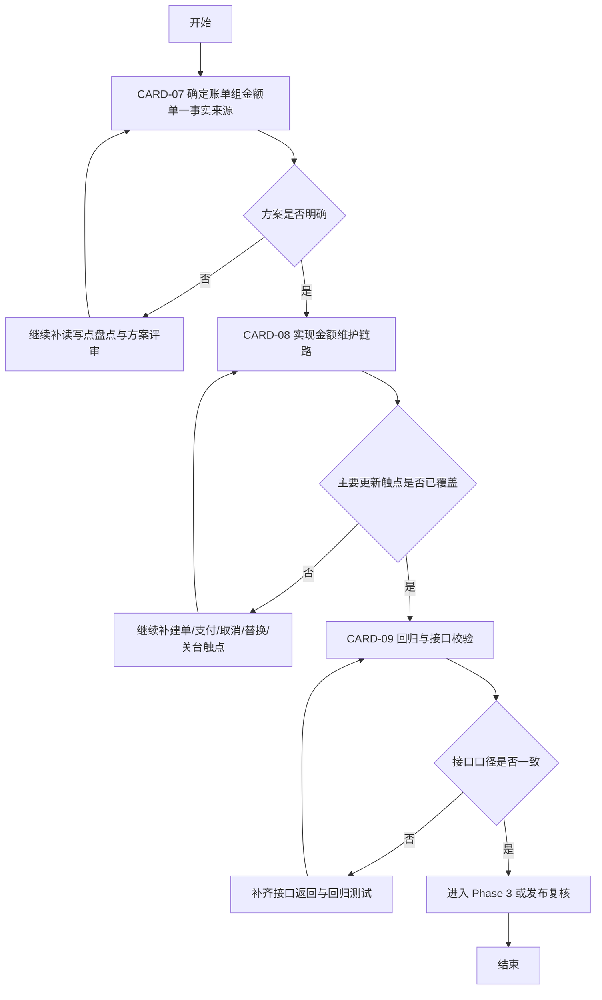

# Phase 2 开发顺序图与依赖图

日期：2026-03-27

本文把 Phase 2 的 3 张任务卡继续拆成“方案决策 -> 实现 -> 回归”三段，目标是避免 AI 或开发在未先统一账单组金额口径前直接进入大面积代码修改。

## Phase 2 总图

## 推荐执行方式

### 方案 A：单线程最稳

1. CARD-07
2. CARD-08
3. CARD-09

适用场景：

- 账单组口径目前明显不统一
- 希望先定方案，再做代码改动，避免返工

### 方案 B：2 人接力

- 开发 1：CARD-07 + CARD-08 前半段
- 开发 2：CARD-09 预埋测试样例与接口校验清单

要求：

- CARD-08 真正开始改代码前，CARD-07 的方案必须冻结

## CARD-07 子任务包

- [x] P2-1 盘点 billing_groups.total_amount / paid_amount 的全部读取点
- [x] P2-2 盘点 billing_groups.total_amount / paid_amount 的全部写入点
- [x] P2-3 盘点 billing_group_orders 是否已具备可靠聚合语义
- [x] P2-4 在“持久化聚合”和“运行时聚合”之间做方案决策
- [x] P2-5 记录方案取舍和非目标

建议重点文件：

- [locallife/db/query/billing_group.sql](locallife/db/query/billing_group.sql)
- [locallife/api/billing_group.go](locallife/api/billing_group.go)
- [locallife/api/dining_session.go](locallife/api/dining_session.go)

交付判断：

- [x] 已有一份明确的方案记录
- [x] 后续 CARD-08 不会再因为口径分歧反复重做

## CARD-08 子任务包

- [x] P2-8-1 根据 CARD-07 方案补建单触点
- [x] P2-8-2 补支付成功触点
- [x] P2-8-3 补取消订单触点
- [x] P2-8-4 补替换订单触点
- [x] P2-8-5 评估并补关台结算触点
- [x] P2-8-6 明确 billing_group_orders.status 与聚合关系
- [x] P2-8-7 增加金额维护相关单测

建议重点文件：

- [locallife/db/sqlc/tx_create_order.go](locallife/db/sqlc/tx_create_order.go)
- [locallife/logic/replace_order.go](locallife/logic/replace_order.go)
- [locallife/worker/task_process_payment.go](locallife/worker/task_process_payment.go)
- [locallife/db/sqlc/tx_dining_session.go](locallife/db/sqlc/tx_dining_session.go)

交付判断：

- [x] 账单组金额不会长期停留在 0 或旧值
- [x] 订单生命周期变化后金额能同步维护或被正确重算

## CARD-09 子任务包

- [x] P2-9-1 检查列表接口金额口径
- [x] P2-9-2 检查详情接口金额口径
- [x] P2-9-3 检查关台或堂食相关接口是否仍返回原始旧值
- [x] P2-9-4 增加 handler 层回归测试
- [ ] P2-9-5 设计并执行手工回归场景

建议重点文件：

- [locallife/api/billing_group.go](locallife/api/billing_group.go)
- [locallife/api/dining_session.go](locallife/api/dining_session.go)

交付判断：

- [x] 同一账单组在列表、详情、关台中的金额一致
- [x] 不存在“一个接口聚合、另一个接口读原值”的漂移

## 里程碑建议

### M4 Phase 2 方案冻结

- [x] CARD-07 完成

### M5 Phase 2 实现完成

- [x] CARD-08 完成

### M6 Phase 2 验证完成

- [ ] CARD-09 完成
- [ ] 输出是否可进入 Phase 3 的结论

## 测试建议汇总

- [ ] `go test ./logic` 覆盖 replace_order 等金额变化链路
- [x] `go test ./api` 覆盖 billing_group / dining_session 相关接口测试
- [x] `go test ./db/sqlc` 覆盖 tx_create_order 等事务测试
- [ ] 手工回归拼桌建单、部分支付、取消/替换订单、关台

## 风险备注

- 如果 CARD-07 最终选择运行时聚合，CARD-08 的重点会从“补写入”转到“统一读取层”，改动点会偏向 API/logic 而非 tx。
- 如果 billing_group_orders.status 语义不够稳定，可能需要先补小范围状态收口，再做金额聚合。