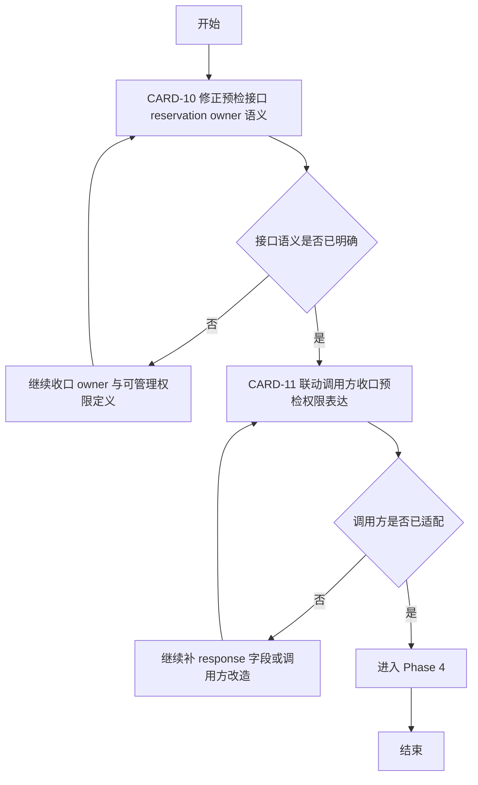

# Phase 3 开发顺序图与依赖图

日期：2026-03-27

本文把 Phase 3 的 2 张任务卡拆成“接口语义修正 -> 调用方收口”两段，目的是先修正后端真实语义，再决定是否需要联动前端或小程序调用方。

## Phase 3 总图

## 推荐执行方式

### 方案 A：单线程

1. CARD-10
2. CARD-11

原因：

- CARD-11 依赖 CARD-10 的接口语义冻结，先后关系明确

### 方案 B：前后端接力

- 后端开发：完成 CARD-10，并产出字段语义说明
- 前端或调用方开发：在语义冻结后处理 CARD-11

适用场景：

- 预检接口已经有外部页面依赖
- 需要控制接口变更引起的联动成本

## CARD-10 子任务包

- [x] P3-10-1 明确 is_reservation_owner 的唯一语义
- [x] P3-10-2 将赋值改为严格依据 reservation.user_id
- [x] P3-10-3 若需要表达商户管理权限，定义新字段或新内部状态
- [x] P3-10-4 增加本人、商户 owner、商户员工、无权限用户四类测试

建议重点文件：

- [locallife/logic/dining_session_precheck.go](locallife/logic/dining_session_precheck.go)
- [locallife/api/dining_session.go](locallife/api/dining_session.go)

交付判断：

- [x] is_reservation_owner 只表示“本人预约”
- [x] 商户侧查看能力不再混入 owner 语义

## CARD-11 子任务包

- [x] P3-11-1 盘点调用方是否依赖 is_reservation_owner 控制按钮、文案或跳转
- [x] P3-11-2 如需新增字段，完成 API response 联动
- [x] P3-11-3 完成前端或小程序调用方适配
- [x] P3-11-4 补充接口说明或调用约束
- [x] P3-11-5 执行最小联动验证

建议重点文件：

- [locallife/api/dining_session.go](locallife/api/dining_session.go)
- 相关前端或小程序调用页面

交付判断：

- [x] 调用方不会再把“商户可管理”误显示成“本人预约”
- [x] 页面不会出现错误入口或错误文案

## 里程碑建议

### M7 Phase 3 语义冻结

- [x] CARD-10 完成

### M8 Phase 3 联动完成

- [x] CARD-11 完成
- [x] 输出是否可以进入 Phase 4 的结论

## 测试建议汇总

- [ ] `go test ./logic` 覆盖 dining_session_precheck 相关测试
- [ ] `go test ./api` 覆盖 dining_session API 相关测试
- [x] 如联动前端或小程序，执行对应最小 lint 或页面验证

## 风险备注

- 如果 CARD-10 最终需要新增 response 字段，CARD-11 需要同步评估兼容策略，避免前后端错版本。
- 如果当前没有统一的调用方清单，CARD-11 可能先需要补一次调用面盘点，再决定是否要真正改 UI。