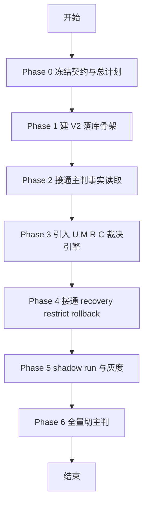

# 异常订单主判落地总计划

日期：2026-03-27

## 1. 文档定位

这份文档是异常订单主判改造的总任务计划。

它和另外三份文档的分工必须明确分开：

1. abnormal-order-main-adjudicator-redesign.md：回答系统应该长成什么样。
2. abnormal-order-main-adjudicator-rules-matrix.md：冻结系统最终怎么判。
3. abnormal-order-main-adjudicator-data-model-v2.md：定义系统应该怎么落库。
4. 本文：定义接下来到底按什么顺序做、每阶段交付什么、什么情况下才能进入下一阶段。

因此，现有重构方案不是总任务计划。

现有重构方案是设计总方案，但还不是实施总计划。

如果后续真的要避免做着做着忘记目标、遗漏阶段或重复返工，必须以本文作为唯一执行主线。

## 2. 总目标

整个主判改造只有一个最终目标：

把当前异常订单索赔链路，从“规则补丁 + 默认责任方 + 少量平台垫付”升级为“规则冻结、数据可回放、动作可回滚、画像可净值修正”的正式自动主判系统。

最终结果必须同时满足：

1. 在线提交索赔时能自动做主判。
2. 追偿、平台兜底、用户限制都走正式主判模式，而不是临时分支。
3. 申诉再裁决能推翻原判并回滚画像净值。
4. 线上主判读取的是净有效画像，而不是裸 claim 计数。
5. 切换过程可灰度、可 shadow run、可回退。

## 3. 总体原则

### 3.1 一切实现以规则契约为准

后续任何 migration、query、logic、worker 改造，都必须先对齐：

1. abnormal-order-main-adjudicator-rules-matrix.md
2. abnormal-order-main-adjudicator-data-model-v2.md

不允许实现中再次发明新的正式判决模式、责任域或追偿口径。

### 3.2 先建正式骨架，再替换旧判定

整个改造不是直接重写 SubmitClaim。

必须先完成：

1. 正式落库结构。
2. 正式主判模式字段。
3. 可回滚画像净值账本。
4. 结构化快照。

只有这些骨架建立后，才允许替换旧主判逻辑。

### 3.3 每一阶段都必须形成可停留状态

不能做“半个阶段必须靠后续补完才不坏”的高耦合变更。

每个阶段结束后，仓库都应处于：

1. 可编译。
2. 可测试。
3. 可解释当前已完成边界。

### 3.4 先总计划，后 phase delivery map

本文先定义总计划。

只有当某个阶段即将真正开工时，才继续为那个阶段下钻更细的 delivery map。

也就是说：

1. 本文负责防遗漏。
2. phase delivery map 负责防落地时乱序和漏切片。

配套任务卡索引见 [abnormal_order_task_cards_20260327/README.md](abnormal_order_task_cards_20260327/README.md)。

## 4. 总阶段图

## 5. 各阶段定义

## 5.1 Phase 0 冻结契约与总计划

### 目标

把“应该做什么”先冻结，避免落地时边做边改核心定义。

### 输入

1. abnormal-order-main-adjudicator-redesign.md
2. abnormal-order-main-adjudicator-rules-matrix.md
3. abnormal-order-main-adjudicator-data-model-v2.md

### 交付物

1. 本总计划文档。
2. 规则契约冻结。
3. 数据模型 V2 冻结。

### 完成标准

1. 正式输出模式已经定清。
2. claim type 责任域已经定清。
3. 平台兜底、用户限制、申诉翻盘、画像回滚都已有明确持久化方案。

### 当前状态

本阶段已完成。

## 5.2 Phase 1 建 V2 落库骨架

### 目标

先把主判 V2 需要的数据库骨架建起来，但不在这一阶段强制替换旧主判逻辑。

### 必做项

1. behavior_decisions 增加 V2 主字段。
2. behavior_trace_snapshots 增加结构化快照字段。
3. claim_recoveries 增加 decision_id 等主判关联字段。
4. 新增 behavior_decision_effects。
5. 新增 claim_recovery_events。
6. 补 query 并重新生成 sqlc。

### 非目标

1. 不在这一阶段引入新评分引擎。
2. 不在这一阶段完成历史回填。
3. 不在这一阶段切主判。

### 输出

1. 数据库已有正式 V2 存储能力。
2. 代码层可双写旧字段和新字段。

### 退出条件

1. make sqlc 成功。
2. tx 层能写入 V2 字段。
3. 现有 claim 提交流程不被破坏。

### 下一步是否要再拆 delivery map

要。

真正开始动手前，应先补一份 Phase 1 delivery map，把 migration、query、sqlc、tx、最小验证拆成可执行切片。

当前已补的第一份 delivery map 见 [abnormal_order_task_cards_20260327/phase-1-delivery-map.md](abnormal_order_task_cards_20260327/phase-1-delivery-map.md)。

## 5.3 Phase 2 接通主判事实读取

### 目标

把在线主判真正需要的事实读取接进提交索赔主链路，但仍可先保留旧决策逻辑。

### 必做项

1. 接通用户、商户、骑手净有效画像摘要读取。
2. 接通设备、地址、图谱、协同索赔摘要读取。
3. 接通关键状态链事实读取，例如取餐确认、配送状态、时间窗事实。
4. 缺失事实时明确降级到平台兜底候选，而不是继续默认追责。

### 非目标

1. 这一阶段不要求最终替换判定矩阵。
2. 不要求历史画像全部重算完成。

### 输出

1. SubmitClaim 已具备 V2 主判需要的事实输入。
2. 平台兜底降级条件可在代码里明确表达。

### 退出条件

1. 主链路已不再只依赖旧 raw claim 窗口统计。
2. 图谱和画像缺失时行为一致且可解释。

### 是否要继续拆 delivery map

要。

这一阶段会跨 api、logic、sqlc、可能的 worker 预聚合链路，必须在开工前单独拆图。

## 5.4 Phase 3 引入 U M R C 裁决引擎

### 目标

把正式规则表中的主判矩阵真正替换进决策层。

### 必做项

1. 定义 DecisionV2 结构。
2. 实现 U、M、R、C 四类分数输出。
3. 按规则表写入 decision_mode。
4. 写入 score_breakdown、graph_hits、fallback_reason、restriction_reason。
5. 让 platform_fallback 和 user_restricted 成为正式主判模式。

### 非目标

1. 不在这一阶段完成灰度切换。
2. 不在这一阶段做全量历史回放。

### 输出

1. 新主判逻辑已存在并可独立运行。
2. 新旧判定可以并行输出用于比对。

### 退出条件

1. 对当前支持的三类 claim type 都能给出正式 decision_mode。
2. 主判结果可完整落库并可回放。

## 5.5 Phase 4 接通 recovery restrict rollback

### 目标

让主判结果真正驱动动作系统，而不是只停留在判断结果。

### 必做项

1. merchant_recovery 和 rider_recovery 进入正式追偿链。
2. platform_fallback 不再创建服务方 recovery。
3. user_restricted 进入正式限制动作链。
4. behavior_decision_effects 接入画像净值入账。
5. 申诉再裁决能够回滚 recovery 和画像净值。
6. claim_recovery_events 能完整记录 created、waived、resumed、overturned。

### 输出

1. 主判已不只是“判一下”，而是能驱动动作和回滚。
2. 画像净值具备正式账本。

### 退出条件

1. 申诉翻盘不再依赖猜测回滚。
2. platform_fallback 不会污染商户或骑手净责任计数。
3. 用户限制动作有正式分级路径。

## 5.6 Phase 5 shadow run 与灰度

### 目标

在不立刻替换线上旧主判的情况下，验证新主判结果质量。

### 必做项

1. shadow run 输出新旧主判差异。
2. 观测平台兜底率、误追责率、误伤率、性能指标。
3. 按城市、claim type 或用户段灰度。

### 输出

1. 有真实线上对比数据，而不是只看设计预期。

### 退出条件

1. 平台兜底率落在可接受区间。
2. 商户和骑手误追责率下降。
3. 用户误伤率下降。
4. 延迟符合目标。

## 5.7 Phase 6 全量切主判

### 目标

让新主判成为正式线上主判。

### 必做项

1. 切换读写主路径到 V2。
2. 下线旧主判核心分支。
3. 保留必要兼容字段和回滚开关。

### 输出

1. 新主判正式接管异常订单自动裁决。

### 退出条件

1. 线上已不依赖旧主判做正式裁决。
2. 回滚策略和监控仍然保留。

## 6. 必须覆盖的工作流清单

这是防遗漏清单。后续任何阶段拆图都不能丢掉这些项。

### 6.1 契约与模型

1. 规则契约
2. 数据模型
3. 主判模式定义
4. 责任域定义

### 6.2 数据库与生成代码

1. migration
2. query
3. sqlc
4. 索引和约束

### 6.3 在线主链路

1. SubmitClaim 资格校验
2. 事实组装
3. 画像读取
4. 图谱读取
5. 裁决写入

### 6.4 动作系统

1. 平台赔付
2. 商户追偿
3. 骑手追偿
4. 用户限制
5. 通知

### 6.5 回滚与再裁决

1. 申诉再裁决
2. recovery 回滚
3. 画像净值回滚
4. overturn 审计链

### 6.6 画像与预聚合

1. 用户画像
2. 商户画像
3. 骑手画像
4. 日汇总和窗口统计
5. 图谱摘要

### 6.7 观测与发布

1. shadow run
2. 灰度
3. 性能指标
4. 误判指标
5. 回滚开关

## 7. 推荐执行顺序

如果后面等其他分支改动收口后再开工，推荐顺序不要变：

1. 先做 Phase 1，不要跳过数据库骨架直接写新判定逻辑。
2. 再做 Phase 2，确保新判定有正式输入。
3. 再做 Phase 3，让规则表真正变成代码。
4. 再做 Phase 4，接上 recovery、restrict、rollback。
5. 最后做 Phase 5 和 Phase 6，上线切换。

严禁顺序：

1. 先重写 SubmitClaim，再补落库。
2. 先接新评分，再补画像回滚。
3. 先切线上，再做 shadow run。

## 8. 什么时候需要更细任务计划

答案是：需要，但不是现在把所有阶段都细化到底。

推荐规则是：

1. 总计划永久只有这一份。
2. 每次只为即将开工的那个阶段补一份 delivery map。
3. 当前最应该补的是 Phase 1 delivery map。
4. 等 Phase 1 完成后，再补 Phase 2 delivery map。

这样可以同时避免两种问题：

1. 只有设计文档，没有实施主线。
2. 一开始把全部阶段拆得过细，后面反而随着实现变化迅速失效。

## 9. 当前结论

如果你的问题是：

1. 现有重构方案文档够不够当总计划。

答案是不够。

它是设计总方案，不是执行总计划。

如果你的问题是：

1. 是否需要先有一个总的任务计划。

答案是需要，而且这份总计划必须先于任何阶段级 delivery map 存在。

因此，后续应按这条主线工作：

1. 以本文作为唯一总计划。
2. 以规则表作为唯一裁决契约。
3. 以数据模型 V2 作为唯一落库合同。
4. 以阶段 delivery map 作为每次真正开工前的细化执行图。

这样后面即使暂停一段时间再继续，也不会忘了整个主判改造还缺哪一段、当前进行到哪一层、下一步为什么必须先做什么。