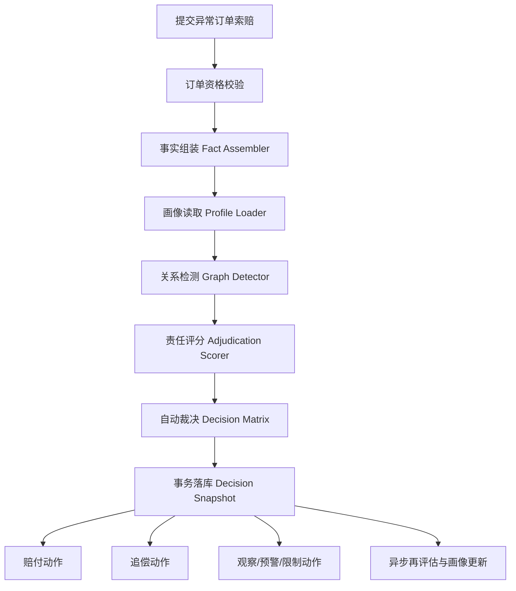

# 异常订单全自动主判重构方案

日期：2026-03-27

## 1. 目标

本方案用于重构异常订单的主判系统，使其成为索赔、判责、追偿、申诉再裁决的统一自动引擎。

配套的正式裁决契约见 [implementation_flows/abnormal-order-main-adjudicator-rules-matrix.md](implementation_flows/abnormal-order-main-adjudicator-rules-matrix.md)。

配套的数据落库方案见 [implementation_flows/abnormal-order-main-adjudicator-data-model-v2.md](implementation_flows/abnormal-order-main-adjudicator-data-model-v2.md)。后续数据模型和代码实现应优先对齐这两份文档。

配套的实施主线见 [implementation_flows/abnormal-order-main-adjudicator-master-plan.md](implementation_flows/abnormal-order-main-adjudicator-master-plan.md)。后续阶段推进、验收和 delivery map 拆分应优先对齐该总计划。

目标只有四个：

1. 更精准：减少把真实受害用户判成恶意用户，减少把真实责任方放过。
2. 更公平：不再默认二元归责，不再把弱证据直接放大成封禁或追偿。
3. 更高效：在线链路维持秒级裁决，主路径不依赖人工审核。
4. 更可复盘：每次判责都能回放分数、证据、责任分配和动作原因。

本方案默认：

1. 主判链路不引入人工审核。
2. 用户在支持的异常订单场景下继续获得秒级自动裁决体验。
3. “秒赔”与“向谁追偿”解耦，不再把它们绑定成同一个决策。

## 2. 当前实现的主要问题

结合当前代码实现，现有系统的核心问题不是没有规则，而是能力没有统一收口成主判引擎：

1. 用户行为判断过度依赖近 90 天索赔次数，且未区分成立索赔、被驳回索赔、申诉翻盘索赔。
2. 行为回溯算法、设备指纹反欺诈、地址聚类、协同索赔检测没有真正接入在线主裁决。
3. 当前判责更接近“默认责任方 + 少量规则覆盖”，而不是多方对称评分。
4. 低置信度场景缺少安全兜底，只能在商户、骑手、平台之间硬选一个结果。
5. 弱证据也可能触发过重处罚，容易误伤家庭、宿舍、公司前台、自提点等共享环境。
6. 现有快照无法解释“为什么判给这个责任方”，申诉再裁决的基础过弱。

如果继续在现有结构上堆规则，结果会越来越主观、越来越难校准。

## 3. 新主判的设计原则

### 3.1 赔付决策与责任决策分离

异常订单里最容易失真的，是把“是否先赔用户”和“责任最终归谁”绑成同一判断。

新主判拆成两个结果：

1. 用户赔付结果：是否秒赔、赔多少、用什么资金源。
2. 责任分配结果：商户、骑手、用户、平台各自承担多少。

这样做的好处是：

1. 可以保留好用户的秒赔体验。
2. 可以在低置信度场景下用平台兜底，避免错追责。
3. 可以在高置信度恶意场景下直接拒赔或限制，而不牵连服务方。

### 3.2 对称建模三类主体

不再只建“用户是否恶意”，而是同时建三类分：

1. 用户恶意分 `U`：反映薅羊毛、团伙索赔、异常聚集、历史翻盘等风险。
2. 商户责任分 `M`：反映餐品、包装、门店侧异常订单密度和独立用户投诉模式。
3. 骑手责任分 `R`：反映时效、丢失、破损、路线偏移、历史配送异常等模式。

同时引入第四个分：

4. 证据置信分 `C`：反映当前判定所基于证据的完整性、独立性和稳定性。

主判不是只看一个阈值，而是同时比较 `U`、`M`、`R` 和 `C`。

### 3.3 责任交割边界必须显式固化

本方案以现有业务规则为前提，明确采用以下责任交割边界：

1. 商户责任只覆盖菜品本身问题，包括食安、异物、餐品本体质量缺陷、出餐时即存在的错误。
2. 骑手在取餐时负有检查餐品完整性和包装完好性的义务。
3. 一旦骑手完成取餐确认并带走餐品，非食品本身问题的责任即转入骑手。
4. 取餐后至送达前的遗漏、遗撒、丢失、破损、运输污染，统一视为骑手责任域。

这意味着在你们当前模式下，主判不应把“商户出餐后、骑手已取走”的异常再判回商户，也不应把此类问题做商户/骑手外部责任分摊。

### 3.4 低置信度不强行追责

当前系统最容易伤害公平性的地方，是在双方都不够确定时仍然必须落给某一方。

新主判要求：

1. 当 `C` 低时，允许平台承担兜底责任。
2. 当 `M` 和 `R` 都有贡献时，允许自动分摊责任，而不是只能选单一责任方。
3. 当 `U` 高但未达确认级时，允许“先不向服务方追偿，只记录用户风险增量”。

也就是说，平台兜底不是失败分支，而是公平性的必要机制。

### 3.5 单一弱特征不能直接定罪

以下单一信号都不能直接触发确认恶意或直接追偿：

1. 同地址多人。
2. 同设备多人。
3. 近 7 天索赔次数高。
4. 首单即索赔。
5. 同一商户集中索赔。

任一弱特征最多只能贡献观察级或预警级分值。要进入确认级，必须满足多特征共振。

### 3.6 结果可逆，画像可回滚

因为系统完全自动化，错误不能靠人工兜底，所以必须支持自动回滚：

1. 申诉成功后，不只回滚追偿，还要回滚用户/商户/骑手画像增量。
2. 申诉驳回后，恢复追偿和约束时，要沿用原判决快照，不能重新拼凑理由。
3. 所有风险计数都区分“原始事件数”和“净有效事件数”。

## 4. 新主判总架构

统一后的主判系统包含 6 个模块：

1. Fact Assembler：组装订单、商户、骑手、用户、设备、地址、时间窗事实。
2. Profile Loader：读取预计算画像摘要，而不是在线扫全量订单和索赔。
3. Graph Detector：读取设备、地址、协同索赔、账号簇等关联命中结果。
4. Adjudication Scorer：输出 `U`、`M`、`R`、`C` 四类分数和分项明细。
5. Decision Matrix：把分数映射成赔付、责任和动作方案。
6. Action Orchestrator：把赔付、追偿、观察、封禁、通知统一执行。

## 5. 在线主判流程

### 5.1 第一步：订单资格校验

只处理满足条件的异常订单：

1. 订单归属正确。
2. 订单状态允许索赔。
3. 索赔类型在支持范围内。
4. 不存在同订单重复 claim。
5. 用户不是已确认的强封禁状态。

这一层只做资格判断，不做责任判断。

### 5.2 第二步：事实组装

在线主判一次性拿齐以下事实：

1. 订单事实：订单金额、运费、优惠、完成时间、超时情况、地址、订单类型。
2. 用户事实：账号年龄、近 7/30/90 天订单数、有效索赔数、翻盘索赔数、恶意确认数。
3. 商户事实：近 7/30/90 天完成单量、异常订单率、独立投诉用户数、同类 claim 分布。
4. 骑手事实：近 7/30/90 天履约单量、超时率、餐损率、配送异常率。
5. 设备事实：设备 ID、设备指纹、设备历史账号数、历史 claim 关联数。
6. 地址事实：地址历史账号数、历史 claim 关联数、稳定居住特征。
7. 时间事实：当前 claim 与相邻 claims 的时间聚集、同商户聚集、同骑手聚集。
8. 规则事实：天气、高峰期、区域基线、门店类型基线、骑手运力基线。

### 5.3 第三步：关系检测

关系检测不再由管理员手动触发，而是作为在线主判的内置步骤。

关系检测输出：

1. 设备复用命中。
2. 地址聚类命中。
3. 协同索赔命中。
4. 已确认团伙图谱命中。
5. 新账号批量首单命中。

但所有命中都必须分级：

1. 弱命中：只贡献观察分。
2. 中命中：贡献风险分并要求二次信号。
3. 强命中：可进入确认恶意候选。

## 6. 四类核心分数

### 6.1 用户恶意分 U

用户恶意分是 0 到 100 的分数，表示“当前 claim 更像薅羊毛或恶意索赔”的概率强度。

建议分项：

1. 有效索赔率：只统计成立索赔，不统计被驳回和已翻盘索赔。
2. 申诉翻盘率：责任方申诉成功越多，用户恶意分越高。
3. 设备关联强度：同设备账号数、同设备 claim 数、设备历史恶意确认数。
4. 地址关联强度：同地址账号数、同地址 claim 数、地址是否稳定长期使用。
5. 时间聚集强度：72 小时内 claim 爆发程度。
6. 对象聚集强度：是否总针对同一商户或骑手。
7. 账号新鲜度：新账号、首单、低订单沉淀的风险加权。
8. 金额异常度：claim 金额是否持续接近上限、是否高于同类历史均值。
9. 历史处罚衰减值：旧风险会随时间衰减，防止永久污点。

约束：

1. 同设备或同地址命中必须至少再叠加一个非关系特征，才允许进入高风险。
2. 长期稳定正常交易会提供负向信用抵扣。
3. 已被申诉翻盘的 claim 不再当作有效维权样本，也不再为用户加分。

### 6.2 商户责任分 M

商户责任分是 0 到 100 的分数，表示“当前异常更像商户侧问题”的强度。

建议分项：

1. 近 7/30/90 天同类异常率。
2. 同类异常的独立用户数，而不是总 claim 数。
3. 同门店、同时间窗、独立设备用户的集中投诉强度。
4. 同 SKU、同菜品、同包装相关异常密度。
5. 商户相对区域基线偏离程度。
6. 历史申诉失败率。
7. 异物、漏送、包装损坏等特定异常类型的长期画像。

关键要求：

1. 多个互不关联用户同时投诉同商户，是强服务侧证据。
2. 商户责任分必须用独立用户数和区域基线做校准，避免大店天然 claim 多而被错判。

### 6.3 骑手责任分 R

骑手责任分是 0 到 100 的分数，表示“当前异常更像配送履约问题”的强度。

建议分项：

1. 近 7/30/90 天超时、丢失、餐损率。
2. 当前订单是否严重超承诺时间。
3. 同区域、同天气、同时段的相对时效偏离。
4. 当前骑手与同单商户组合的异常密度。
5. 历史申诉失败率。
6. 餐损型索赔在同骑手上的集中性。

关键要求：

1. 骑手责任分必须做时空归一化，不能把暴雨晚高峰与普通时段同权比较。
2. timeout 类型优先看履约链路事实，damage 类型优先看餐损和包装相关事实。

### 6.4 证据置信分 C

证据置信分反映“当前自动裁决是否足够稳”。

建议由三类信息组成：

1. 证据完整性：订单、配送、设备、地址、统计摘要是否完整。
2. 证据独立性：是否由多个来源相互印证，而不是单点来源。
3. 证据稳定性：同样规则在历史上是否稳定导向相同结论。

置信分的作用不是直接决定谁有责，而是决定系统敢不敢自动追责和自动处罚。

## 7. 自动裁决矩阵

新的主判结果输出下列 4 种正式自动裁决模式和 1 种保留扩展模式。

### 7.1 模式 A：用户秒赔 + 商户追偿

适用条件：

1. `M >= 70`
2. `M >= U + 20`
3. `M >= R + 10`
4. `C >= 60`

动作：

1. 用户秒赔。
2. 自动生成商户追偿单。
3. 商户画像增加本次异常权重。

### 7.2 模式 B：用户秒赔 + 骑手追偿

适用条件：

1. `R >= 70`
2. `R >= U + 20`
3. `R >= M + 10`
4. `C >= 60`

动作：

1. 用户秒赔。
2. 自动生成骑手追偿单。
3. 骑手画像增加本次异常权重。

### 7.3 模式 C：用户秒赔 + 平台兜底

适用条件：

1. `U < 60`
2. `M < 70`
3. `R < 70`
4. 或 `C < 55`

动作：

1. 用户秒赔。
2. 本单不对商户和骑手发起追偿。
3. 记录为平台兜底样本。
4. 这类样本进入离线再学习，用于优化后续模型。

这是系统公平性的关键兜底模式。当前“双方都可能无责时倾向服务方”的原则应改为：

1. 只有当用户恶意分明确较低、且商户或骑手责任分明显高于基线时，才允许向该责任方追偿。
2. 否则优先平台兜底，而不是把不确定性转嫁给服务方。

### 7.4 模式 D：自动拒赔或限制赔付

适用条件：

1. `U >= 80`
2. `U >= M + 20`
3. `U >= R + 20`
4. `C >= 70`

动作：

1. 自动拒赔，或仅给出极低额度的平台安抚赔付，由产品策略决定。
2. 不向商户或骑手追偿。
3. 用户画像增加确认恶意事件。
4. 触发阶梯式限制：观察、警告、限制服务、封禁。

如果产品必须保持“永远先赔”，则该模式可以改成：

1. 用户当次仍秒赔，但仅由平台承担。
2. 同时立即升级账户限制级别。
3. 严禁把这类高风险单继续追给商户或骑手。

### 7.5 保留扩展模式：服务方分摊追偿

该模式不建议进入当前外卖主判的正式版本。

原因：

1. 在当前“骑手代取 + 取餐后责任转移”的业务规则下，商户与骑手之间的外部责任边界已经足够清晰。
2. 对用户侧索赔而言，食安和菜品本体问题归商户，取餐后的遗漏、遗撒、破损、丢失归骑手，原则上不需要商户/骑手分摊。

因此，服务方分摊只保留为未来扩展能力，不进入当前异常订单主判的默认决策矩阵。

## 8. 用户赔付策略

为了兼顾秒赔体验与反薅羊毛，建议把赔付策略分层，而不是一刀切。

### 8.1 低风险用户

满足条件：

1. `U < 40`
2. 历史有效订单充足。
3. 无确认恶意记录。

结果：

1. 正常秒赔。
2. 金额上限按订单可赔金额执行。

### 8.2 中风险用户

满足条件：

1. `40 <= U < 80`
2. 无强关系团伙命中。

结果：

1. 仍维持秒级自动裁决。
2. 若责任不清，优先平台兜底，不向服务方追偿。
3. 用户画像加观察或警告。

### 8.3 高风险用户

满足条件：

1. `U >= 80`
2. 且达到强确认条件。

结果：

1. 默认自动拒赔，或进入平台安抚限额策略。
2. 不再给予“无上限无摩擦秒赔”。
3. 进入服务限制状态。

这一步是防止系统成为自动化薅羊毛工具的必要边界。

## 9. 反薅羊毛设计

### 9.1 关系命中必须从“单点判定”升级为“图谱判定”

设备指纹、地址、账号簇不能各自孤立判断，应统一形成关系图谱。

图谱边类型：

1. 同设备。
2. 同地址。
3. 同支付标识。
4. 同收货模式。
5. 同时间窗针对同一服务对象。

### 9.2 确认恶意的最小条件

建议至少满足下列之一：

1. 强关系命中 + 高频索赔 + 高翻盘率。
2. 强关系命中 + 新账号簇 + 同商户短时密集索赔。
3. 已确认团伙图谱再次命中。

明确禁止：

1. 仅凭“同设备 3 账号”直接确认恶意。
2. 仅凭“同地址 3 账号”直接确认恶意。
3. 仅凭“7 天 3 次索赔”直接确认恶意。

### 9.3 惩罚动作分级

不再用低阈值直接封禁，改为四级：

1. Observe：只记录和观察。
2. Warn：提示和风险加权。
3. Restrict：限制秒赔额度或限制下单。
4. Block：确认恶意后封禁。

进入 Block 至少要求：

1. 两个独立时间窗内重复确认。
2. 或强图谱命中且本次恶意分极高。

## 10. 画像与统计口径重构

当前系统最需要修正的是统计口径。

用户画像至少拆成以下指标：

1. total_claim_attempts：提交索赔总数。
2. effective_claims：成立索赔数。
3. overturned_claims：被申诉翻盘数。
4. malicious_confirmed_claims：确认恶意数。
5. platform_fallback_claims：平台兜底数。
6. merchant_recovered_claims：最终追偿商户数。
7. rider_recovered_claims：最终追偿骑手数。

商户与骑手画像也要区分：

1. 原始异常数。
2. 净有效责任数。
3. 被申诉撤销数。
4. 独立用户异常数。
5. 同类异常密度。

主判只使用净有效口径，不使用裸 claim 计数。

## 11. 数据模型建议

为了尽量复用现有表，建议在现有 behavior 决策体系上做 V2 升级，而不是推倒重建。

### 11.1 behavior_decisions 增加字段

建议增加：

1. decision_mode：`merchant`、`rider`、`platform_fallback`、`user_rejected`，并保留 `split` 作为扩展保留值。
2. confidence_score
3. user_risk_score
4. merchant_liability_score
5. rider_liability_score
6. payout_mode：`instant_paid`、`limited_paid`、`rejected`
7. liability_shares JSONB
8. score_breakdown JSONB
9. graph_hits JSONB

### 11.2 behavior_trace_snapshots 扩展含义

不再只存 7 天、30 天统计值，而要支持：

1. actor_type：user、merchant、rider。
2. window_type：7d、30d、90d。
3. metric_payload：多指标 JSONB。
4. association_hits：真实命中项列表，不允许永远为空。

### 11.3 新增或扩展画像摘要表

为了在线秒级裁决，建议维护以下预计算摘要：

1. user_claim_outcome_stats
2. merchant_abnormal_outcome_stats
3. rider_abnormal_outcome_stats
4. risk_graph_edges 或 graph aggregation table

这几类表通过 worker 或 scheduler 增量更新，在线只读。

## 12. 自动申诉再裁决

既然主判不使用人工，那么申诉也不应该回退到人工审核，而应变成“再裁决引擎”。

自动申诉再裁决的输入：

1. 原始 decision snapshot。
2. 申诉方提交的结构化理由。
3. 审核时点已经到达的迟到证据，例如更多独立用户投诉、更多配送轨迹、更多同类异常样本。

自动申诉再裁决的输出：

1. 维持原判。
2. 切换为分摊责任。
3. 切换为平台兜底。
4. 撤销对服务方的追偿。
5. 提升用户恶意级别。

申诉成功后必须同步：

1. 回滚追偿。
2. 回滚原本写入的画像净值。
3. 写入再裁决快照。

## 13. 效率设计

为了保证这套主判可以在线执行，必须把重计算前移到离线或异步层。

### 13.1 在线层只做三件事

1. 读取当前订单事实。
2. 读取预聚合画像。
3. 计算分数并生成决策。

### 13.2 异步层负责预计算

1. 用户、商户、骑手 7/30/90 天净有效统计。
2. 图谱边更新和聚类摘要。
3. 申诉结果回滚后的画像修正。
4. 平台兜底样本和误判样本回灌。

### 13.3 性能目标

建议主判接口目标：

1. P50 < 300ms
2. P95 < 800ms
3. P99 < 1500ms

如果画像或图谱摘要缺失，系统降级到平台兜底，而不是降级到强制追责。

## 14. 切换为主判的实施路径

### 阶段 1：修正统计口径

目标：把用户、商户、骑手画像改成净有效口径。

要做的事：

1. 区分提交索赔、成立索赔、翻盘索赔、确认恶意索赔。
2. 申诉结果回滚画像净值。
3. 停止用裸 claims 数直接做主判。

### 阶段 2：接通在线主判特征

目标：把设备、地址、协同索赔、商户异常率、骑手异常率统一接到 SubmitClaim 主链路。

要做的事：

1. 在提交索赔时同步读取图谱摘要。
2. 让 `PerformLookback`、`CheckClaimCorrelation` 不再闲置。
3. 把现有手动 fraud detect 能力变成主判内置能力。

### 阶段 3：引入新评分与裁决矩阵

目标：用 `U/M/R/C` 四分模型替换当前默认判责逻辑。

要做的事：

1. 新增 `DecisionV2` 结构。
2. 新增 score breakdown 和 liability shares。
3. 允许 `platform_fallback` 成为一等决策模式，`split` 仅作为保留扩展模式存在。

### 阶段 4：切换追偿与限制动作

目标：让 payout、recovery、restrict、block 全部走统一动作编排。

要做的事：

1. 追偿单支持分摊责任。
2. 平台兜底单不创建服务方 recovery。
3. 用户限制动作改为分级，不再低阈值直接 block。

### 阶段 5：切主判

切换条件建议同时满足：

1. 平台兜底占比稳定在可接受区间。
2. 商户/骑手申诉成功率显著下降。
3. 已确认恶意用户的漏判率下降。
4. 用户秒级响应时间未明显恶化。

切换方式：

1. 先 shadow run，新主判只写快照不生效。
2. 再按城市或 claim_type 灰度。
3. 最后全量替换现有主判。

## 15. 成功指标

这套系统是否更精准更公平，不应靠主观感受，而应看以下指标：

1. 用户误伤率：被限制后又在申诉再裁决中撤销的比例。
2. 服务方误追责率：被追偿后又被撤销的比例。
3. 恶意漏判率：后续确认恶意但首判未识别的比例。
4. 平台兜底率：低置信度单由平台承担的比例。
5. 秒级裁决耗时：P50、P95、P99。
6. 平台兜底命中准确率：进入平台兜底后未发生后续责任撤销争议的比例。

其中最关键的是：

1. 平台兜底率可以高一点，但服务方误追责率必须显著下降。
2. 真正的恶意团伙进入确认级的速度必须快于当前实现。

## 16. 最终结论

新的异常订单主判不应该是“更多 if-else”，而应该是：

1. 用净有效统计替换裸 claim 次数。
2. 用对称的用户/商户/骑手三方评分替换默认责任方。
3. 用平台兜底替换低置信度强行追责。
4. 用图谱共振替换单点设备/地址定罪。
5. 用自动申诉再裁决替换人工复核。
6. 用可回放快照替换只存一个 reason 字符串。

当这六点落地后，这套系统才能真正成为异常订单的全自动主判，而不是“若干自动规则 + 若干补丁”的组合。