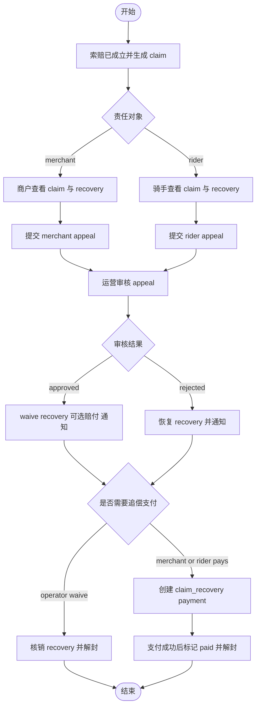

# 索赔、申诉与追偿真实流程

## 范围

本文件只依据这些实现文件：

- locallife/api/server.go
- locallife/api/appeal.go
- locallife/api/claim_recovery.go
- locallife/logic/claim_recovery.go
- locallife/logic/claim_recovery_payment.go
- locallife/worker/task_process_appeal_result.go

## 1. 真实入口

从路由注册可以确认，售后相关能力分布在三组角色入口：

1. `/v1/merchant/claims` 和 `/v1/merchant/appeals`
2. `/v1/rider/claims` 和 `/v1/rider/appeals`
3. `/v1/operator/appeals` 和 `/v1/operator/claims/:id/recovery/waive`

这意味着索赔、申诉、追偿在实现上是按角色分视图，而不是统一单表接口。

## 2. 追偿单查看权限

`logic/claim_recovery.go` 里有三套读取逻辑：

1. `GetClaimRecoveryForMerchant`
2. `GetClaimRecoveryForRider`
3. `GetClaimRecoveryForOperator`

它们的权限边界不同：

1. 商户必须是该 claim 的 `merchant_id`。
2. 骑手必须是该 claim 的 `rider_id`。
3. 运营商必须管理该 claim 所在的 `region_id`。

因此 recovery 不是只按 recovery 自身字段鉴权，而是要先回到 claim 上确认归属。

## 3. 商户与骑手申诉入口

### 3.1 商户申诉

`createMerchantAppeal` 的真实流程：

1. 当前用户先映射成商户。
2. 调 `logic.CreateMerchantAppeal`。
3. 传入 `merchant_id`、`claim_id`、`reason`、`AppealWindowDays` 和当前时间。

这说明商户申诉的资格、窗口期和 claim 状态校验都在 logic 层完成，而不是 handler 自己拼规则。

### 3.2 骑手申诉

`createRiderAppeal` 的真实流程：

1. 当前用户先映射成骑手。
2. 调 `logic.CreateRiderAppeal`。
3. 同样传入 claim、reason、窗口期与当前时间。
4. 如果 logic 返回 `AlreadyExists`，接口会直接返回 200 而不是重复创建。

这说明骑手申诉在实现上显式做了“重复申诉幂等返回”。

## 4. 运营审核申诉真实流程

`reviewAppeal` 是整个申诉链路的关键切点，真实行为如下：

1. 当前用户必须能映射成运营商。
2. 先直接读取 `appeal` 记录。
3. appeal 所属 `region_id` 必须与运营商区域一致。
4. 只有 `pending` 状态 appeal 可以审核。
5. 如果审核结果是 `approved` 且带 `compensation_amount > 0`，系统要求 `paymentClient` 已可用。
6. 审核动作通过 `ReviewAppealWithCompensationTx` 一次性写入：
   - appeal 审核结果
   - review notes
   - reviewer_id
   - 可选补偿动作
7. 随后组装 `ProcessAppealResultPayload`，交给异步任务或本地 inline 处理。

真实结论：审核不是“改 appeal 一张表”，而是“审核 + 可选补偿动作 + 后续异步收口”的组合事务。

## 5. 审核后的后置处理

`reviewAppeal` 在事务成功后会调用 `ProcessAppealResult` 任务，若任务分发不可用则走 inline 版本。

inline 逻辑可以确认两条真实分支：

1. `approved`：
   - 先执行 `waiveClaimRecoveryInline`
   - 如果有补偿动作，则执行 `ExecuteClaimPayoutAction`
   - 给申诉方和索赔方分别发通知
2. `rejected`：
   - 执行 `resumeClaimRecoveryInline`
   - 继续发通知

这说明审核结果会直接改变 recovery 的去向，而不是 appeal 独立闭环。

## 6. 追偿支付真实流程

`logic/claim_recovery_payment.go` 显示商户与骑手追偿支付共用同一套内部实现。

### 6.1 商户追偿支付

`CreateMerchantClaimRecoveryPayment` 的前置条件：

1. claim 必须存在且可用于申诉/追偿。
2. claim 的 `merchant_id` 必须属于当前商户。
3. recovery 必须存在。
4. recovery 的 `recovery_target` 必须是 `merchant`。

### 6.2 骑手追偿支付

`CreateRiderClaimRecoveryPayment` 的前置条件：

1. claim 必须存在。
2. claim 的 `rider_id` 必须属于当前骑手。
3. recovery 必须存在。
4. recovery 的 `recovery_target` 必须是 `rider`。

### 6.3 共用内部支付逻辑

`createClaimRecoveryPayment` 的真实行为：

1. 必须已配置直连支付 client。
2. recovery 状态只能是 `pending` 或 `overdue`。
3. 如果 recovery 已经 `paid`，直接拒绝。
4. 先把 `claim_id/recovery_id/recovery_target` 编码进 `attach`。
5. 用 `business_type = claim_recovery + attach` 查找已有支付单。
6. 若已有 `pending/paid` 支付单且付款人相同，则直接复用并重新生成 `pay_params`。
7. 若无现有支付单，则创建新的直连 `payment_order`。
8. 调用 `CreateJSAPIOrder` 获取 `prepay_id`。
9. 写回 `prepay_id`，供后续重复拉起支付复用。

真实结论：追偿支付已经具备“同一 recovery 支付单复用”机制，不会每次都新建支付单。

## 7. 追偿单支付成功或核销后的解封逻辑

`logic/claim_recovery.go` 明确了 recovery 状态变化和风控恢复的真实关系。

### 7.1 商户支付成功

`PayMerchantClaimRecovery` 会：

1. 再次校验 claim 归属与 recovery target。
2. 调 `MarkClaimRecoveryPaid`。
3. 调 `UnsuspendMerchantTakeout`。

也就是说，商户追偿支付成功后恢复的是商户外卖能力。

### 7.2 骑手支付成功

`PayRiderClaimRecovery` 会：

1. 再次校验 claim 归属与 recovery target。
2. 调 `MarkClaimRecoveryPaid`。
3. 调 `UnsuspendRider`。

也就是说，骑手追偿支付成功后恢复的是骑手接单能力。

### 7.3 运营核销

`WaiveClaimRecovery` 的真实行为：

1. 校验 claim 所属区域。
2. 调 `MarkClaimRecoveryWaived`。
3. 若 target 是 `merchant`，通过 order 找回 merchant 并执行 `UnsuspendMerchantTakeout`。
4. 若 target 是 `rider`，通过 delivery 找回 rider 并执行 `UnsuspendRider`。

真实结论：支付成功和运营核销都会解除限制，只是状态分别变成 `paid` 或 `waived`。

## 8. 当前可以确认的实现边界

1. 申诉创建、列表、详情是角色分离的。
2. 审核权限严格绑定运营商区域。
3. appeal 审核结果会改变 recovery，而不是单纯改变 appeal。
4. 追偿支付走直连支付，并且按 recovery attach 做幂等复用。
5. 商户和骑手的“恢复资格”分别绑定外卖能力和接单能力。