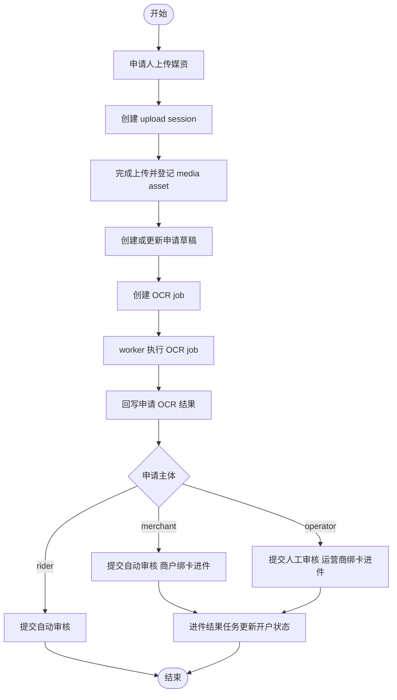

# 入驻、媒资与 OCR 真实流程

## 范围

本文件只依据这些实现文件：

- locallife/api/server.go
- locallife/api/media.go
- locallife/api/ocr.go
- locallife/api/merchant_application.go
- locallife/api/operator_application.go
- locallife/api/rider_application.go
- locallife/api/ecommerce_applyment.go
- locallife/worker/task_merchant_application_ocr.go
- locallife/worker/task_process_payment.go

## 1. 媒资上传真实流程

`api/media.go` 展示的不是简单文件上传，而是“上传会话 + 完成确认”的双阶段流程。

### 1.1 创建上传会话

`createMediaUploadSession` 会：

1. 校验 `business_type/media_category/content_type/content_length/checksum_sha256`。
2. 从当前用户拿 `user_id`。
3. 读取 `X-Source-Client`。
4. 调 `mediaRegistry.CreateUploadSession`，传入类别、文件大小、校验和、过期时间和最大字节数。

也就是说，上传前就已经把业务类型、媒资类别和内容长度纳入约束。

### 1.2 完成上传

`completeMediaUpload` 会：

1. 校验 `upload_id/object_key/etag`。
2. 调 `mediaRegistry.CompleteUpload`，同时带当前 `user_id`。
3. 对找不到会话、会话过期、越权、对象未上传等情况分别返回不同错误。
4. 上传成功后触发媒体审核。
5. 返回 `media_id`、可公开访问的变体 URL 和审核状态。

真实结论：媒资落库并不是在“开始上传”阶段完成，而是在“完成上传确认”阶段才登记为正式资产。

### 1.3 私有访问与删除

`getMediaPrivateAccess` 和 `deleteMediaAsset` 的实现说明：

1. 私有资产默认只允许上传者访问。
2. 身份证正反面这类 owner-only 私有资产，即使是私有资产，也不允许普通他人越权访问。
3. 管理员可访问非 owner-only 的私有资产。
4. 删除走软删除，而不是直接物理删对象。

## 2. 统一 OCR 作业真实流程

`createOCRJob` 给出了统一 OCR 的真实工作方式。

### 2.1 创建 OCR 作业

创建 OCR job 时会做这些校验：

1. `document_type` 必须是受支持类型。
2. `owner_type` 必须是受支持主体。
3. `side` 必须规范化后才能使用。
4. `owner_type + owner_id + user_id` 需要通过所有权校验；如果不是 owner，则必须是 OCR 管理员。
5. 若没有显式 `idempotency_key`，系统会自动按 `media_asset + document_type + owner_type + owner_id + side` 生成。
6. 根据证件类型生成默认数据保留截止时间。
7. 调 `UpsertOCRJob`，说明 OCR job 创建本身已经是幂等 upsert。
8. 创建成功后立刻入队 worker。

真实结论：OCR 在实现上已经收口成统一 job 系统，不再是各申请模块各写一套直连 OCR 调用。

### 2.2 Worker 执行与回写

`worker/task_merchant_application_ocr.go` 显示商户申请 OCR 的执行模式：

1. worker 取到 `application_id/media_asset_id/ocr_job_id`。
2. 必须通过 `ocrService.ExecuteJob` 执行统一 job。
3. job 失败时：
   - 发送 OCR 失败告警
   - 把 `status/error/error_code/alert_emitted_at` 写回申请 OCR 字段
4. job 成功时：
   - 反序列化 `normalized_result`
   - 解析营业执照、食品许可证、身份证等结构化字段
   - 回写到申请表 OCR 字段与部分标准字段

这说明申请表上的 OCR 结果只是统一 OCR job 的投影，不是单独的识别事实源。

## 3. 商户申请真实流程

### 3.1 草稿与更新

`merchant_application.go` 可以确认商户申请流程包含：

1. 获取或创建草稿。
2. 更新基础信息。
3. 更新图片资料。
4. 解析并展示 OCR 结果。

一个关键实现特征是：申请响应里会同时带申请字段、媒资资产 ID 和 OCR 结果 JSON。

### 3.2 提交申请

`submitMerchantApplication` 是真实提交入口。虽然自动审核细则分散在函数内部，但从入口和后续绑卡流程可以确认：

1. 商户申请先沉淀成结构化申请记录。
2. 审核通过后，商户主体才进入绑卡进件流程。
3. 绑卡时使用的身份证、营业执照、门店资料来自申请记录和对应 OCR/媒体字段，而不是运行时重新上传。

## 4. 运营商申请真实流程

`operator_application.go` 的实现和商户不同，体现出 3 个真实差异：

1. 创建草稿时必须先选区域。
2. 草稿创建前会检查：
   - 用户是否已有运营商申请
   - 用户是否已经是正式运营商
   - 区域是否已有运营商
   - 区域是否已有待审核申请
3. 已批准申请和待审核申请都不能再次新建。

真实结论：运营商申请是“区域独占 + 单人单申请”的模型，不同于商户和骑手。

### 4.1 提交申请

`submitOperatorApplication` 是独立入口，说明运营商申请并不走商户那套自动审核提交逻辑，而是单独的审核链路。

### 4.2 运营商绑卡进件

`operatorBindBank` 的真实行为：

1. 当前用户必须已经映射成正式运营商。
2. 运营商状态只能是 `active` 或 `bindbank_submitted`。
3. 进件资料来源是“已审核通过的运营商申请”。
4. 会先创建本地 `ecommerce_applyment` 记录并加密敏感信息。
5. 未配置微信客户端时只保留本地状态。
6. 已配置时才继续提交微信收付通进件。

## 5. 骑手申请真实流程

`rider_application.go` 的实现相对直接，真实链路如下：

1. 获取或创建骑手申请草稿。
2. 只有 `draft` 才能更新基础信息。
3. 提交前必须具备：
   - 真实姓名
   - 手机号
   - 身份证正面媒资
   - 身份证背面媒资
   - 健康证媒资
4. 提交时会执行自动审核。

因此骑手申请的真实模型是“草稿 -> 自动审核”，没有运营商那种区域独占和人工审核入口。

## 6. 商户/运营商绑卡进件真实差异

`ecommerce_applyment.go` 可以确认两者共享这些核心模式：

1. 都先检查主体状态是否允许绑卡。
2. 都先检查是否已有进行中的进件申请。
3. 都从申请资料中提取身份证、营业执照、OCR 结果和媒体 URL。
4. 都会对身份证号、银行卡号等敏感字段先本地加密再存库。
5. 都先创建本地 `ecommerce_applyment` 记录。
6. 若支付客户端缺失，就只保留本地提交状态。

差异点在于资料来源：

1. 商户绑卡读取当前用户的商户申请。
2. 运营商绑卡读取已审核通过的运营商申请。

## 7. 进件结果收口

`ProcessTaskApplymentResult` 存在于 worker 层，说明“微信返回进件状态 -> 本地主体状态变更”是异步任务处理，而不是在 API 调用处同步完成。

这意味着申请、绑卡、进件结果之间至少分成三段：

1. 申请资料阶段。
2. 绑卡提交阶段。
3. 进件结果异步落地阶段。

## 8. 当前可以确认的实现结论

1. 媒资采用会话式直传，不是简单 multipart 直写数据库。
2. OCR 已统一成 job 系统，申请表只是结果承载体。
3. 商户申请与骑手申请偏自动审核，运营商申请偏区域独占和人工审核。
4. 绑卡进件先落本地记录，再决定是否提交微信。
5. 敏感字段在本地入库前已经加密。