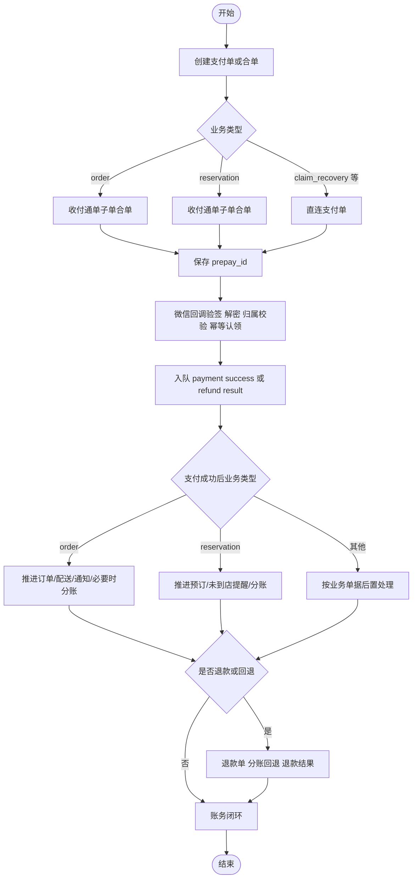

# 支付、结算与补偿真实流程

## 范围

本文件只依据这些实现文件：

- locallife/api/server.go
- locallife/api/payment_order.go
- locallife/api/payment_callback.go
- locallife/logic/payment_order_service.go
- locallife/worker/task_process_payment.go
- locallife/api/ecommerce_applyment.go

## 1. 支付入口的真实分层

支付相关实现实际上分成三层：

1. `api/payment_order.go`：接请求、做兼容归一化、调 facade。
2. `logic/payment_order_service.go`：决定创建直连支付单还是收付通合单。
3. `worker/task_process_payment.go`：在回调之后推进业务状态、退款、分账和进件结果。

这意味着“创建支付单”和“支付成功后业务推进”不是一个模块完成，而是 API + logic + worker 的跨层协作。

## 2. 支付单创建真实行为

### 2.1 API 层归一化

`createPaymentOrder` 有两个真实特征：

1. 会把旧客户端传入的 `payment_type` 统一归一化为 `miniprogram`。
2. 创建成功后会立即为支付单安排超时任务。

因此，客户端字段不再直接决定底层支付物理链路，真实链路由 logic 层的 `business_type` 决定。

### 2.2 `order` 支付

`PaymentOrderService.CreatePaymentOrder` 对 `business_type == order` 的真实行为：

1. 订单必须属于当前用户。
2. 订单状态必须是 `pending`。
3. 如果已存在 `pending` 支付单，会直接复用该支付单；若已有 `prepay_id`，会重新签名返回 `pay_params`。
4. 新建时走 `createOrderEcommercePayment`。
5. `createOrderEcommercePayment` 不创建单笔直连支付，而是：
   - 生成 `combine_out_trade_no`。
   - 执行 `CreateCombinedPaymentTx`。
   - 调用收付通 `CreateCombineOrder`。
   - 把 `prepay_id` 同时写回子支付单与合单主记录。

真实结论：订单主支付当前走的是“单子单的收付通合单支付”，而不是历史上可能存在的直连单笔支付。

### 2.3 `reservation` 支付

`business_type == reservation` 的真实行为也走收付通：

1. 预订必须属于当前用户。
2. 预订状态必须是 `pending`。
3. `deposit` 模式取 `deposit_amount`，否则取 `prepaid_amount`。
4. 调用 `createReservationEcommercePayment`。
5. 内部执行 `CreateEcommercePaymentTx` + `CreateCombineOrder`。

真实结论：预订主支付同样不是单笔直连支付，而是单子单合单支付。

### 2.4 追偿支付

`logic/claim_recovery_payment.go` 表明追偿支付仍走直连 `JSAPIOrder`：

1. 商户/骑手各自只能为属于自己的追偿单发起支付。
2. 追偿单状态只能是 `pending` 或 `overdue`。
3. 若存在同一 `attach` 的 `pending/paid` 支付单，会直接复用。
4. 新建支付单时使用 `business_type = claim_recovery`。
5. 随后调用直连 `CreateJSAPIOrder`，并写回 `prepay_id`。

真实结论：同一个项目里并存两条支付物理链路：

1. 订单/预订主支付走收付通合单。
2. 追偿、押金等非商户订单支付继续走直连。

## 3. 回调入口的真实安全门槛

`api/payment_callback.go` 给出了回调真正会做的 5 层收口：

1. 限制 webhook body 大小。
2. 校验微信签名。
3. 解密回调报文。
4. 做支付归属校验：
   - 直连支付校验 `mchid/appid`。
   - 合单支付校验 `combine_mchid/combine_appid`。
   - 收付通退款校验 `sp_mchid`。
   - 分账通知校验服务商 `mchid` 和商户 `sub_mchid`。
5. 通过 `TryClaimWechatNotification` 原子认领通知，避免并发重复处理。

如果通知已被占用，还会进一步区分：

1. 已处理完成：直接返回成功。
2. 占位过久未完成：释放占位并返回失败，等待微信重试。
3. 正在处理中：返回失败，维持占位。

这说明支付回调的真实幂等策略不是简单查状态，而是基于通知表做 claim/release 协调。

## 4. 支付成功后的真实后置处理

`worker.ProcessTaskPaymentSuccess` 是支付与业务状态真正衔接的位置。

执行逻辑：

1. 根据 `payment_order_id` 调 `ProcessPaymentSuccessTx`。
2. 若该支付单已处理过或不满足推进条件，则直接跳过。
3. 对 `business_type == order`：
   - 向商户发送新订单通知。
   - 如果已有 `delivery/pool_item`，则向骑手广播新配送单。
   - 若支付类型为 `profit_sharing` 且订单不是 `takeout`，立即入队分账。
4. 对 `business_type == reservation` 或 `reservation_addon`：
   - 入队分账任务。
   - 读取预订时间并调度未到店提醒任务。

一个关键实现细节是：`takeout` 支付成功后不会立即触发分账，而是等待后续结算条件。

## 5. 退款真实处理路径

`worker/task_process_payment.go` 中退款链路的真实行为是：

1. 先找已有 `refund_order`，若已经成功或处理中则直接短路。
2. 若不存在，通过 `CreateRefundOrderTx` 原子创建退款单并做累计退款校验。
3. 若原支付单是 `profit_sharing`：
   - 先处理平台、运营商、骑手三类分账回退。
   - 回退状态可能是 `success/processing/failed`。
   - 若 `processing`，会继续入队分账回退结果任务。
4. 之后再根据支付渠道调用：
   - 收付通 `CreateEcommerceRefund`。
   - 直连 `CreateRefund`。
5. 根据微信返回把退款单置为 `success/processing/failed`。

真实结论：对收付通订单，退款并不是单步动作，而是“分账回退 + 退款请求”两段式处理。

## 6. 退款结果任务

`ProcessTaskRefundResult` 会：

1. 用 `out_refund_no` 找本地退款单。
2. 对重复成功/失败/关闭结果做幂等跳过。
3. 根据退款结果继续更新 `refund_order` 与相关业务单据。
4. 如果该支付单对应押金等特殊业务，还会走专门落账服务。

这说明退款结果不是只改退款表，还承担业务状态闭环职责。

## 7. 分账与分账回退真实位置

`worker/task_process_payment.go` 内部实现了 3 类异步财务任务：

1. `ProcessTaskProfitSharing`：发起分账。
2. `ProcessTaskProfitSharingResult`：处理分账结果。
3. `ProcessTaskProfitSharingReturnResult`：处理分账回退结果。

这些任务由支付成功、退款或恢复任务入队，说明分账并不和支付成功同步完成，而是单独的异步状态机。

## 8. 进件绑卡与进件结果

### 8.1 商户绑卡进件

`merchantBindBank` 的真实行为：

1. 当前用户必须是商户 owner。
2. 商户状态只能是 `approved` 或 `pending_bindbank`。
3. 若已有进行中的收付通进件申请，则拒绝重复提交。
4. 从已保存的商户申请中读取营业执照、身份证、OCR 结果与媒体资源。
5. 本地先创建 `ecommerce_applyment` 记录，并加密身份证号、账户号等敏感信息。
6. 若未配置收付通客户端，只更新本地状态，不提交微信。
7. 若已配置客户端，则继续下载证件对象、换取微信可用材料并提交进件。

### 8.2 运营商绑卡进件

`operatorBindBank` 的真实行为与商户相同，但约束对象变成运营商：

1. 当前用户必须已绑定运营商。
2. 运营商状态只能是 `active` 或 `bindbank_submitted`。
3. 申请资料来自“已审核通过”的运营商申请记录。
4. 同样先本地落 `ecommerce_applyment`，再决定是否提交微信。

### 8.3 进件结果任务

`ProcessTaskApplymentResult` 说明进件结果不是在回调 handler 里直接改业务对象，而是交给 worker 异步处理。也就是说，商户/运营商“已绑卡、已开通”的最终状态收口在任务处理阶段。

## 9. 当前可以确定的实现结论

1. 订单主支付和预订主支付都已统一到收付通合单支付。
2. 追偿等非商户订单支付仍保留直连 JSAPI 支付。
3. 回调处理已不是简单幂等查单，而是带通知认领表的 claim/release 机制。
4. 支付成功、退款、分账、进件结果都依赖 worker 异步后置，而不是在 webhook 同步完成。
5. 收付通退款前会尝试回退分账，退款与分账回退是强关联链路。