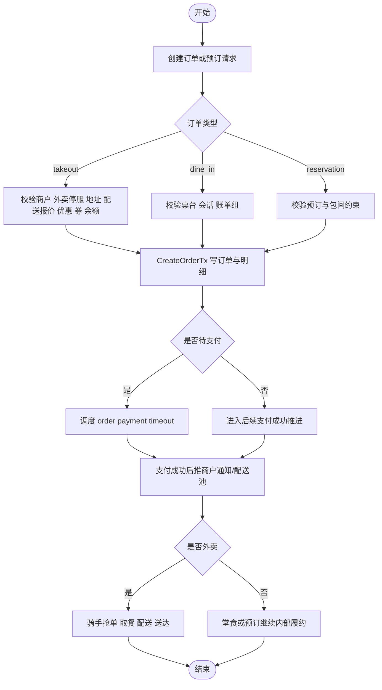

# 交易与履约真实流程

## 范围

本文件只依据这些实现文件：

- locallife/api/server.go
- locallife/api/order.go
- locallife/api/table_reservation.go
- locallife/logic/order_service.go
- locallife/logic/order_post.go
- locallife/logic/reservation.go
- locallife/logic/delivery_grab.go
- locallife/logic/delivery_status.go
- locallife/worker/task_process_payment.go

## 1. 真实入口

从路由注册看，交易与履约主入口分成 5 组：

1. `/v1/orders`：用户创建、查询、取消订单。
2. `/v1/merchant/orders`：商户接单、拒单、出餐、完成订单。
3. `/v1/kitchen/orders`：后厨开始制作、标记 ready。
4. `/v1/delivery`：骑手抢单、开始取餐、确认取餐、开始配送、确认送达。
5. `/v1/reservations`：用户/商户预订、签到、加菜、改菜、取消、确认、完结。

这说明“交易”在实现上不是单一订单流，而是订单、预订、配送三条状态机拼接出来的闭环。

## 2. 订单创建主链路

`logic.OrderService.CreateOrder` 的真实执行顺序如下：

1. 先做创建参数校验，拒绝非法 `order_type`、空商品等输入。
2. 加载商户并校验商户是否允许接单。
3. 如果是 `takeout`，先检查商户是否被暂停外卖接单。
4. 执行规则引擎判断；堂食与预订会继续校验会话或账单组。
5. `dine_in` 且带 `table_id` 时，会校验桌台归属。
6. `dine_in` 与 `reservation` 会进入 `ValidateOrderSessionAndBilling`，把桌台、会话、账单组关系校正为可下单状态。
7. 如果是预订点菜且预订支付模式为 `deposit`，会先检查该预订是否已有未取消且未被替换的活跃订单，避免重复占用定金。
8. 计算订单明细价格，处理定制项标准化。
9. `takeout` 会加载地址，并通过配送报价逻辑计算距离、时长、配送费和配送费优惠。
10. 计算商户活动优惠、券抵扣、预订定金抵扣、会员余额抵扣。
11. 生成订单号并调用 `CreateOrderTx` 一次性写入订单、明细、券和余额扣减结果。
12. 如果订单仍是 `pending`，调度 30 分钟后的 `order payment timeout`。
13. `dine_in` 会把新订单绑定为 `dining_session.active_order_id`。
14. `dine_in` 与 `reservation` 创建完成后会清空对应购物车。

这意味着订单创建阶段已经把价格、配送、券、余额、预订抵扣、桌台会话等前置约束收口进同一事务入口。

## 3. 订单类型差异

### 3.1 外卖 `takeout`

外卖订单在创建阶段比其他类型多出 4 个强约束：

1. 商户不能处于外卖停服状态。
2. 必须有地址且地址可被加载。
3. 必须能计算配送报价。
4. 在未启用规则引擎时，还会检查用户是否在外卖限制名单中。

支付成功后，外卖不会直接完结，而是推进到配送池和骑手履约流。

### 3.2 堂食 `dine_in`

堂食订单会耦合桌台、会话和账单组：

1. 允许通过桌台和账单组落到已有会话。
2. 创建成功后把订单绑定到当前堂食会话。
3. 创建后清空堂食购物车。
4. 如果规则引擎返回 `alert`，还会给商户推送风险提示。

### 3.3 预订点菜 `reservation`

预订型订单并不是独立模型，而是“已存在预订 + 订单”的组合：

1. 创建时必须先通过预订/账单校验。
2. `deposit` 模式下会把预订定金作为 `deposit_deduction` 参与总额计算。
3. 该模式下同一预订只能挂一个活跃订单。
4. 创建后同样会清空对应预订购物车。

## 4. 支付成功后的交易推进

`worker.ProcessTaskPaymentSuccess` 是订单进入履约流的真实切点。

它在成功执行 `ProcessPaymentSuccessTx` 后，会按业务类型分叉：

1. 订单支付成功：
   - 通知商户有新订单。
   - 如果生成了 `delivery` 和 `delivery_pool`，则向骑手广播新单。
   - 如果支付类型是 `profit_sharing` 且不是外卖，会立即入队分账任务。
2. 预订支付成功：
   - 入队分账任务。
   - 根据预订时间创建未到店提醒任务。

这里可以确认，订单创建和支付成功推进是两个不同事务边界，中间依赖异步任务衔接。

## 5. 骑手履约状态机

`logic/delivery_grab.go` 和 `logic/delivery_status.go` 给出了外卖履约的真实状态门槛。

### 5.1 抢单

`GrabDeliveryOrder` 的前置条件：

1. 当前用户必须能映射成骑手。
2. 骑手必须在线。
3. 骑手不能处于暂停接单状态。
4. 骑手必须已绑定服务区域。
5. 订单必须仍在 `delivery_pool` 且未过期。
6. 高值单会检查骑手积分门槛。
7. 商户区域必须与骑手区域一致。
8. 若配置了距离限制，骑手和商户距离不能超阈值。
9. 订单必须已有配送单。
10. 订单状态必须允许执行 `grab`。
11. 若本单需要冻结押金，则骑手可用押金必须足够。

满足后会执行 `GrabOrderTx`，并把订单状态推到 `courier_accepted`。

### 5.2 开始取餐

`StartPickup` 的前置条件：

1. 骑手必须是该配送单绑定骑手。
2. 配送单状态必须是 `assigned`。
3. 订单状态必须允许 `start_pickup`。

成功后执行 `UpdateDeliveryToPickupTx`。

### 5.3 确认取餐

`ConfirmPickup` 的前置条件：

1. 配送单状态必须是 `picking`。
2. 骑手归属校验通过。
3. 订单状态必须允许 `confirm_pickup`。

成功后执行 `UpdateDeliveryToPickedTx`，并将订单状态记为 `picked`。

### 5.4 开始配送

`StartDelivery` 的前置条件：

1. 配送单状态必须是 `picked`。
2. 骑手归属校验通过。

成功后执行 `UpdateDeliveryToDeliveringTx`，并将订单状态记为 `delivering`。

### 5.5 确认送达

`ConfirmDelivery` 的前置条件：

1. 配送单状态必须是 `delivering`。
2. 骑手归属校验通过。
3. 如果设置了送达半径，需要用骑手当前位置与收货坐标做距离校验。

成功后会执行 `CompleteDeliveryTx`：

1. 完结配送单。
2. 将订单推进到 `rider_delivered`。
3. 解冻本单对应的骑手押金。
4. 记录订单状态日志。

## 6. 预订状态机

### 6.1 用户创建预订

`logic.CreateReservation` 的真实前置条件：

1. `payment_mode` 只能是 `deposit` 或 `full`。
2. 预订时间必须晚于当前时间。
3. 桌台必须存在，且 `table_type` 必须是 `room`。
4. 桌台不能是 `disabled`。
5. 就餐人数不能超过桌台容量。
6. 同一时间段不能与现有有效预订冲突。

金额规则：

1. `deposit` 模式优先用包间最低消费作为定金，否则使用默认定金额。
2. `full` 模式会校验预点菜品金额；若低于包间最低消费则直接拒绝。
3. 创建时会同时写入 `payment_deadline` 与 `refund_deadline`。

### 6.2 商户代客创建预订

`table_reservation.go` 通过 `logic.MerchantCreateReservation` 暴露了商户代客预订入口，说明预订并不只存在用户自助创建路径。

### 6.3 签到、加菜、改菜

从 `table_reservation.go` 的真实调用可以确认，预订后续还有三条已实现路径：

1. `logic.CheckInReservation`：用户或场景方签到。
2. `logic.AddReservationDishes`：对预订追加菜品。
3. `logic.ModifyReservationDishes`：修改预订菜品，并可能触发补款或退款。

这三条路径说明预订在实现上不是静态记录，而是带后续支付变更能力的业务对象。

## 7. 本文没有展开的部分

以下能力在代码中已能看到入口，但本轮没有继续下钻到每个函数体：

1. 商户接单、拒单、ready、complete 的全部细节。
2. 堂食换桌、关台、账单组合并/拆分的事务细节。
3. 预订取消、确认、完结、no-show 的每个状态更新分支。

如果继续拆，可以在本文件基础上再分成：

1. 订单创建与价格计算。
2. 预订与堂食会话。
3. 骑手配送状态机。