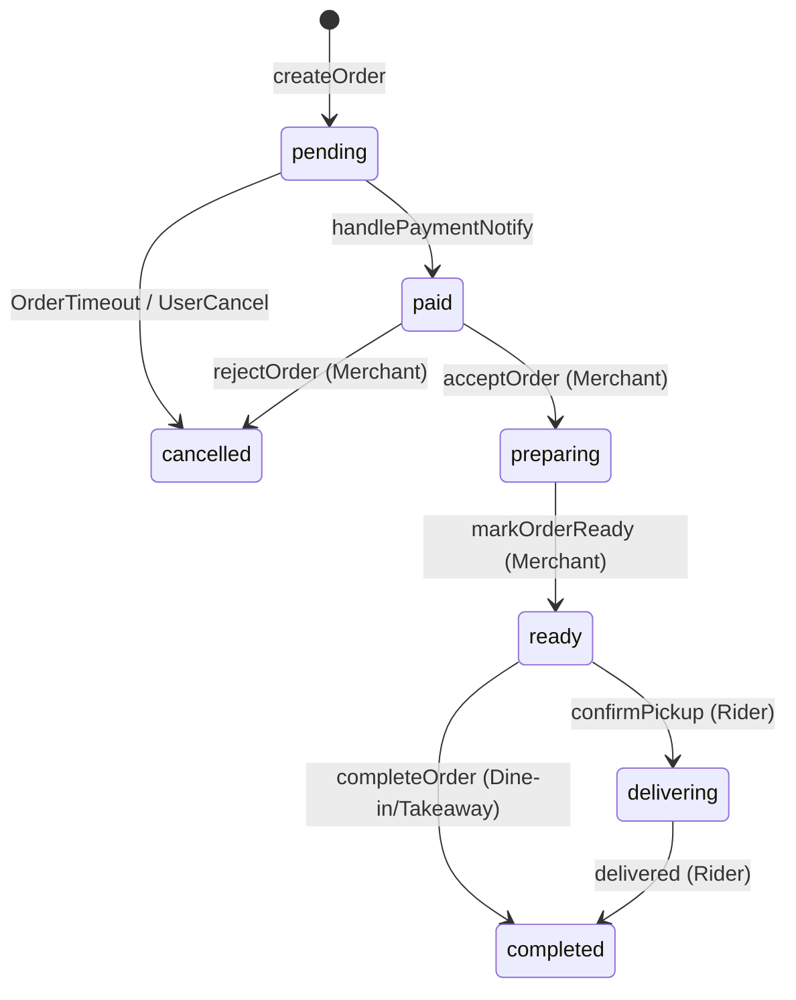
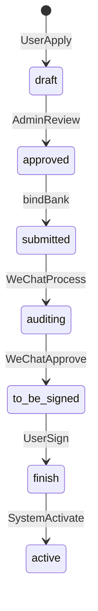
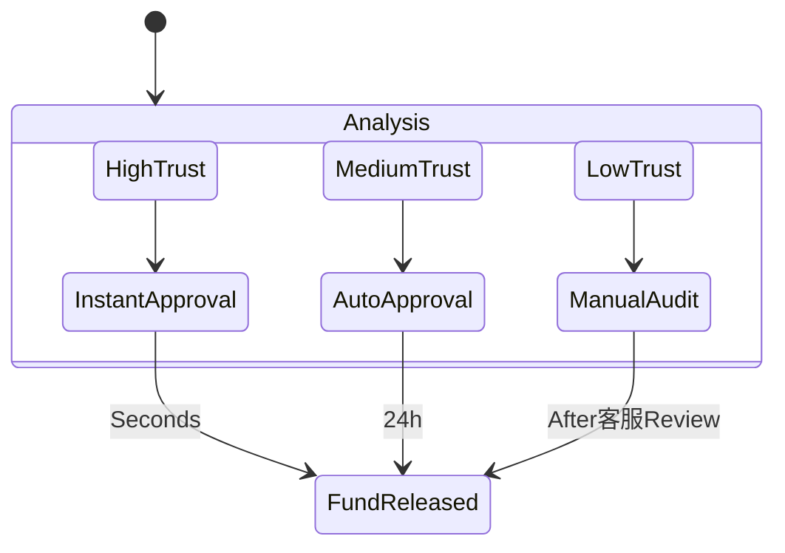

# LocalLife Business Flows (Implementation Truth)

Detailed state transitions as implemented in the Go API layer.

## 1. Core Order Transaction Flow

### Transition Logic Truth
- **Automatic Cancellation**: If `pending` isn't paid within 30 mins, a background task (`DistributeTaskOrderTimeout`) cancels it.
- **Merchant Responsibility**: Merchants move orders from `paid` to `ready`.
- **Rider Responsibility**: Riders move orders from `ready` (assigned) to `completed`.

---

## 2. Onboarding Lifecycle (WeChat V3)

---

## 3. Trust-Based Settlement Flow

