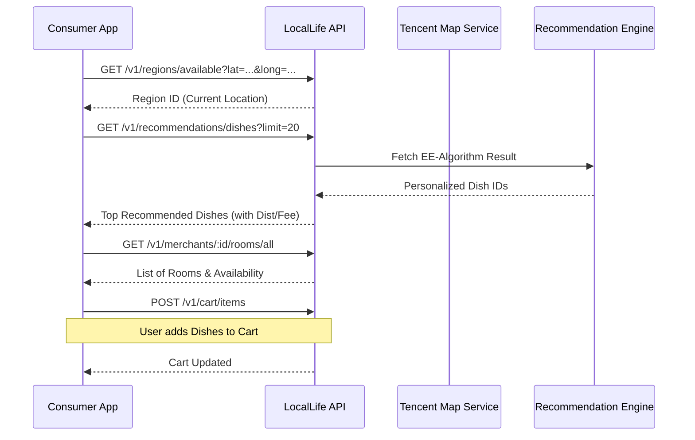
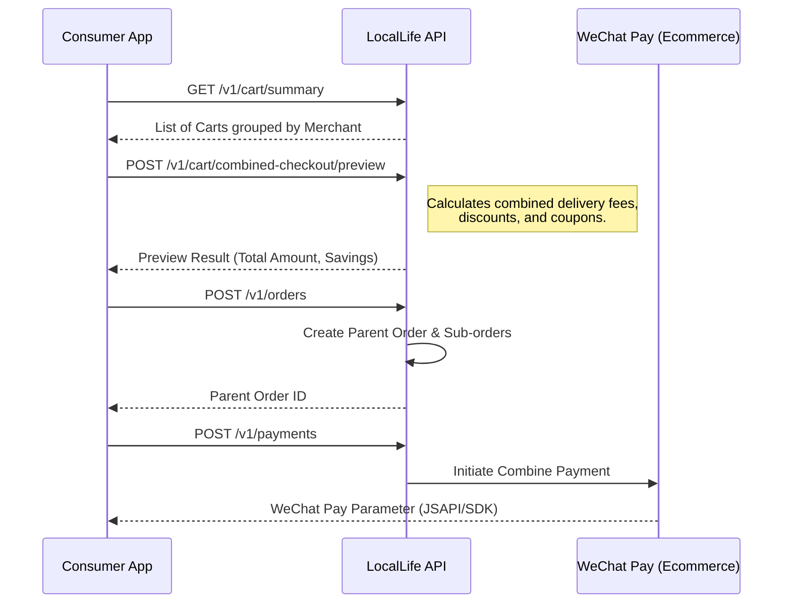
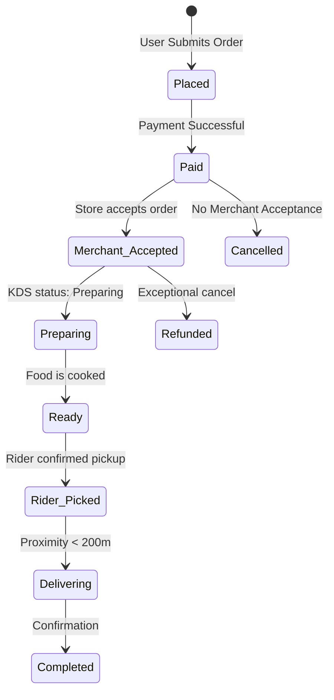

# Customer Order Life-cycle Flows

This document details the visual sequences for the most complex customer interactions. Technical endpoint details can be found in [customer_v1.json](../swagger/customer_v1.json).

## 1. Discovery to Cart Flow
The sequence from landing on the app to preparing a cart.

---

## 2. Combined Order Checkout (Multi-Merchant)
LocalLife supports multi-merchant combined checkout.

---

## 3. Order Tracking & Delivery Status
State transitions during the delivery process.

