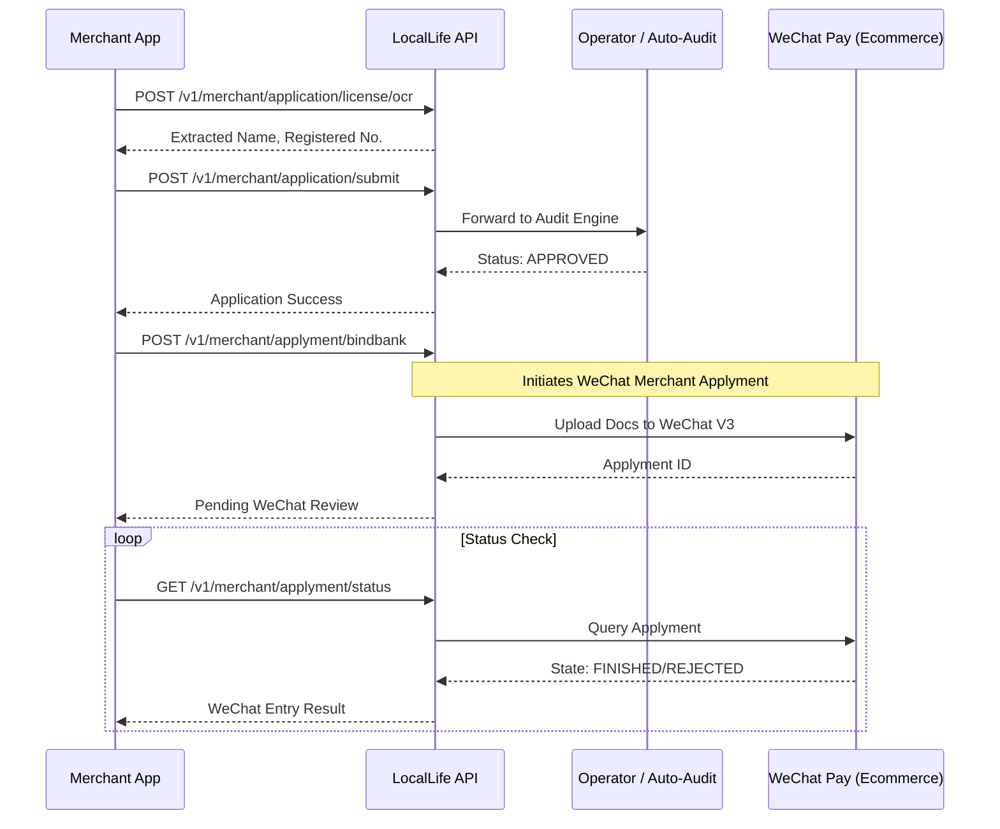
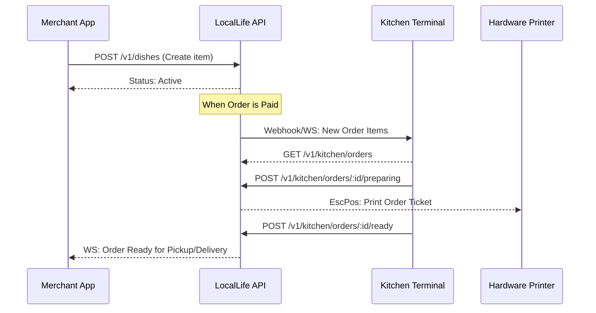
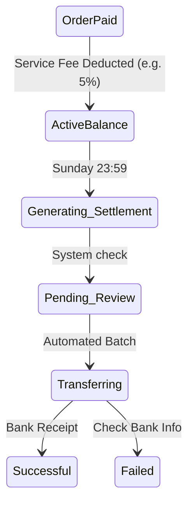

# Merchant Onboarding & Operations Flows

This document details the business and technical sequences for Merchant SaaS operations. Technical endpoint details can be found in [merchant_v1.json](../swagger/merchant_v1.json).

## 1. Merchant Onboarding (WeChat Ecommerce V3)
The complex multi-stage process from draft to active store.

---

## 2. Menu & Kitchen Operation (KDS)
Flow of items from management to kitchen display.

---

## 3. Financial Settlement
Weekly cycles and service fee deductions.

