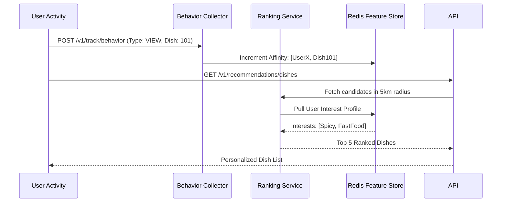

# Recommendation Engine Data Flows

How LocalLife leverages user behavior to drive conversion.

```mermaid
sequenceDiagram
    participant User as User Activity
    participant Collector as Behavior Collector
    participant Filter as Ranking Service
    participant Cache as Redis Feature Store

    User->>Collector: POST /v1/track/behavior (Type: VIEW, Dish: 101)
    Collector->>Cache: Increment Affinity: [UserX, Dish101]
    
    User->>API: GET /v1/recommendations/dishes
    API->>Filter: Fetch candidates in 5km radius
    Filter->>Cache: Pull User Interest Profile
    Cache-->>Filter: Interests: [Spicy, FastFood]
    Filter-->>API: Top 5 Ranked Dishes
    API-->>User: Personalized Dish List
```
