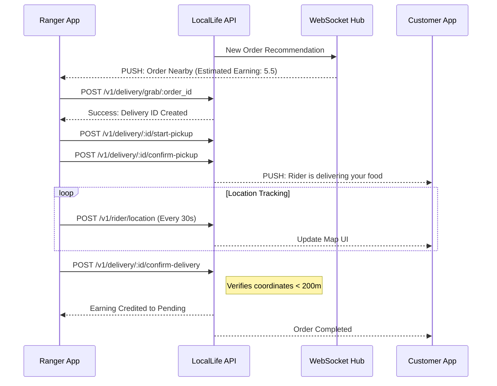
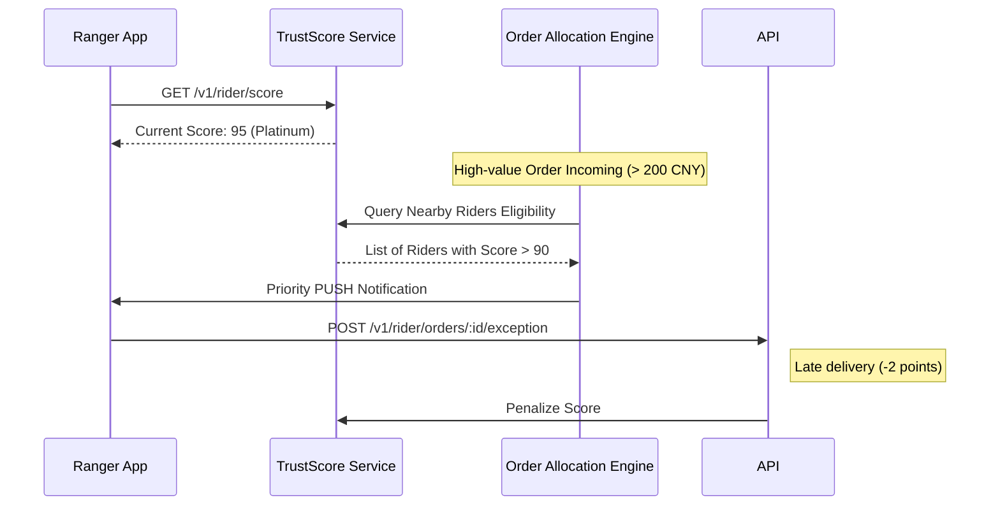
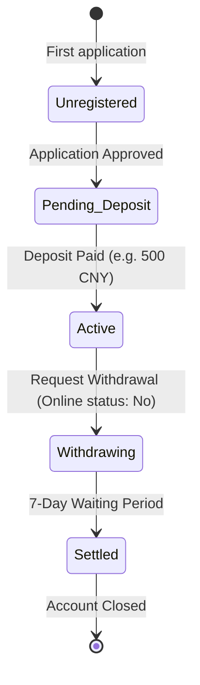

# Rider (Ranger) Delivery Lifecycle Flows

This document details the operational and financial sequences for Riders. Technical endpoint details can be found in [rider_v1.json](../swagger/rider_v1.json).

## 1. Delivery Execution Flow
The standard "Grab-to-Complete" cycle for a Rider.

---

## 2. Trust Score & Premium Order Eligibility
How riders unlock high-value orders through service quality.

---

## 3. Financials: Deposit & Withdrawal
Managing the mandatory safety deposit.

