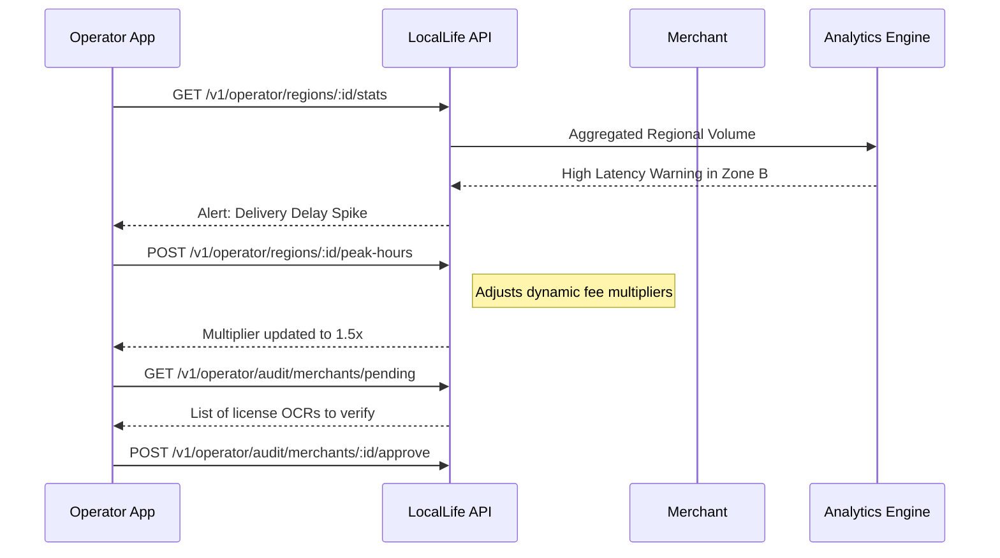
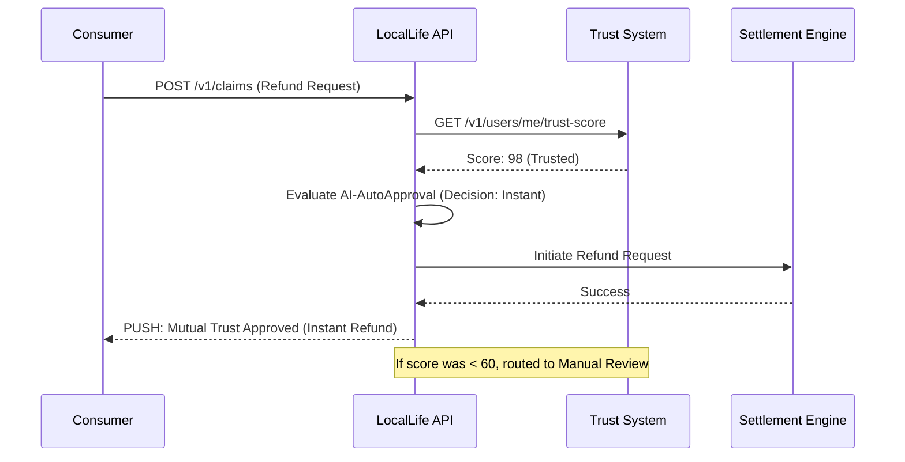
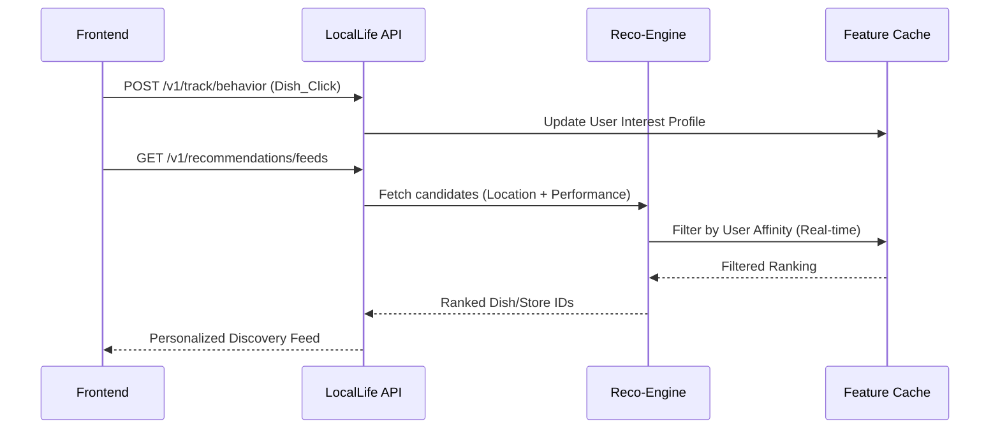

# Regional Oversight & Trust Governance Flows

This document details the platform-level governance and operational steering. Technical endpoint details can be found in [operator_v1.json](../swagger/operator_v1.json).

## 1. Regional Steering & Audit Flow
How operators manage their assigned territory.

---

## 2. Trust Score Arbitration & Auto-Claim
The logic behind the "Governance" role.

---

## 3. Recommendation Intelligence Flow
Data loop for the Personalized Feed.

