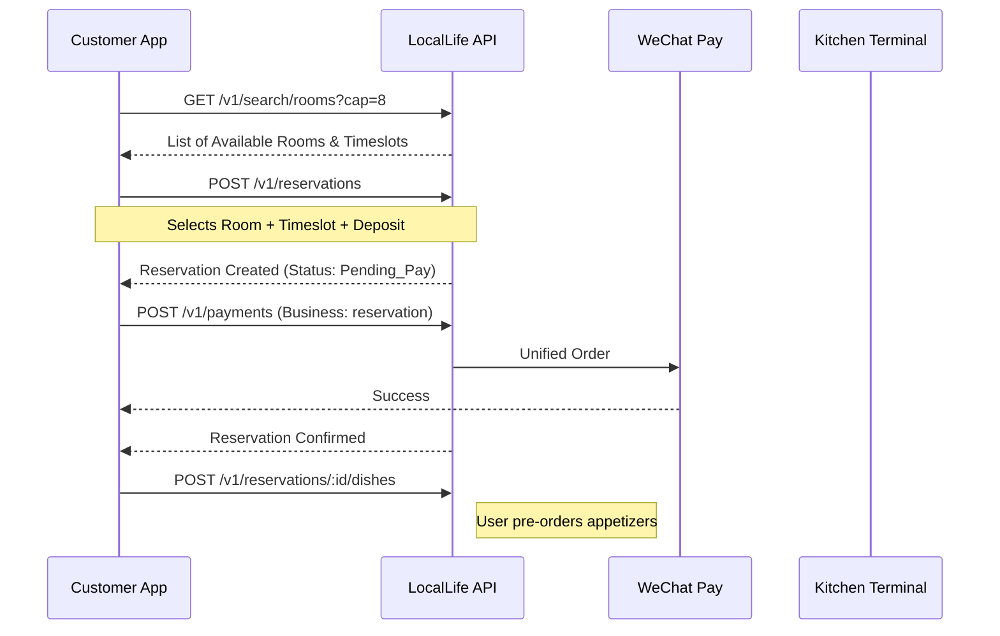
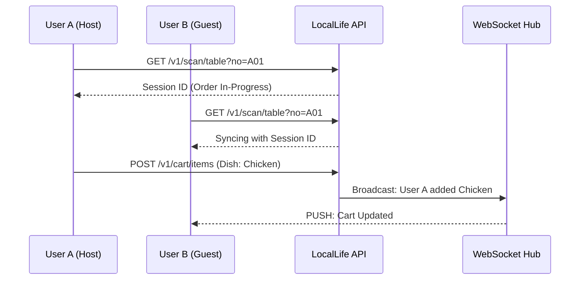

# In-Store Operations: Table & Room Reservation Flows

This document details the sequences for offline-to-online (O2O) in-store interactions. Technical endpoint details can be found in [instore_v1.json](../swagger/instore_v1.json).

## 1. Table/Room Reservation & Dish Pre-order
The flow for scheduling a meal and pre-selecting dishes.

---

## 2. QR Scanning & In-Store Joint Ordering
How multiple users join a single table's ordering session.

