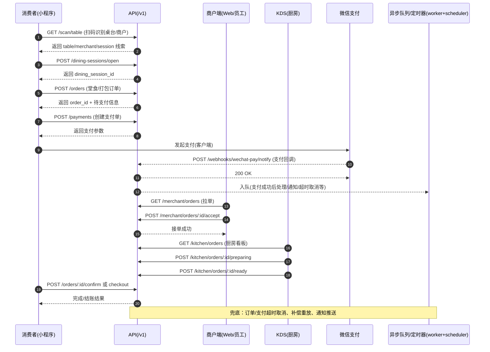
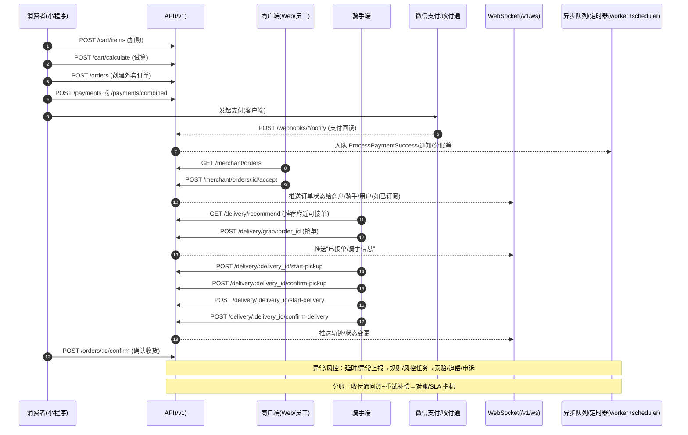
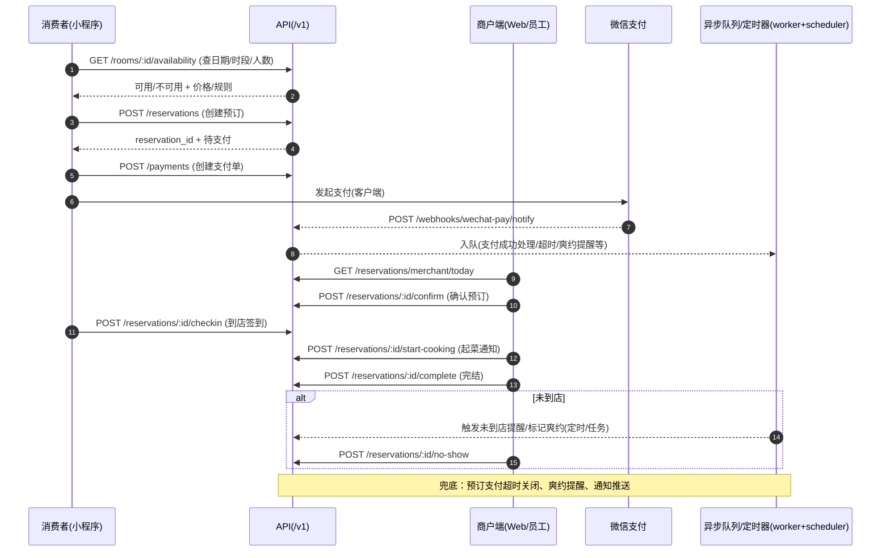
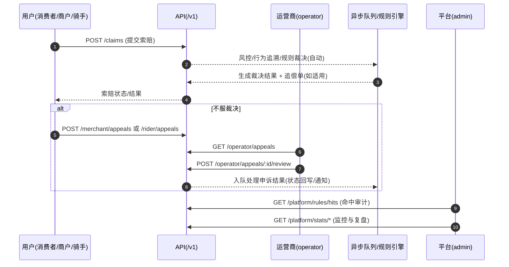

# 按角色用户旅程（Mermaid）

> 目的：用“角色泳道 + 关键 API/事件”把三条主线（堂食扫码点餐 / 外卖履约 / 包间预订）串成可讨论、可验收的端到端旅程。
> 
> 说明：下图以 `API /v1` 为后端入口，支付/分账/通知等通过 webhook + 异步任务（Asynq）补偿。

---

## 0. 总览：三条主线与共用底座

```mermaid
flowchart TB
  %% ===== 基础底座 =====
  subgraph 基础底座
    A[鉴权: /v1/auth/*] --> B[region_id 约束: /v1/regions* + /v1/location/*]
    B --> C[发现: /v1/search/* + /v1/public/*]
    C --> D[交易: cart/orders/reservations]
    D --> E[支付: /v1/payments + /v1/webhooks/*]
    E --> F[异步兜底: worker+scheduler
(支付/退款/分账/通知/超时/恢复)]
    F --> G[售后: /v1/claims + /appeals]
    F --> H[运营治理: /v1/operator/* + /v1/platform/*]
  end

  %% ===== 三条主线 =====
  subgraph 主线A_堂食扫码点餐
    A1[扫码: /v1/scan/table] --> A2[用餐会话: /v1/dining-sessions/open]
    A2 --> A3[下单: /v1/orders]
    A3 --> A4[KDS/出餐: /v1/kitchen/*]
    A4 --> A5[结账: /v1/dining-sessions/:id/checkout]
  end

  subgraph 主线B_外卖履约
    B1[购物车: /v1/cart/*] --> B2[下单: /v1/orders]
    B2 --> B3[支付成功事件] --> B4[商户接单: /v1/merchant/orders/*]
    B4 --> B5[骑手抢单: /v1/delivery/grab]
    B5 --> B6[配送状态: /v1/delivery/*]
    B6 --> B7[确认收货: /v1/orders/:id/confirm]
  end

  subgraph 主线C_包间预订
    C1[查可用: /v1/rooms/:id/availability] --> C2[创建预订: /v1/reservations]
    C2 --> C3[支付] --> C4[商户确认/改期: /v1/reservations/*]
    C4 --> C5[到店签到: /v1/reservations/:id/checkin]
    C5 --> C6[完结/爽约: /v1/reservations/:id/complete|no-show]
  end

  %% 关系
  D --> 主线A_堂食扫码点餐
  D --> 主线B_外卖履约
  D --> 主线C_包间预订
```

---

## 1. 主线A：堂食扫码点餐（消费者 × 商户 × 系统）



---

## 2. 主线B：外卖履约（消费者 × 商户 × 骑手 × 支付 × 实时通知）



---

## 3. 主线C：包间预订（可用性 × 支付 × 商户确认 × 到店履约）



---

## 4. 售后/风控旅程（跨主线的“异常闭环”）



---

## 5. 关键状态机节点清单（可验收 Checklist）

> 目的：把“状态值/允许动作/异步补偿点”落成一页表，便于：
> - 验收：每个动作是否正确校验了前置状态
> - 重构：状态/任务/回调的耦合点是否覆盖
> - 运营：异常时能否定位到可重试的节点

### 5.1 订单状态机（Order.status）

状态值来源：[`api/order.go`](../../api/order.go)

| 状态 | 含义 | 典型触发/转移 | 允许动作（关键 API） | 关键异步/补偿点 |
|---|---|---|---|---|
| `pending` | 待支付 | `createOrder` 创建 | 用户：取消/改单/催单 `/v1/orders/:id/cancel\|replace\|urge` | 支付超时取消：`order:payment_timeout`（30min）与 `payment_order:timeout`（见 worker） |
| `paid` | 已支付 | webhook 支付成功 → 状态回写 | 商户：接单/拒单 `/v1/merchant/orders/:id/accept\|reject` | `payment:process_success`（webhook 入队/补偿重放） |
| `preparing` | 制作中 | 商户接单或厨房开始制作 | 厨房：开始制作 `/v1/kitchen/orders/:id/preparing` | 厨房平均出餐时间统计、通知（WS） |
| `ready` | 待取餐/待配送 | 厨房出餐完成或商户标记可取 | 商户：标记出餐 `/v1/merchant/orders/:id/ready`；厨房：`/v1/kitchen/orders/:id/ready` | 外卖：进入“可取餐阶段”；配送池/抢单大厅通常在支付成功后即创建，且抢单允许 `paid/preparing/ready` |
| `courier_accepted` | 骑手已接单 | 骑手抢单成功 | 骑手：查看/开始取餐 `/v1/delivery/:delivery_id/start-pickup` | WS 推送骑手信息/状态 |
| `picked` | 已取餐 | 骑手确认取餐 | 骑手：开始配送 `/v1/delivery/:delivery_id/start-delivery` | 地理围栏可触发自动推进（见 `rider_location_events`） |
| `delivering` | 配送中 | 骑手开始配送 | 骑手：确认送达 `/v1/delivery/:delivery_id/confirm-delivery`；骑手：延时/异常 `/v1/rider/orders/:id/delay\|exception` | 轨迹/围栏事件推送（WS） |
| `rider_delivered` | 骑手送达（待用户确认） | 骑手确认送达 | 用户：确认收货/完成 `/v1/orders/:id/confirm` | 可进入索赔/追偿链路 |
| `user_delivered` | 用户确认送达（历史/兼容态） | 旧版本确认收货/数据迁移 | 用户：再次确认收货/完成 `/v1/orders/:id/confirm`（收敛到 `completed`） | 用于兼容存量数据，主链路以 `completed` 为终点 |
| `completed` | 已完成 | 用户完成/系统自动完成/商户完结（非外卖） | 只读 | 完成后可触发分账；分账恢复任务可能仍运行（见 5.5） |
| `cancelled` | 已取消 | 用户取消/拒单/超时任务/系统取消 | 只读 | 释放库存/占用、关闭支付单（如适用） |

### 5.2 配送状态机（Deliveries.status + 与订单联动）

状态值来源：DB CHECK（deliveries）与 handler 校验：[`db/migration/000012_add_riders_and_deliveries.up.sql`](../../db/migration/000012_add_riders_and_deliveries.up.sql)、[`api/delivery.go`](../../api/delivery.go)

| delivery 状态 | 典型前置 | 允许动作（关键 API） | 同步写入的订单状态 | 备注 |
|---|---|---|---|---|
| `pending` | 订单 `ready`（待配送） | （通常由系统创建配送单） | 不变 | DB 允许但业务上通常不会长留 |
| `assigned` | 已分配/抢单成功 | `/v1/delivery/:delivery_id/start-pickup` | `courier_accepted` | `grab/:order_id` 成功后进入该阶段 |
| `picking` | 已开始取餐 | `/v1/delivery/:delivery_id/confirm-pickup` | `picked` | 取餐围栏事件可触发自动确认 |
| `picked` | 已取餐 | `/v1/delivery/:delivery_id/start-delivery` | `delivering` | 进入配送途中 |
| `delivering` | 配送中 | `/v1/delivery/:delivery_id/confirm-delivery` | `rider_delivered` | 送达围栏事件可触发自动确认 |
| `delivered` | 已送达（配送侧） | （等待用户确认/系统自动完成） | 通常仍为 `rider_delivered`，后续收敛到 `completed` | DB 中存在该状态，API 动作主要在 `confirm-delivery` 处完成 |
| `completed` | 订单完结后 | 只读 | `completed` | 订单/配送收敛到完成态 |
| `cancelled` | 任意可取消阶段 | 只读/由系统取消 | `cancelled`（或保持并走售后） | 取消策略需要按角色/原因细化 |

### 5.3 预订状态机（Reservation.status）

状态值来源：[`api/constants.go`](../../api/constants.go)

| 状态 | 含义 | 允许动作（关键 API） | 关键异步/补偿点 |
|---|---|---|---|
| `pending` | 创建后待支付 | 用户：取消 `/v1/reservations/:id/cancel`；创建支付 `/v1/payments` | `reservation:payment_timeout`（到期取消 + 释放库存） |
| `paid` | 已支付待商户确认 | 商户：确认 `/v1/reservations/:id/confirm`；商户：改期/改菜 `PUT /v1/reservations/:id/update` | `reservation:no_show_alert`（到店前提醒/运营触达） |
| `confirmed` | 商户已确认 | 用户：签到 `/v1/reservations/:id/checkin`；商户：取消/改期 | 到店时间驱动的提醒/爽约判定（任务/运营） |
| `checked_in` | 用户已到店 | 商户：起菜 `/v1/reservations/:id/start-cooking`；商户：完结 `/v1/reservations/:id/complete` | 通知推送（WS/站内） |
| `completed` | 已履约完结 | 只读 | （如有关联合支付/分账，同 5.4/5.5） |
| `cancelled` | 已取消 | 只读 | 释放库存/座位资源 |
| `expired` | 过期未处理 | 只读 | 通常由定时/任务推进 |
| `no_show` | 爽约 | 商户：标记爽约 `/v1/reservations/:id/no-show` | 可触发风控/黑名单/赔付策略 |

### 5.4 支付/退款状态机（PaymentOrder / RefundOrder）

状态值来源：[`api/payment_order.go`](../../api/payment_order.go)、DB CHECK：[`db/migration/000011_add_payment_orders.up.sql`](../../db/migration/000011_add_payment_orders.up.sql)

**PaymentOrder.status**

| 状态 | 典型触发/转移 | 允许动作（关键 API / webhook） | 关键异步/补偿点 |
|---|---|---|---|
| `pending` | 创建支付单 `/v1/payments` | 用户：关单 `/v1/payments/:id/close`；微信回调 `/v1/webhooks/wechat-pay/notify` | `payment_order:timeout`（到期关单 + 可能取消业务单） |
| `paid` | webhook 支付成功 | 只读 | `payment:process_success`；补偿扫描（payment recovery scheduler） |
| `failed` | 微信/系统失败 | 只读 | 可重试创建支付单（业务侧） |
| `refunded` | 退款成功 | 只读 | 触发分账回退/对账（见 ProfitSharingReturn） |
| `closed` | 超时关单/主动关单 | 只读 | 可重试发起新支付（业务侧） |

**RefundOrder.status**

| 状态 | 典型触发/转移 | 允许动作（关键 API / webhook） | 关键异步/补偿点 |
|---|---|---|---|
| `pending` | 创建退款单 `/v1/refunds` | （内部）入队 `payment:initiate_refund` | 收付通退款前可能需要分账回退（见 5.5） |
| `processing` | 已向微信发起退款 | webhook `/v1/webhooks/*/refund` 回写结果 | `payment:process_refund`（结果处理/通知） |
| `success` | 退款成功 | 只读 | 若曾分账：生成回退流水 `profit_sharing_returns` |
| `failed` | 退款失败 | 只读 | 告警（平台 WS/Redis pubsub）+ 允许人工介入/重试 |
| `closed` | 退款关闭 | 只读 | 对账修复/人工处理 |

### 5.5 分账状态机（ProfitSharingOrder / CombinedSubOrder / ProfitSharingReturn）

状态值来源：DB CHECK：[`db/migration/000011_add_payment_orders.up.sql`](../../db/migration/000011_add_payment_orders.up.sql)、[`db/migration/000040_upgrade_profit_sharing_combined_payment.up.sql`](../../db/migration/000040_upgrade_profit_sharing_combined_payment.up.sql)、[`db/migration/000114_add_profit_sharing_returns.up.sql`](../../db/migration/000114_add_profit_sharing_returns.up.sql)

**ProfitSharingOrder.status**（收付通分账主单）

| 状态 | 典型触发/转移 | 关键入口 | 关键异步/补偿点 |
|---|---|---|---|
| `pending` | 支付成功后创建待分账 | webhook → `payment:process_profit_sharing` | profit sharing recovery scheduler（周期扫描 + 重试入队） |
| `processing` | 已发起分账请求 | 微信分账回调 `/v1/webhooks/wechat-ecommerce/profit-sharing` | `payment:process_profit_sharing_result` |
| `finished` | 分账成功 | 只读 | 财务统计/对账 | 
| `failed` | 分账失败 | 只读 | 告警 + 重试/人工介入 |

**combined_payment_sub_orders.profit_sharing_status**（合单子单分账状态）

| 状态 | 含义 | 备注 |
|---|---|---|
| `pending/processing/finished/failed` | 与主分账类似，但粒度为“每商户子单” | 合单支付场景用于拆分核算 |

**profit_sharing_returns.status**（分账回退流水，用于退款前扣回）

| 状态 | 典型触发/转移 | 关键入口 | 备注 |
|---|---|---|---|
| `pending` | 创建回退记录（退款前） | `/v1/refunds/:id/returns`（查询） | 内部任务驱动发起回退 |
| `processing` | 已向微信发起回退 | 微信回退回调 `/v1/webhooks/wechat-ecommerce/profit-sharing`（或专用回退回调） | `payment:process_profit_sharing_return_result` |
| `success` | 回退成功 | 只读 | 允许继续完成退款 |
| `failed` | 回退失败 | 只读 | 需告警/人工介入，避免“已分账却退款”不一致 |

### 5.6 KDS 与就餐会话（Kitchen / DiningSession）

状态值来源：[`api/kitchen.go`](../../api/kitchen.go)、[`api/constants.go`](../../api/constants.go)

**KDS（厨房出餐）**：`new` → `preparing` → `ready`

| 状态 | 允许动作（关键 API） | 对订单的影响 |
|---|---|---|
| `new` | 查看 `/v1/kitchen/orders` | 通常对应订单 `paid` |
| `preparing` | `/v1/kitchen/orders/:id/preparing` | 订单 → `preparing` |
| `ready` | `/v1/kitchen/orders/:id/ready` | 订单 → `ready`（进入自取/配送阶段） |

**DiningSession（就餐会话）**：`open` → `closed`

| 状态 | 关键动作（示例） | 备注 |
|---|---|---|
| `open` | `/v1/dining-sessions/open` | 承载堂食桌台占用/加单/结账 |
| `closed` | `/v1/dining-sessions/:id/checkout` | 结账后释放桌台，WS 推送 `session_closed` |

---

## 6. 旅程剧本（端到端可走通 + 异常分支）

> 用法：把每条旅程当作“可执行的业务剧本”。每一步都要求：
> - **数据来源**：上一跳 API 响应/DB 记录/webhook 解密数据
> - **状态写入点**：明确是谁把状态从 A 推到 B
> - **终点定义**：这条旅程在哪个状态算完成（业务验收口径）
> - **兜底机制**：回调丢失/入队失败/超时/异常是否有补偿路径

### 6.1 旅程B：外卖履约（从下单到确认收货）

**适用业务场景**：用户外卖下单 → 在线支付 → 商户出餐 → 骑手配送 → 用户确认收货。

**终点定义（验收口径）**：订单到达 `completed`。

- 手动终点：用户在送达后点击“确认收货/完成”（`POST /v1/orders/:id/confirm`）收敛到 `completed`
- 自动终点：若用户未点击完成且无索赔，则系统在“送达后 1 小时”自动收敛到 `completed`

**Happy Path（逐步走通）**

1) 用户创建订单
- API：`POST /v1/orders`（`order_type=takeout`）
- 前置：商户 `active` 且 `IsOpen=true`；地址归属当前用户；菜品在线且可售
- 写入：订单创建为 `pending`
- 兜底：创建时会调度 `order:payment_timeout`（30min）自动取消（见 [`api/order.go`](../../api/order.go) 与 worker `TaskOrderPaymentTimeout`）

2) 用户创建支付单
- API：`POST /v1/payments`（`business_type=order`）
- 前置：订单必须属于当前用户且 `Order.status=pending`
- 写入：`payment_orders.status=pending` 且 `expires_at=now+30min`（幂等：若已有 pending 支付单则直接返回）

3) 微信支付回调（支付成功事件）
- API：`POST /v1/webhooks/wechat-pay/notify`
- 前置：验签通过；事件类型 `TRANSACTION.SUCCESS`
- 写入：同步把 `payment_orders.status` 更新为 `paid`（金额不匹配会直接返回 success 并要求人工介入，不会推进业务）
- 异步：入队 `payment:process_success`（若入队失败会发平台告警；但支付单仍为 paid）

4) 异步“支付成功后处理”推进业务订单
- Worker：`payment:process_success` → `ProcessPaymentSuccessTx`
- 写入：将订单从 `pending` 推进到 `paid`（并创建/准备配送单与配送池数据，用于骑手推荐/抢单），同时推送商户新单与骑手新单通知
- 兜底：若 webhook 入队失败或未触发，payment recovery scheduler 会扫描“已 paid 但未处理”的支付单并补入队（见 worker recovery scheduler）

5) 商户接单与出餐
- 接单 API：`POST /v1/merchant/orders/:id/accept`（前置：`Order.status=paid`）→ 写入 `preparing`
- 出餐 API（二选一）：
  - 商户：`POST /v1/merchant/orders/:id/ready`（前置：`preparing`）→ 写入 `ready`
  - 厨房：`POST /v1/kitchen/orders/:id/ready`（前置：`paid` 或 `preparing`）→ 写入 `ready`

6) 骑手抢单与配送推进
- 推荐 API：`GET /v1/delivery/recommend`
- 抢单 API：`POST /v1/delivery/grab/:order_id`
  - 前置：骑手上线；有服务区域；押金余额满足订单冻结金额；订单处于可抢状态（代码允许 `Order.status ∈ {paid, preparing, ready}`）
  - 写入：分配骑手、移除订单池、冻结押金，并同步把订单推进为 `courier_accepted`
- 配送推进 API：
  - `POST /v1/delivery/:delivery_id/start-pickup`（delivery `assigned` + order `courier_accepted`）
  - `POST /v1/delivery/:delivery_id/confirm-pickup`（delivery `picking` + order `courier_accepted`）→ 写入 order `picked`
  - `POST /v1/delivery/:delivery_id/start-delivery`（delivery `picked` + order `picked`）→ 写入 order `delivering`
  - `POST /v1/delivery/:delivery_id/confirm-delivery`（delivery `delivering` + order `delivering`）→ 写入 order `rider_delivered`

7) 用户确认收货/完成（手动终点）
- API：`POST /v1/orders/:id/confirm`
- 前置：必须是外卖订单且 `Order.status ∈ {rider_delivered, user_delivered}`（幂等：若已 `completed` 直接返回）
- 写入：订单推进到 `completed`（补齐 `user_delivered_at/completed_at`），并通知商户/骑手
- 后置：若订单支付类型为收付通分账（profit_sharing），则在完成时“尽力触发”分账任务入队

8) 系统自动完成（兜底终点）
- Scheduler：`takeout-auto-complete`（每 5 分钟扫描一次，见 [`scheduler/takeout_auto_complete.go`](../../scheduler/takeout_auto_complete.go)）
- 逻辑：筛选“送达超过 1 小时”的外卖订单，若无索赔，则自动写入 `completed`（并写入 `auto_user_delivered_at`）
- 后置：同样在自动完成时“尽力触发”分账任务入队

> 注：本剧本是“端到端走通”视角，已经把商户端（接单/出餐）、骑手端（抢单/取餐/配送）等关键动作写在同一条链路里，便于验证数据来源与状态推进；后续如果要做“按角色旅程”，可以在不改变状态机口径的前提下，把同一链路拆成用户/商户/骑手/运营的各自剧本。

**关键异常分支（必须能闭环）**

- 支付超时未完成：
  - 订单侧：`order:payment_timeout` 取消 `pending` 订单
  - 支付侧：`payment_order:timeout` 关闭 `pending` 支付单，并在必要时同步取消业务订单
- webhook 丢失/入队失败：支付单已 `paid` 但订单仍 `pending` → payment recovery scheduler 补偿入队 `payment:process_success`
- 商户拒单：`POST /v1/merchant/orders/:id/reject`（仅 `paid`）→ 订单 `cancelled` + 自动发起退款（若能取到已 paid 支付单）
- 顾客端索赔（售后入口）：`POST /v1/claims` / `GET /v1/claims`
  - 当前实现前置：只能对 `Order.status=completed` 的订单提交索赔（见 `SubmitClaim` 校验）
  - 口径：外卖在“用户确认完成”或“1 小时无索赔自动完成”后会进入 `completed`，从而满足索赔前置
- 骑手端异常：延时/异常上报 `POST /v1/rider/orders/:id/delay|exception` 进入风控/索赔/申诉闭环
- 退款与分账回退：退款回调进入 `payment:process_refund`；若涉及收付通分账需要 `profit_sharing_returns` 回退流水闭环（见第 5.4/5.5 节）

**验收点（用于代码审查）**

- 每个动作都必须校验前置状态（订单/配送双重状态校验），且写入必须落在事务里或有幂等保护
- webhook 必须：验签 + 幂等（notification_id）+ 金额校验
- 所有“异步推进”必须有兜底（scheduler 扫描重放）
- 旅程终点必须可达：外卖必须能走到 `completed`（手动完成与自动完成两条路径都要可用）
- 完成后结算触发：`completed` 应能触发分账（profit_sharing 时），且若入队失败需要有恢复/重试机制

### 6.2 旅程A：堂食扫码点餐（从开台到结账离店）

**适用业务场景**：顾客扫码入座 → 开台（用餐会话）→ 下单支付 → 出餐 → 商户结账离店。

**终点定义（验收口径）**：用餐会话 `DiningSession.status=closed`（桌台释放 + 账单组关闭）。订单可在 `ready/completed` 等状态并存，但离店结账必须收敛到会话关闭。

**Happy Path（逐步走通）**

1) 用户扫码后开台（创建/返回开放会话）
- API：`POST /v1/dining-sessions/open`
- 前置：桌台存在；用户提供桌台验证码（商户不可代客开台）；若存在关联预订需满足预订状态与签到窗口
- 写入：创建或复用 `dining_sessions.status=open`

2) 用户创建堂食订单并支付
- API：`POST /v1/orders`（`order_type=dine_in` + `table_id`）→ 订单 `pending`（同样调度 `order:payment_timeout`）
- API：`POST /v1/payments`（同外卖）
- webhook：`/v1/webhooks/wechat-pay/notify` 同外卖
- worker：`payment:process_success` 推进订单 `paid` 并通知商户/厨房

3) 厨房/商户推进制作与出餐
- 厨房：`POST /v1/kitchen/orders/:id/preparing`（仅 `paid`）→ `preparing`
- 厨房：`POST /v1/kitchen/orders/:id/ready`（`paid|preparing`）→ `ready`
- 商户也可用 `merchant/orders/:id/ready`（要求 `preparing`）

4) 商户结账离店（旅程终点）
- API：`POST /v1/dining-sessions/:id/checkout`
- 前置：商户身份；会话属于该商户
- 写入：事务关闭会话、释放桌台，并推送 WS（`session_closed` / `table_status_change`）

**关键异常分支（必须能闭环）**

- 桌台被预订冲突：非预订用户开台会返回冲突；预订用户需在签到窗口内
- 支付超时：同外卖（`order:payment_timeout` + `payment_order:timeout`）
- 商户/厨房重复点击：状态机校验应阻止非法推进（例如未 paid 就 preparing）

### 6.3 旅程C：包间预订（从创建预订到到店完结/爽约）

**适用业务场景**：用户预订包间（定金/全款）→ 支付 → 商户确认 → 到店（可开台）→ 完结或爽约。

**终点定义（验收口径）**：预订进入 `completed` 或 `no_show` 或 `cancelled/expired`（三类结局都算“旅程有终点”）。

**Happy Path（逐步走通）**

1) 用户创建预订
- API：`POST /v1/reservations`
- 前置：桌台必须为 `room`；时间在未来且不冲突；人数不超容量；全款模式预点菜需满足最低消费
- 写入：预订 `Reservation.status=pending`，并写入 `payment_deadline`
- 兜底：调度 `reservation:payment_timeout`（到期取消 + 释放库存）

2) 用户为预订创建支付单并支付
- API：`POST /v1/payments`（`business_type=reservation`）
- 前置：预订属于当前用户且状态必须为 `pending`
- webhook：`/v1/webhooks/wechat-pay/notify` 同外卖
- worker：`payment:process_success` 会通过 `ProcessPaymentSuccessTx` 推进预订相关状态（并创建未到店提醒任务）

3) 商户确认预订
- API：`POST /v1/reservations/:id/confirm`
- 前置：预订已支付（状态允许 confirm）
- 写入：预订推进为 `confirmed`（并更新桌台为占用/保留），同时创建 `reservation:no_show_alert` 提醒任务

4) 到店履约与完结（旅程终点）
- 用户到店可开台：`POST /v1/dining-sessions/open`（带 reservation 走签到窗口校验）
- 商户离店完结：`POST /v1/reservations/:id/complete` → 预订 `completed` + 释放桌台

**关键异常分支（必须能闭环）**

- 支付超时：`reservation:payment_timeout` 取消 `pending` 预订并释放库存
- 未到店/爽约：提醒任务触发后，商户可 `POST /v1/reservations/:id/no-show` → `no_show`
- 取消与退款：用户/商户取消需与退款窗口（`refund_deadline`）与退款回调处理闭合；若涉及分账需回退流水闭环（见第 5.4/5.5 节）
