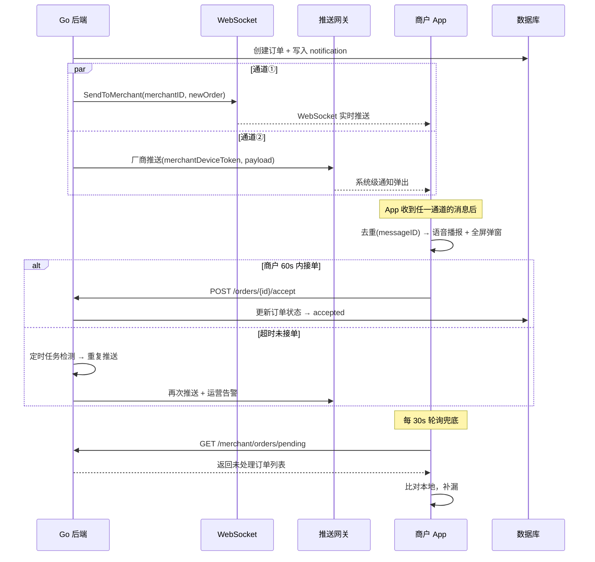
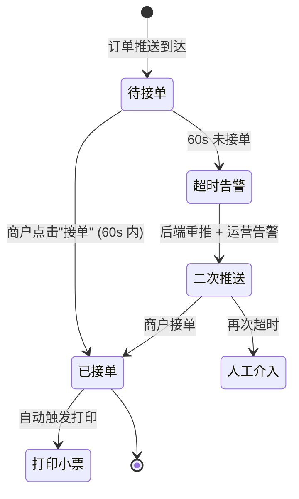
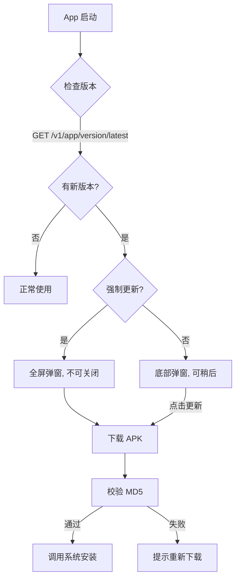

# 乐客来福 Android 商户端 — 完整技术方案

## 一、项目背景与目标

### 问题
当前微信小程序方案在**熄屏/页面失活**状态下无法实时通知商户新订单，导致漏单风险。

### 目标
开发一个 Flutter Android 原生应用，通过**地推直装 APK** 分发给商户，实现：
- 🔔 **不漏单**：订单在任何设备状态下（前台/后台/锁屏/进程被杀）均可达
- 🔊 **语音播报**：大声播报"您有新的乐客来福订单，请及时处理"
- 🖨️ **自动打印**：接单后自动打印小票（飞鹅云打印 + 蓝牙本地打印）
- 📱 **自更新**：通过自有服务器检测版本并下载安装新 APK

---

## 二、系统架构全景

### 核心原则：三重保险，绝不漏单

```
┌──────────────── Go 后端 (已有) ────────────────┐
│                                                 │
│  新订单产生 ──→ order.go / payment_callback.go   │
│       │                                         │
│       ├──① WebSocket Hub (已有，秒级)            │
│       │    websocket/hub.go SendToMerchant()     │
│       │                                         │
│       ├──② 推送网关 (新增)                       │
│       │    push/gateway.go → JPush/厂商 SDK      │
│       │    系统级推送，App 被杀也能收到            │
│       │                                         │
│       └──③ 数据库标记 (已有)                     │
│            notifications 表 is_pushed 字段       │
│            供 App 轮询兜底                       │
│                                                 │
└─────────────────────────────────────────────────┘
        │           │           │
     WebSocket   系统推送    REST API
     (实时)     (必达)      (轮询兜底)
        │           │           │
┌───────┴───────────┴───────────┴─────────┐
│          Flutter 商户端 App              │
│                                         │
│  ┌───────────┐  ┌──────────────────┐    │
│  │前台服务    │  │消息接收与去重     │    │
│  │Foreground  │  │WebSocket + Push  │    │
│  │Service     │  │+ Polling 三合一  │    │
│  └───────────┘  └────────┬─────────┘    │
│                          │              │
│  ┌──────────┐  ┌─────────┴─────────┐   │
│  │语音播报   │  │全屏弹窗+接单确认   │   │
│  │TTS/音频   │  │Full-Screen Intent │   │
│  └──────────┘  └─────────┬─────────┘   │
│                          │              │
│  ┌──────────┐  ┌─────────┴─────────┐   │
│  │小票打印   │  │自动更新 OTA       │   │
│  │云打印+BLE │  │版本检测+APK下载   │   │
│  └──────────┘  └───────────────────┘   │
└─────────────────────────────────────────┘
```

### 消息投递保证流程



---

## 三、Flutter App 详细设计

### 3.1 项目结构

```
merchant_app/
├── android/                      # Android 原生配置
│   └── app/src/main/
│       ├── AndroidManifest.xml   # 权限声明、前台服务
│       └── kotlin/               # 原生 Channel 代码(推送/保活)
├── lib/
│   ├── main.dart                 # 入口
│   ├── app.dart                  # MaterialApp 配置
│   ├── config/
│   │   ├── env.dart              # 环境配置(API地址/推送Key)
│   │   └── theme.dart            # 主题
│   ├── core/
│   │   ├── network/
│   │   │   ├── api_client.dart       # HTTP (dio)
│   │   │   ├── ws_client.dart        # WebSocket 客户端
│   │   │   └── connectivity.dart     # 网络状态监听
│   │   ├── push/
│   │   │   ├── push_manager.dart     # 推送统一管理
│   │   │   └── push_handler.dart     # 推送消息处理
│   │   ├── audio/
│   │   │   ├── tts_service.dart      # TTS 语音合成
│   │   │   └── sound_player.dart     # 预录音频播放
│   │   ├── print/
│   │   │   ├── cloud_printer.dart    # 飞鹅云打印
│   │   │   └── ble_printer.dart      # 蓝牙本地打印
│   │   └── service/
│   │       ├── foreground_service.dart    # 前台服务
│   │       ├── order_poller.dart          # 轮询兜底
│   │       └── message_dedup.dart         # 消息去重
│   ├── features/
│   │   ├── auth/
│   │   │   ├── bind_code_page.dart        # 输入绑定码登录 UI
│   │   │   ├── auth_provider.dart          # 认证状态管理
│   │   │   └── auth_service.dart           # 绑定码验证 + Token 安全存储
│   │   ├── order/
│   │   │   ├── order_list_page.dart       # 订单列表
│   │   │   ├── order_detail_page.dart     # 订单详情
│   │   │   ├── order_alert_page.dart      # 全屏接单弹窗
│   │   │   └── order_provider.dart        # 订单状态管理
│   │   ├── printer/
│   │   │   ├── printer_settings_page.dart
│   │   │   └── printer_provider.dart
│   │   ├── settings/
│   │   │   ├── settings_page.dart
│   │   │   ├── permission_guide_page.dart  # 权限引导
│   │   │   └── about_page.dart
│   │   └── update/
│   │       ├── update_dialog.dart
│   │       └── update_service.dart
│   ├── models/
│   │   ├── order.dart
│   │   ├── merchant.dart
│   │   └── push_message.dart
│   └── widgets/
│       ├── status_bar.dart           # 连接状态指示器
│       └── order_card.dart           # 订单卡片组件
├── assets/
│   └── audio/
│       ├── new_order.mp3             # 预录:"您有新的乐客来福订单"
│       ├── order_timeout.mp3         # 预录:"订单即将超时，请尽快处理"
│       └── network_error.mp3         # 预录:"网络连接异常，请检查"
└── pubspec.yaml
```

### 3.2 核心依赖选型

| 功能 | 推荐插件 | 理由 |
|---|---|---|
| **状态管理** | `flutter_riverpod` | StreamProvider 天然适配 WebSocket 流 |
| **HTTP** | `dio` | 拦截器、重试、Token 刷新 |
| **WebSocket** | `web_socket_channel` | Flutter 官方维护 |
| **厂商推送** | `jpush_flutter` (统一) | 极光封装了华为/小米/OV 厂商通道，一套代码搞定 |
| **前台服务** | `flutter_foreground_task` | 维护活跃，API 简洁 |
| **全屏通知** | `flutter_local_notifications` | 支持 Full-Screen Intent |
| **语音** | `audioplayers` (预录音频) + `flutter_tts` (动态文字) | 预录音频保证音质，TTS 补充动态内容如"订单 1234 号" |
| **蓝牙打印** | `flutter_blue_plus` + ESC/POS 协议自编 | 比封装库更灵活 |
| **网络监听** | `connectivity_plus` | 官方维护 |
| **本地存储** | `shared_preferences` + `sqflite` | 轻量配置 + 离线订单缓存 |
| **Token 安全存储** | `flutter_secure_storage` | Android Keystore 加密存储 JWT tokens |
| **APK 安装** | `install_plugin_2` | 触发系统安装界面 |
| **权限** | `permission_handler` | 统一请求权限 |

> [!WARNING]
> **不推荐** `china_push`（不活跃）、`esc_pos_printer`（更新慢）、`ota_update`（功能单一）、`awesome_notifications`（配置复杂且与 jpush 冲突）。

### 3.3 消息去重机制

App 会同时从 3 个通道收到同一订单消息。使用 **messageID 去重**：

```dart
/// message_dedup.dart
class MessageDeduplicator {
  // 内存 LRU + sqflite 持久化，双层去重
  final _memoryCache = LinkedHashMap<String, DateTime>();
  static const _maxMemorySize = 500;

  /// 返回 true 表示是新消息，false 表示重复
  bool tryAccept(String messageId) {
    if (_memoryCache.containsKey(messageId)) return false;

    _memoryCache[messageId] = DateTime.now();
    if (_memoryCache.length > _maxMemorySize) {
      _memoryCache.remove(_memoryCache.keys.first);
    }
    // 同时写入 sqflite 持久化
    _persistToDb(messageId);
    return true;
  }
}
```

### 3.4 前台服务与保活

```dart
/// foreground_service.dart
/// 启动前台服务，在通知栏显示"乐客来福正在运行"
class MerchantForegroundService {
  static Future<void> start() async {
    FlutterForegroundTask.init(
      androidNotificationOptions: AndroidNotificationOptions(
        channelId: 'merchant_fg_service',
        channelName: '商户在线服务',
        channelDescription: '保持商户端在线接收订单',
        channelImportance: NotificationChannelImportance.LOW,
        priority: NotificationPriority.LOW,
        // 不可划掉
        isSticky: true,
        iconData: NotificationIconData(
          resType: ResourceType.drawable,
          resPrefix: ResourcePrefix.ic,
          name: 'notification_icon',
        ),
      ),
      iosNotificationOptions: const IOSNotificationOptions(),
      foregroundTaskOptions: const ForegroundTaskOptions(
        interval: 15000, // 15秒心跳
        isOnceEvent: false,
        autoRunOnBoot: true,
        allowWakeLock: true,
        allowWifiLock: true,
      ),
    );

    await FlutterForegroundTask.startService(
      notificationTitle: '乐客来福商户端',
      notificationText: '正在运行 · 等待新订单...',
      callback: foregroundTaskCallback,
    );
  }
}

// 前台服务回调：心跳 + 轮询兜底
@pragma('vm:entry-point')
void foregroundTaskCallback() {
  FlutterForegroundTask.setTaskHandler(MerchantTaskHandler());
}

class MerchantTaskHandler extends TaskHandler {
  @override
  Future<void> onRepeatEvent(DateTime timestamp, SendPort? sendPort) async {
    // 每 15 秒执行一次
    // 1. 检查 WebSocket 连接状态，断了就重连
    // 2. 每 2 次(30秒)执行一次轮询兜底
  }
}
```

### 3.5 全屏接单弹窗 (Full-Screen Intent)

当新订单到达时（无论锁屏还是亮屏），弹出全屏接单界面：

```dart
/// 使用 flutter_local_notifications 的 Full-Screen Intent
Future<void> showOrderAlert(OrderMessage order) async {
  // 1. 语音播报
  await SoundPlayer.play('assets/audio/new_order.mp3');
  // 动态补充: "订单 1234 号，金额 58 元"
  await TtsService.speak('订单${order.number}号，金额${order.amount}元');

  // 2. 全屏通知 (锁屏也会亮屏弹出)
  final details = AndroidNotificationDetails(
    'order_alert',
    '新订单提醒',
    importance: Importance.max,
    priority: Priority.high,
    fullScreenIntent: true,          // 关键：全屏 Intent
    sound: RawResourceAndroidNotificationSound('new_order'),
    playSound: true,
    ongoing: true,                   // 不可划掉
    autoCancel: false,
    timeoutAfter: 60000,             // 60 秒后自动消失
    category: AndroidNotificationCategory.alarm,
  );

  await flutterLocalNotificationsPlugin.show(
    order.id.hashCode,
    '🔔 新订单',
    '${order.shopName} · ¥${order.amount}',
    NotificationDetails(android: details),
    payload: jsonEncode(order.toJson()),
  );

  // 3. 如果 App 在前台，直接跳转全屏接单页
  if (AppLifecycleState == resumed) {
    navigatorKey.currentState?.push(
      MaterialPageRoute(builder: (_) => OrderAlertPage(order: order)),
    );
  }
}
```

### 3.6 接单确认闭环



**后端逻辑**（Go 侧，在现有 `scheduler/` 中新增定时任务）：

```go
// scheduler/order_accept_checker.go
// 每 30 秒扫描一次 "待接单" 订单
func (s *Scheduler) CheckUnacceptedOrders(ctx context.Context) {
    // 1. 查询 status = 'paid' AND created_at < now() - 60s 的订单
    // 2. 对每个超时订单:
    //    a. 重新通过推送网关发送
    //    b. 写入 platform_alert_events 表（运营告警）
    //    c. 通过 WebSocket 推送给平台运营（已有 ClientTypePlatform）
}
```

---

## 四、Go 后端改造

### 4.1 新增推送网关模块

> [!IMPORTANT]
> 这是后端唯一需要新增的核心模块。你现有的 WebSocket Hub、通知系统、飞鹅云打印已经非常完善，只需要新增一个"厂商推送通道"。

```
locallife/
├── push/                          # [NEW] 推送网关
│   ├── gateway.go                 # 统一推送入口
│   ├── jpush_provider.go          # 极光推送实现
│   ├── provider.go                # Provider 接口
│   └── gateway_test.go
├── api/
│   ├── app_bind.go                # [NEW] 绑定码认证 (生成码 + 验证码)
│   ├── merchant_device.go         # [NEW] 商户设备注册 API
│   ├── merchant_app_version.go    # [NEW] 版本检测 API
│   └── order.go                   # [MODIFY] 接单 accept 接口
├── db/sqlc/
│   ├── merchant_devices.sql       # [NEW] 设备表 SQL
│   └── app_versions.sql           # [NEW] 版本表 SQL
└── scheduler/
    └── order_accept_checker.go    # [NEW] 超时未接单检测
```

### 4.2 推送网关设计

```go
// push/provider.go
type Provider interface {
    // Send 发送推送消息，返回推送平台的 messageID
    Send(ctx context.Context, req PushRequest) (string, error)
}

type PushRequest struct {
    DeviceTokens []string           // 设备推送 token
    Title        string
    Content      string
    Extra        map[string]string  // 自定义数据 (order_id, message_id 等)
    Priority     Priority           // HIGH / NORMAL
    ChannelID    string             // Android 通知渠道
}

type Priority int
const (
    PriorityNormal Priority = iota
    PriorityHigh
)
```

```go
// push/gateway.go
type Gateway struct {
    provider Provider
    store    db.Store
}

// PushToMerchant 推送消息给商户的所有已注册设备
func (g *Gateway) PushToMerchant(ctx context.Context, merchantID int64, msg PushMessage) error {
    // 1. 从 merchant_devices 表查询该商户的所有 device_token
    devices, err := g.store.ListMerchantDevices(ctx, merchantID)
    if err != nil {
        return err
    }
    if len(devices) == 0 {
        log.Warn().Int64("merchant_id", merchantID).Msg("No registered devices for merchant")
        return nil
    }

    // 2. 构建推送请求
    tokens := make([]string, len(devices))
    for i, d := range devices {
        tokens[i] = d.PushToken
    }

    return g.provider.Send(ctx, PushRequest{
        DeviceTokens: tokens,
        Title:        msg.Title,
        Content:      msg.Content,
        Extra: map[string]string{
            "message_id": msg.MessageID,
            "order_id":   strconv.FormatInt(msg.OrderID, 10),
            "type":       "new_order",
        },
        Priority:  PriorityHigh,
        ChannelID: "order_alert", // 对应 App 的高优先级通知渠道
    })
}
```

### 4.3 新增数据库表

```sql
-- merchant_devices.sql
CREATE TABLE merchant_devices (
    id            BIGSERIAL    PRIMARY KEY,
    merchant_id   BIGINT       NOT NULL REFERENCES merchants(id),
    user_id       BIGINT       NOT NULL REFERENCES users(id),
    device_id     VARCHAR(255) NOT NULL, -- 设备唯一标识
    push_token    VARCHAR(512) NOT NULL, -- 推送 token (JPush Registration ID)
    device_model  VARCHAR(100),          -- 设备型号 "Xiaomi Redmi Note 12"
    os_version    VARCHAR(50),           -- "Android 13"
    app_version   VARCHAR(20),           -- "1.0.0"
    last_active   TIMESTAMPTZ  NOT NULL DEFAULT now(),
    created_at    TIMESTAMPTZ  NOT NULL DEFAULT now(),

    UNIQUE(merchant_id, device_id)
);

CREATE INDEX idx_merchant_devices_merchant ON merchant_devices(merchant_id);
CREATE INDEX idx_merchant_devices_push_token ON merchant_devices(push_token);
```

```sql
-- app_versions.sql
CREATE TABLE app_versions (
    id           BIGSERIAL    PRIMARY KEY,
    version_code INT          NOT NULL,    -- 整数版本号 (1, 2, 3...)
    version_name VARCHAR(20)  NOT NULL,    -- "1.0.0"
    download_url VARCHAR(500) NOT NULL,    -- APK 下载地址
    changelog    TEXT,                      -- 更新日志
    is_force     BOOLEAN      NOT NULL DEFAULT false, -- 是否强制更新
    is_active    BOOLEAN      NOT NULL DEFAULT true,
    file_size    BIGINT,                   -- 文件大小 (bytes)
    md5_hash     VARCHAR(32),              -- APK 文件 MD5
    created_at   TIMESTAMPTZ  NOT NULL DEFAULT now()
);
```

### 4.4 现有代码改造点

#### [MODIFY] 订单创建/支付回调流程

在现有的 `api/payment_callback.go` 中，支付成功后的订单通知逻辑：

```diff
 // 支付成功 → 通知商户
 // 现有：只通过 WebSocket 推送
 server.wsHub.SendToMerchant(merchantID, websocket.Message{
     Type: websocket.MessageTypeNotification,
     Data: orderData,
 })

+// 新增：同时通过厂商推送通道
+go func() {
+    if err := server.pushGateway.PushToMerchant(ctx, merchantID, push.PushMessage{
+        MessageID: messageID,
+        OrderID:   order.ID,
+        Title:     "🔔 新订单",
+        Content:   fmt.Sprintf("订单 %s · ¥%.2f", order.OrderNumber, order.TotalAmount),
+    }); err != nil {
+        log.Error().Err(err).Int64("merchant_id", merchantID).Msg("Push to merchant failed")
+    }
+}()
```

#### [NEW] 商户设备注册 API

```
POST   /v1/merchant/device/register    # 注册/更新设备推送 token
DELETE /v1/merchant/device/{device_id} # 注销设备
GET    /v1/app/version/latest          # 检查最新版本
```

#### [NEW] 商户待处理订单查询 API（轮询兜底用）

```
GET /v1/merchant/orders/pending        # 返回未接单的订单列表
```

> [!NOTE]
> 现有 `api/order.go` 已有商户订单查询能力，可能只需要增加一个 `status=pending` 的筛选条件即可，需要确认现有 API 是否已支持。

---

## 五、推送服务选型：极光 JPush

### 为什么选极光而不是直接对接各厂商？

| 方案 | 优点 | 缺点 |
|---|---|---|
| **直接各厂商 SDK** | 延迟最低、无中间商 | 需要对接 4-5 个 SDK，后端要维护 4 套推送逻辑 |
| **极光 JPush** | 一套 SDK 覆盖全厂商通道，统一 API | 有少量延迟（<1s 可忽略）；收费 |
| **个推/信鸽** | 类似极光 | 极光在餐饮行业使用更广 |

**推荐：首期用 JPush，节省 70% 的推送对接工作量。**

### 极光推送工作流

```
Go 后端 → JPush REST API → 极光服务器
                              │
                    ┌─────────┼─────────┐
                    │         │         │
                 华为 HMS  小米 MiPush  OPPO/vivo
                    │         │         │
                    └─────────┼─────────┘
                              │
                        商户手机系统
                              │
                      弹出系统通知
                     (即使 App 被杀)
```

### 后端集成方式

```go
// push/jpush_provider.go
type JPushProvider struct {
    appKey       string
    masterSecret string
    httpClient   *http.Client
}

func (j *JPushProvider) Send(ctx context.Context, req PushRequest) (string, error) {
    payload := map[string]any{
        "platform": "android",
        "audience": map[string]any{
            "registration_id": req.DeviceTokens,
        },
        "notification": map[string]any{
            "android": map[string]any{
                "alert":      req.Content,
                "title":      req.Title,
                "channel_id": req.ChannelID,
                "priority":   2, // HIGH
                "extras":     req.Extra,
            },
        },
        "options": map[string]any{
            "third_party_channel": map[string]any{
                "huawei":  map[string]any{"importance": "NORMAL", "category": "IM"},
                "xiaomi":  map[string]any{"channel_id": req.ChannelID},
                "oppo":    map[string]any{"channel_id": req.ChannelID},
                "vivo":    map[string]any{"classification": 1}, // 即时消息
            },
        },
    }

    body, _ := json.Marshal(payload)
    httpReq, _ := http.NewRequestWithContext(ctx, "POST",
        "https://api.jpush.cn/v3/push", bytes.NewReader(body))
    httpReq.SetBasicAuth(j.appKey, j.masterSecret)
    httpReq.Header.Set("Content-Type", "application/json")

    resp, err := j.httpClient.Do(httpReq)
    // ... 处理响应
}
```

---

## 六、小票打印方案

### 双轨打印策略

```
商户接单
  ├── 飞鹅云打印 (已有 cloudprint/feieyun.go)
  │   └── 通过你现有的 Go 后端调用飞鹅API
  │       适合: 有网口打印机的店铺
  │
  └── 蓝牙本地打印 (新增 Flutter 端)
      └── App 直连蓝牙打印机 (ESC/POS 协议)
          适合: 小店铺，成本更低
```

> [!TIP]
> 你现有的 `cloudprint/feieyun.go` 已经非常完善。蓝牙本地打印是**可选的增强功能**，MVP 阶段可以先只用飞鹅云打印。

---

## 七、OTA 自更新流程



---

## 八、国产厂商保活适配指南

> [!IMPORTANT]
> 这是**地推人员装机时必须操作的步骤**，建议制作成一张卡片。

### 华为 / 荣耀 (EMUI / HarmonyOS)
1. 设置 → 应用和服务 → 应用启动管理 → 找到"乐客来福" → 关闭"自动管理"
2. 手动开启：自启动 ✅、关联启动 ✅、后台活动 ✅
3. 设置 → 电池 → 更多电池设置 → 休眠时始终保持网络连接 ✅
4. 设置 → 电池 → 乐客来福 → 不允许（忽略电池优化）

### 小米 / Redmi (MIUI / HyperOS)
1. 设置 → 应用设置 → 应用管理 → 乐客来福 → 自启动 ✅
2. 设置 → 省电与电池 → 无限制 ✅
3. 最近任务 → 长按乐客来福卡片 → 锁定 🔒

### OPPO / Realme (ColorOS)
1. 设置 → 应用管理 → 乐客来福 → 耗电保护 → 允许后台运行 ✅
2. 设置 → 电池 → 自启动管理 → 乐客来福 ✅
3. 设置 → 通知与状态栏 → 通知管理 → 乐客来福 → 允许悬浮通知 ✅

### vivo (OriginOS / Funtouch)
1. 设置 → 电池 → 后台耗电管理 → 乐客来福 → 允许后台高耗电 ✅
2. i管家 → 应用管理 → 权限管理 → 自启动 → 乐客来福 ✅

---

## 九、API 接口清单（新增）

| 方法 | 路径 | 说明 | 认证 |
|---|---|---|---|
| `POST` | `/v1/auth/app-bind/code` | 小程序生成 6 位绑定码 | Bearer Token (merchant) |
| `POST` | `/v1/auth/app-bind/verify` | App 验证绑定码换 JWT | 无 (公开端点) |
| `POST` | `/v1/merchant/device/register` | 注册设备推送 Token | Bearer Token |
| `DELETE` | `/v1/merchant/device/:device_id` | 注销设备 | Bearer Token |
| `PUT` | `/v1/merchant/device/heartbeat` | 设备心跳（更新 last_active） | Bearer Token |
| `GET` | `/v1/merchant/orders/pending` | 查询待接单订单（轮询兜底） | Bearer Token |
| `POST` | `/v1/merchant/orders/:id/accept` | 确认接单 | Bearer Token |
| `GET` | `/v1/app/version/latest` | 检查最新版本 | 可选 |
| `GET` | `/v1/app/download/:version_code` | 下载 APK | 无 |

> [!NOTE]
> 现有的 WebSocket 端点 `GET /v1/ws` 已支持商户连接，无需新增。Flutter App 使用同一端点建立 WebSocket 连接。

---

## 十、开发排期建议

### Phase 1：MVP 核心（第 1-3 周）

| 周次 | 任务 | 交付物 |
|---|---|---|
| 第 1 周 | Flutter 项目骨架 + 绑定码登录 + WebSocket 对接 | 能登录、能连上后端收消息 |
| 第 2 周 | 语音播报 + 全屏弹窗 + 前台服务 | 锁屏也能弹窗 |
| 第 3 周 | Go 后端推送网关 + JPush Flutter 端集成 | App 被杀也能收到推送 |

**Phase 1 交付标准：** 新订单来了 → 语音播报 + 全屏弹窗 + 系统推送，三通道均可达。

### Phase 2：完善体验（第 4-5 周）

| 周次 | 任务 | 交付物 |
|---|---|---|
| 第 4 周 | 接单确认 + 超时告警 + 轮询兜底 + 云打印 | 完整接单闭环 |
| 第 5 周 | OTA 自更新 + 权限引导页 + UI 精调 | 可地推的 APK |

### Phase 3：宁晋试点（第 6-7 周）

| 周次 | 任务 |
|---|---|
| 第 6 周 | 集齐华为/小米/OPPO/vivo 四品牌真机测试 |
| 第 7 周 | 选 3-5 家商户实际装机，收集问题 |

---

## 十一、风险与应对

| 风险 | 等级 | 应对措施 |
|---|---|---|
| 鸿蒙 NEXT 不支持 APK | 🟡 中 | Phase 1 先忽略，试点时统计商户手机型号分布 |
| 极光推送延迟 | 🟢 低 | WebSocket 实时通道兜底，正常延迟 < 1s |
| 县城 Wi-Fi 不稳定 | 🟡 中 | 心跳检测 + 断线通知 + 轮询兜底 |
| 商户不会开权限 | 🟡 中 | 地推检查单 + App 内自动检测并引导 |
| 蓝牙打印机兼容性 | 🟢 低 | MVP 优先用飞鹅云打印，蓝牙打印后续迭代 |

---

## User Review Required

> [!IMPORTANT]
> 请确认以下决策点：
> 1. **推送服务**：是否同意用极光 JPush？需要注册极光开发者账号并创建应用。免费版有限额（日推送量 100 万条/应用，商户端够用）。
> 2. **Flutter vs Kotlin 原生**：方案基于 Flutter，如果你团队更熟悉 Kotlin 原生开发，也可以考虑。Flutter 优势是开发速度快，但原生在保活方面控制力更强。
> 3. **接单超时时间**：方案设定 60 秒，是否合适？
> 4. **蓝牙打印**：MVP 阶段是否只做飞鹅云打印，还是也要做蓝牙？
> 5. **是否需要立刻启动开发**？如果确认方案，我可以开始搭建 Flutter 项目骨架和 Go 后端推送网关模块。

## Verification Plan

### 自动化测试
- Go 后端推送网关单元测试 (`push/gateway_test.go`)
- 超时未接单定时任务测试
- 设备注册 API 测试

### 真机测试
- 华为/小米/OPPO/vivo 四品牌覆盖
- 测试场景：前台收消息、后台收消息、锁屏收消息、进程被杀收消息
- 网络切换（Wi-Fi ↔ 4G）不漏单测试
- 72 小时长稳测试（前台服务是否被系统回收）

### 人工验证
- 地推检查单实操验证
- 语音播报音量和清晰度
- 小票打印格式
