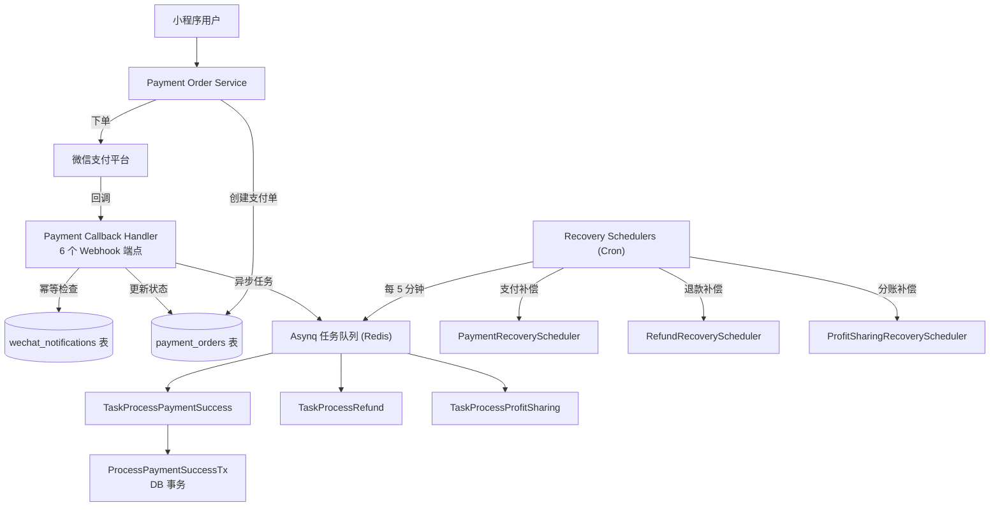

# 支付链路生产级鲁棒性审计报告

**审计范围**: `locallife` 项目支付链路全链路代码  
**审计日期**: 2026-03-22  
**审计深度**: 约 4,300 行核心代码，覆盖 SDK → 回调 → 业务逻辑 → DB 事务 → Worker → Recovery

---

## 总体评估

> [!TIP]
> **整体评价：支付链路架构设计成熟，已具备大部分生产级鲁棒性要求，可以上线。** 以下列出需要注意的风险点和建议优化项。

| 维度 | 评级 | 说明 |
|------|------|------|
| **安全性** | ⭐⭐⭐⭐⭐ | RSA 签名验证 + AES-GCM 解密 + 防重放 + 请求体大小限制 |
| **幂等性** | ⭐⭐⭐⭐⭐ | 通知 ID 去重 + 支付状态双重检查 + DB 事务内 SELECT FOR UPDATE |
| **可靠性** | ⭐⭐⭐⭐☆ | 3 个 Recovery Scheduler 兜底，但有少量边界场景待完善 |
| **可观测性** | ⭐⭐⭐⭐☆ | Prometheus 指标 + 结构化日志 + WebSocket 告警，但缺少链路追踪 |
| **资金安全** | ⭐⭐⭐⭐⭐ | 金额校验 + 超额退款防护 + 分账恒等式验证 + 累计退款检查 |
| **测试覆盖** | ⭐⭐⭐⭐☆ | 15 个测试文件覆盖核心路径，但缺少端到端集成测试 |

---

## 架构概览

---

## 逐模块审计

### 1. WeChat SDK 层 — [payment.go](file:///home/sam/locallife/locallife/wechat/payment.go)

**✅ 做得好的地方：**

- RSA-SHA256 请求签名，严格按照微信 V3 规范
- 平台公钥优先，证书回退的双模式支持，平滑迁移
- AES-256-GCM 解密回调通知数据
- 防重放攻击：回调签名验证含 ±5 分钟时间窗口检查
- HTTP 请求超时可配置（默认 30s）
- 敏感数据 OAEP 加密
- Request-ID 便于排查问题

**⚠️ 需要注意：**

| # | 风险等级 | 问题 | 详情 |
|---|---------|------|------|
| SDK-1 | 🟡 低 | [doRequestWithSerial](file:///home/sam/locallife/locallife/wechat/payment.go#790-863) 缺少响应体大小限制 | 微信响应一般很小（<100KB），但生产建议加 `io.LimitReader` 防止异常大响应耗尽内存 |
| SDK-2 | 🟡 低 | HTTP Client 未配置连接池参数 | 建议配置 `MaxIdleConns`、`IdleConnTimeout` 等，避免高并发下连接泄漏 |
| SDK-3 | 🟢 建议 | [generateNonceStr](file:///home/sam/locallife/locallife/wechat/payment.go#887-893) 未做 `rand.Read` 错误检查 | 虽然在 Linux 上 `crypto/rand.Read` 几乎不会失败，但严谨起见建议检查返回值 |

---

### 2. 支付回调处理 — [payment_callback.go](file:///home/sam/locallife/locallife/api/payment_callback.go)

**✅ 做得好的地方（六个 Webhook 端点全覆盖）：**

- **签名验证**：每个端点都有签名校验
- **幂等保障**：通知 ID + 支付状态双重检查
- **金额校验**：回调金额与预期金额严格匹配（第 225 行）
- **僵尸订单处理**：已关闭订单收到支付回调后自动触发退款（第 177-222 行）- 这非常关键！
- **异步架构**：核心状态同步更新，后续业务放入 Asynq 队列
- **告警机制**：金额异常、任务入队失败等关键场景发送运营告警
- **Prometheus 指标**：按类型统计回调失败次数
- **请求体限制**：1MB 上限（`maxWebhookBodyBytes`）

**⚠️ 需要注意：**

| # | 风险等级 | 问题 | 详情 |
|---|---------|------|------|
| CB-1 | 🟡 中等 | 合单支付回调子单部分失败时返回 FAIL 触发全量重试 | 第 1038-1051 行：如果 5 个子单中 3 个成功 2 个失败，微信重试时已成功的子单会被幂等跳过，**逻辑正确但效率不高**。建议记录已成功的子单 ID，仅重试失败的 |
| CB-2 | 🟡 中等 | [handlePaymentNotify](file:///home/sam/locallife/locallife/api/payment_callback.go#46-353) 中支付成功任务入队失败时只记录日志和告警 | 第 320-342 行：依赖 [PaymentRecoveryScheduler](file:///home/sam/locallife/locallife/worker/payment_recovery_scheduler.go#22-31) 兜底（5 分钟扫描），**在极端情况下可能延迟 5 分钟处理**。生产可接受，但建议降低 recovery 间隔到 2 分钟 |
| CB-3 | 🟢 建议 | 分账回调 [handleProfitSharingNotify](file:///home/sam/locallife/locallife/api/payment_callback.go#638-888) 中 `DistributeTaskProcessProfitSharingResult` 入队失败被静默忽略 | 第 868 行 `_ = server.taskDistributor.Distribute...`，建议增加日志和告警 |
| CB-4 | 🟡 中等 | 进件回调 [handleApplymentStateNotify](file:///home/sam/locallife/locallife/api/payment_callback.go#1102-1359) 中多次 DB 更新无事务包裹 | 第 1253-1321 行：更新进件状态、商户配置、商户状态三步操作非原子执行。失败中断时可能导致不一致状态。**建议使用 DB 事务**，或确保 recovery 能修复不一致 |
| CB-5 | 🟢 建议 | 结算回调 [handleOrderSettlementNotify](file:///home/sam/locallife/locallife/api/payment_callback.go#1384-1576) 中先记录通知 ID 再派发分账任务 | 第 1530-1554 行：如果通知 ID 记录成功但任务派发失败，本次不会重试。依赖 [ProfitSharingRecoveryScheduler](file:///home/sam/locallife/locallife/worker/profit_sharing_recovery_scheduler.go#23-32) 兜底，**逻辑正确** |

---

### 3. 支付订单服务 — [payment_order_service.go](file:///home/sam/locallife/locallife/logic/payment_order_service.go)

**✅ 做得好的地方：**

- 校验订单归属 + 状态 + 金额非零
- OutTradeNo 冲突自动重试（最多 3 次，指数退避）
- 已有 pending 支付单复用 + prepay_id 重新签名
- [ClosePaymentOrder](file:///home/sam/locallife/locallife/logic/payment_order_service.go#320-348) 同时关闭微信侧订单

**⚠️ 需要注意：**

| # | 风险等级 | 问题 | 详情 |
|---|---------|------|------|
| POS-1 | 🟡 中等 | [generateOutTradeNo](file:///home/sam/locallife/locallife/logic/payment_order_service.go#349-352) 随机性不足 | 第 349-366 行：4 字节随机数只有 `256^4 = 4.29 亿` 种可能，有冲突风险。虽然有重试机制保护，但建议增加到 8 字节或使用 UUID |
| POS-2 | 🟡 中等 | [CreatePaymentOrder](file:///home/sam/locallife/locallife/logic/payment_order_service.go#92-263) 中微信下单失败后关闭本地支付单，但未关闭微信侧 | 第 244-246 行：如果微信 API 超时（请求实际已到达微信），本地标记 closed 但微信侧订单可能已创建。微信订单会在 30 分钟后自动关闭，**风险可控** |
| POS-3 | 🟢 建议 | [ClosePaymentOrder](file:///home/sam/locallife/locallife/logic/payment_order_service.go#320-348) 微信关单 API 错误被忽略（`_ =`） | 第 343 行：建议至少记录日志。微信侧关单失败不影响业务（订单会自动过期），但日志有利于排查 |

---

### 4. 合单支付服务 — [combined_payment_service.go](file:///home/sam/locallife/locallife/logic/combined_payment_service.go) + [tx_create_combined_payment.go](file:///home/sam/locallife/locallife/db/sqlc/tx_create_combined_payment.go)

**✅ 做得好的地方：**

- DB 事务保证跨子单原子性
- 订单去重 + 上限 10 单
- 锁定订单防并发（`GetOrderForUpdate`）
- 已有 pending 支付单自动关闭再创建新的
- PrepayID 为空时防御性检查

**⚠️ 需要注意：**

| # | 风险等级 | 问题 | 详情 |
|---|---------|------|------|
| CP-1 | 🟡 中等 | 合单子单 OutTradeNo 生成方式有碰撞风险 | 第 136 行：`CP` + OrderID + `UnixNano()%1000000`，如果同一订单快速重试，纳秒截断可能重复。建议改用 [generateOutTradeNoWithPrefix](file:///home/sam/locallife/locallife/logic/payment_order_service.go#353-367) |
| CP-2 | 🟡 中等 | 事务中未对 OrderIDs 排序加锁 | 第 54-56 行代码注释自己提到了：**应排序** `OrderIDs` 后再 `GetOrderForUpdate` 以防死锁。高并发相同订单组合时可能触发。建议加上 `sort.Slice` |
| CP-3 | 🟢 建议 | 微信下单失败后未回滚 DB 事务中创建的支付单 | 第 168-170 行：DB 事务已提交，但微信下单失败，会残留 pending 状态的支付单。依赖超时机制清理，**可接受** |

---

### 5. 退款链路 — [refund_service.go](file:///home/sam/locallife/locallife/logic/refund_service.go)

**✅ 做得好的地方：**

- 累计退款金额校验，防超额退款（第 88-97 行）
- 分账退款：先回退分账再申请退款，顺序正确
- 分账回退支持平台 + 运营商 + 骑手三方
- 每一步失败都将退款单标记为 failed
- 分账回退结果轮询（PROCESSING 状态）通过任务队列异步跟踪

**⚠️ 需要注意：**

| # | 风险等级 | 问题 | 详情 |
|---|---------|------|------|
| RF-1 | 🟡 中等 | 分账退款中多方回退不在 DB 事务中 | 第 457-483 行：平台/运营商/骑手回退是三次独立的微信 API 调用 + DB 操作。如果运营商回退成功但骑手回退失败，退款单标记为 failed，但平台和运营商的钱已经退了。**建议**：记录每方回退状态，失败时只标记整体为 `partial_failed`，后续 recovery 可以只重试失败的部分 |
| RF-2 | 🟢 建议 | [processProfitSharingRefund](file:///home/sam/locallife/locallife/logic/refund_service.go#269-527) 函数过长（260 行） | 建议拆分为 `returnPlatformShare`、`returnOperatorShare`、`returnRiderShare` 等子函数 |

---

### 6. DB 事务层 — [tx_payment_success.go](file:///home/sam/locallife/locallife/db/sqlc/tx_payment_success.go)

**✅ 做得好的地方：**

- 单一事务处理支付成功后续逻辑，保证原子性
- `GetPaymentOrderForUpdate` 行级锁防并发
- `processedAt` 标记防重复处理（幂等守卫）
- 5 种 business_type 全覆盖（rider_deposit, reservation, reservation_addon, membership_recharge, order）
- 每种类型都有独立的幂等检查（如检查 rider_deposit 是否已存在）

**⚠️ 需要注意：**

| # | 风险等级 | 问题 | 详情 |
|---|---------|------|------|
| TX-1 | 🟢 建议 | `membership_recharge` 的 `attach` JSON 解析内容来自用户可控字段 | 第 140-151 行：虽然 attach 是在服务端生成的（[membership_payment.go](file:///home/sam/locallife/locallife/logic/membership_payment.go)），不是直接用户输入，但建议增加 `membership_id` 归属校验 |
| TX-2 | 🟢 建议 | `order` case 中 `order_id` 缺失时静默跳过 | 第 203-206 行：注释说为了避免无限重试，这是正确的。但建议增加告警日志，以便人工排查 |

---

### 7. Recovery 机制 — 三个调度器

| 调度器 | 间隔 | 扫描范围 | 评估 |
|--------|------|----------|------|
| [PaymentRecoveryScheduler](file:///home/sam/locallife/locallife/worker/payment_recovery_scheduler.go) | 每 5 分钟 | 已 paid 但未 processed 的支付单 | ✅ 生产级：批量 200，2 分钟超时，互斥锁 |
| [RefundRecoveryScheduler](file:///home/sam/locallife/locallife/worker/refund_recovery_scheduler.go) | 每 5 分钟 | 订单已取消但支付单仍 paid 的 | ✅ 生产级：二次确认订单状态 |
| [ProfitSharingRecoveryScheduler](file:///home/sam/locallife/locallife/worker/profit_sharing_recovery_scheduler.go) | 每 10 分钟 | 失败/卡死的分账单 + 缺失分账单的已完成订单 + 卡死的分账回退单 | ✅ 生产级：三重扫描兜底 |

**✅ 所有调度器都有：**
- `TryLock` 防并发执行
- 上下文超时控制
- `SkipIfStillRunning` + [Recover](file:///home/sam/locallife/locallife/worker/refund_recovery_scheduler.go#19-28) 中间件

---

### 8. 分账计算 — [profit_sharing_calculator.go](file:///home/sam/locallife/locallife/algorithm/profit_sharing_calculator.go)

**✅ 做得好的地方：**

- 分账金额恒等式验证（所有分账之和 == 支付总额）
- 按订单来源区分分账规则（外卖/堂食/自提/预约）
- 向下取整保护商户利益
- 所有金额非负校验

**⚠️ 需要注意：**

| # | 风险等级 | 问题 | 详情 |
|---|---------|------|------|
| PS-1 | 🟡 中等 | 使用 `math.Floor(float64())` 做分账计算 | 第 159 行：浮点数精度问题。建议改用 `amount * rate / 100` 纯整数运算（Go 整数除法自然向下取整） |

---

### 9. 超时处理 — Worker Tasks

| 任务 | 评估 |
|------|------|
| [task_payment_timeout.go](file:///home/sam/locallife/locallife/worker/task_payment_timeout.go) | ✅ 检查状态 + 到期时间，关闭支付单后同步取消业务订单 |
| [task_combined_payment_timeout.go](file:///home/sam/locallife/locallife/worker/task_combined_payment_timeout.go) | ✅ 调用微信关单 API + 关闭所有子支付单 |
| [task_claim_refund.go](file:///home/sam/locallife/locallife/worker/task_claim_refund.go) | ✅ 通过 DB 事务处理索赔退款 |

---

## 🏁 生产上线清单

### ✅ 已满足的要求

1. **签名验证** — 所有 webhook 端点均验证微信签名
2. **防重放** — 时间戳 ±5 分钟窗口
3. **幂等处理** — 通知 ID + 支付状态双重去重
4. **金额校验** — 回调金额与预期严格匹配
5. **异常订单处理** — 已关闭订单收到支付自动退款
6. **异步架构** — 快速响应微信，耗时操作入队
7. **Recovery 兜底** — 3 个调度器覆盖支付/退款/分账
8. **资金安全** — 累计退款校验 + 分账恒等式
9. **可观测性** — Prometheus + 结构化日志 + 告警
10. **超时管理** — 支付单 30 分钟到期 + 超时自动关闭

### ⚠️ 建议上线前修复（非阻塞）

| 优先级 | 编号 | 建议 | 预估工作量 |
|--------|------|------|------------|
| P1 | CP-2 | 合单事务中对 OrderIDs 排序防死锁 | 5 分钟 |
| P1 | PS-1 | 分账计算改用纯整数运算避免浮点精度问题 | 10 分钟 |
| P2 | CB-4 | 进件回调多步 DB 操作加事务 | 30 分钟 |
| P2 | CP-1 | 合单子单 OutTradeNo 使用更安全的生成方式 | 10 分钟 |
| P3 | CB-3 | 分账结果异步任务入队失败增加日志/告警 | 5 分钟 |
| P3 | POS-3 | 微信关单 API 失败增加日志 | 2 分钟 |
| P3 | SDK-1 | HTTP 响应体增加大小限制 | 5 分钟 |

### 🔮 长期优化建议

1. **分布式追踪（OpenTelemetry）**：加入 trace_id 贯穿 API → Worker → DB，便于跨服务排查
2. **金额对账**：增加每日对账任务，比对微信交易流水与本地记录
3. **熔断降级**：微信 API 调用增加熔断器（如 `sony/gobreaker`），防止微信服务异常时雪崩
4. **端到端集成测试**：当前 15 个测试文件覆盖单元测试，建议增加模拟微信回调的集成测试
5. **多实例部署**：Recovery Scheduler 目前依赖进程内 `TryLock`，多实例部署时需要分布式锁（Redis 或 DB advisory lock）

---

## 结论

> [!IMPORTANT]
> **可以上线。** 支付链路的核心安全性（签名、幂等、金额校验）和可靠性（Recovery 兜底）已经达到生产级标准。上述建议项均为增强性优化，不会导致资金安全问题。建议优先修复 P1 级别的两项（排序防死锁 + 整数分账计算），其余可在上线后逐步完善。
