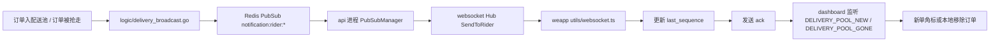
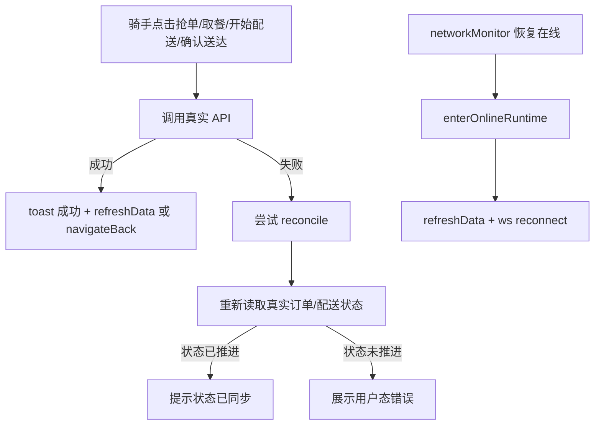
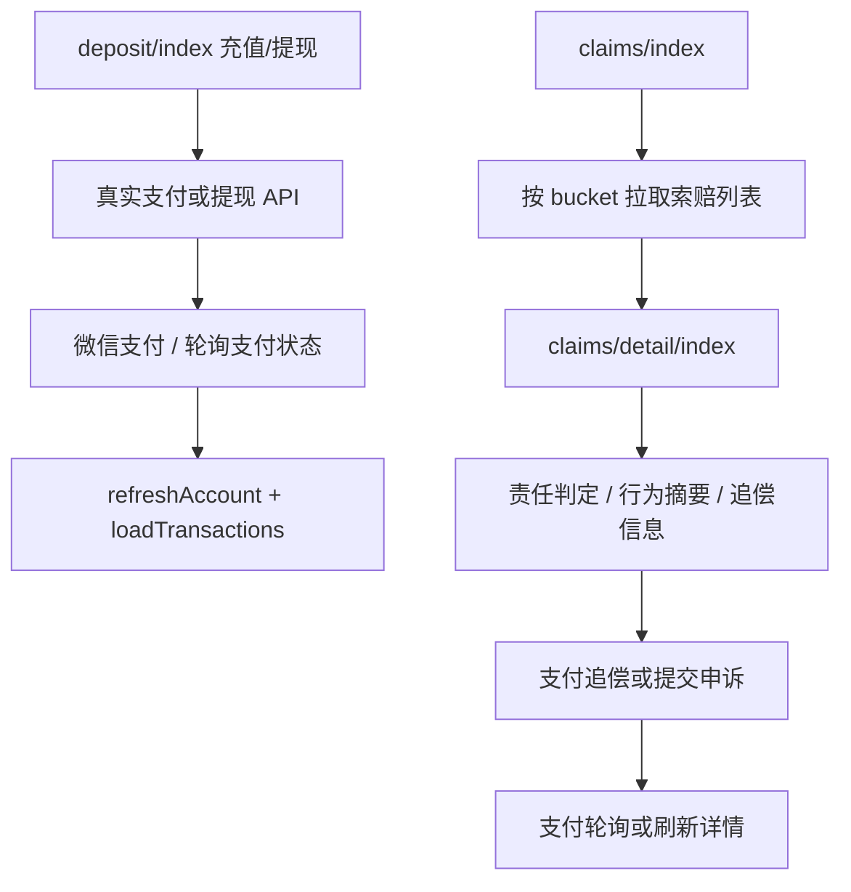

# Rider 运行时与实时链路流程图

本文是 rider 子包当前真值文档，用于描述运行时、弱网恢复和后端实时支撑的真实链路。

涉及实现时，请优先以以下代码为准：

- weapp/miniprogram/pages/rider/dashboard/index.ts
- weapp/miniprogram/pages/rider/task-detail/index.ts
- weapp/miniprogram/pages/rider/claims/index.ts
- weapp/miniprogram/pages/rider/claims/detail/index.ts
- weapp/miniprogram/pages/rider/deposit/index.ts
- weapp/miniprogram/utils/request.ts
- weapp/miniprogram/utils/network-monitor.ts
- weapp/miniprogram/utils/websocket.ts
- locallife/api/notification.go
- locallife/logic/delivery_broadcast.go
- locallife/worker/task_send_notification.go
- locallife/websocket/hub.go

## 1. 冷启动与在线态进入

```mermaid
flowchart TD
    A[App onLaunch] --> B[silentLogin + getLocationCoordinates]
    B --> C[dashboard onLoad]
    C --> D[bindNetworkMonitor]
    C --> E[initData]
    E --> F[refreshRiderOverview]
    F -->|离线/未上线| G[仅渲染工作台静态状态]
    F -->|已上线| H[enterOnlineRuntime]
    H --> I[refreshData]
    I --> J[initWebSocket]
    J --> K[wsManager.connect]
    K --> L[/v1/ws 升级]
    L --> M[后端校验 rider 角色与 is_online]
    M --> N[注册 Hub 客户端]
    N --> O[last_sequence 回放可选触发]
```

结论：

- rider 端当前只在“已上线”状态进入实时链路，和后端 `/v1/ws` 的上线门槛一致。
- 冷启动时不会只依赖 `onShow` 被动建立实时连接；`initData -> enterOnlineRuntime` 已覆盖在线骑手首进场景。

## 2. 配送池实时消息链



结论：

- 后端已有完整的跨进程实时广播链：逻辑层广播 -> Redis Pub/Sub -> Hub -> 小程序。
- Hub 支持 ACK、回放、队列和重试；当前 rider 客户端已补发 ACK，和服务端可靠投递模型对齐。
- 骑手回放时带 `last_sequence`，且服务端会过滤已不在配送池的 `delivery_pool_new` 消息，避免把已被他人接走的单重新回放出来。

## 3. 主链动作与弱网恢复



结论：

- rider 主链不再只依赖本地乐观更新；关键动作失败后会做一次真实状态回读，减少“后端已成功但前端报失败”的假失败。
- 网络恢复时，dashboard 会重新拉工作台数据并保持 websocket 重连，弱网恢复路径已具备代码级闭环。

## 4. 资金与索赔链路



结论：

- rider 域当前已没有异常报备和延时报备页面；弱网验证目标应聚焦充值、提现、申诉、追偿支付四条真实链路。
- 充值与追偿支付都已接入支付后轮询或刷新，避免只依赖微信成功回调。

## 5. 后端实时支撑核对结果

已确认存在：

- `/v1/ws` 会校验角色，并对 rider 强制要求 `is_online=true`。
- `worker/task_send_notification.go` 会先落库通知，再通过 Redis Pub/Sub 尝试 websocket 实时推送。
- `websocket/hub.go` 具备 ACK 去重、消息回放、背压入队、超时重试和 replay filter。
- `logic/delivery_broadcast.go` 负责骑手抢单大厅的差量实时广播，且有定向测试覆盖附近骑手筛选与新单广播。

未闭合为当前 rider UI 能力的点：

- rider 工作台当前只消费 `delivery_pool_new` 和 `delivery_pool_gone` 两类消息，没有直接消费通知中心类 websocket 消息。
- 定位类实时能力仍未在 rider 页面形成展示闭环，现阶段只是后端有能力、前端未承接。

## 6. 本轮验证记录

已执行：

- `cd weapp && npm run quality:check`
- `cd locallife && go test ./websocket`
- `cd locallife && go test ./logic -run 'TestListNearbyBroadcastRiders|TestBroadcastNewOrderNotification'`

结果：

- 小程序静态检查通过。
- websocket 包测试通过。
- 与配送广播直接相关的 logic 定向测试通过。

补充说明：

- `go test ./logic` 全量运行在当前仓库里仍有与本任务无关的既有失败，因此本轮只采信实时广播相关定向用例。

## 7. 结论与建议

结论：

- rider 端当前的实时主链已经形成“冷启动在线接入、弱网恢复重刷、配送池差量消息、动作失败回读”的代码级闭环。
- 后端实时基础设施完整度高于当前 rider UI 消费面，特别是 ACK、回放、队列和重试能力已经具备。
- 当前剩余风险主要集中在“真机/开发者工具弱网回归尚未执行”和“通知类 websocket 消息尚未在 rider 工作台直接消费”。

建议：

- 真机或开发者工具下一轮重点只测 4 条：抢单后假失败回读、配送状态推进回读、充值支付回查、追偿支付回查。
- 如果 rider 后续需要把通知中心做成实时红点或弹层，优先复用当前 websocket `notification` 消息，不要另起一套轮询。
- 在定位链路未真正承接前，不要把 rider 侧宣传为“实时轨迹可见”；当前只能认为后端具备能力储备。