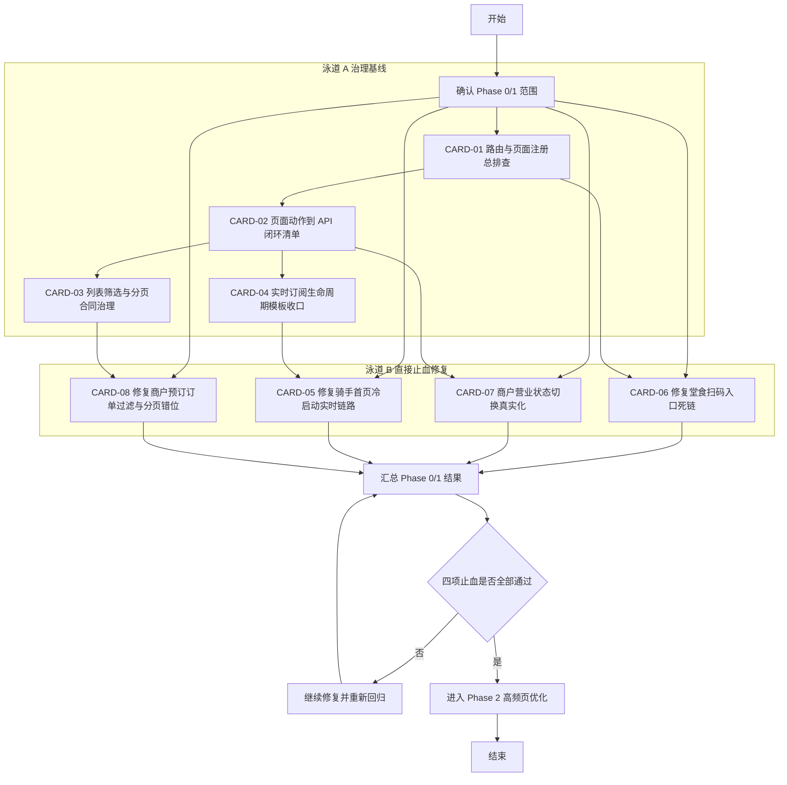

# Phase 0/1 开发顺序图与并行依赖图

日期：2026-03-27

> 历史快照说明
>
> 本文是 2026-03-27 阶段对 Phase 0 和 Phase 1 任务卡的开发顺序图快照，保留的是当时的并行关系和交付批次建议，不代表当前阶段依赖关系仍完全一致。
>
> 涉及当前执行顺序时，请优先以最新任务卡状态、当前代码真值和后续收口文档为准。

本文将 weapp 95 分提升计划中的 Phase 0 和 Phase 1 继续拆成可执行的开发泳道、依赖顺序和批次建议，方便直接分配给前端、接口协作方、测试与评审。

## 适用范围

本图只覆盖以下 8 张任务卡：

1. [CARD-01 路由与页面注册总排查](weapp/docs/historical/pre-2026-04-05/weapp_95_task_cards_20260327/card-01-route-and-page-registry-audit.md)
2. [CARD-02 页面动作到 API 闭环清单](weapp/docs/historical/pre-2026-04-05/weapp_95_task_cards_20260327/card-02-button-api-closure-matrix.md)
3. [CARD-03 列表筛选与分页合同治理](weapp/docs/historical/pre-2026-04-05/weapp_95_task_cards_20260327/card-03-pagination-and-filter-contract.md)
4. [CARD-04 实时订阅生命周期模板收口](weapp/docs/historical/pre-2026-04-05/weapp_95_task_cards_20260327/card-04-realtime-lifecycle-template.md)
5. [CARD-05 修复骑手首页冷启动实时链路](weapp/docs/historical/pre-2026-04-05/weapp_95_task_cards_20260327/card-05-rider-dashboard-cold-start-realtime.md)
6. [CARD-06 修复堂食扫码入口死链](weapp/docs/historical/pre-2026-04-05/weapp_95_task_cards_20260327/card-06-dinein-scan-route-repair.md)
7. [CARD-07 商户营业状态切换真实化](weapp/docs/historical/pre-2026-04-05/weapp_95_task_cards_20260327/card-07-merchant-business-status-contract.md)
8. [CARD-08 修复商户预订订单过滤与分页错位](weapp/docs/historical/pre-2026-04-05/weapp_95_task_cards_20260327/card-08-merchant-reservation-order-contract.md)

## 总图

## 推荐并行方式

### 方案 A：3 人并行

- 开发 1：CARD-01 + CARD-06
- 开发 2：CARD-02 + CARD-07
- 开发 3：CARD-03 + CARD-04 + CARD-05 + CARD-08
- 测试或评审支持：统一做 Phase 1 回归和弱网检查

适用场景：

- 当前有 2 到 3 名前端可并行推进
- 可以穿插 1 名接口协作或评审同学

### 方案 B：2 人并行

- 开发 1：CARD-01 + CARD-02 + CARD-06 + CARD-07
- 开发 2：CARD-03 + CARD-04 + CARD-05 + CARD-08

适用场景：

- 希望把“治理基线”和“运行时止血”分成两条线推进

### 方案 C：单线程推进

1. CARD-01
2. CARD-06
3. CARD-02
4. CARD-07
5. CARD-03
6. CARD-08
7. CARD-04
8. CARD-05

适用场景：

- 只有 1 名主力前端在处理 weapp
- 希望先清掉最直观的死链和伪操作，再处理合同和实时机制

## 泳道 A：治理基线

### A1 CARD-01 子任务包

- [ ] A1-1 导出 app.json 与分包页面清单
- [ ] A1-2 全量扫描五端跳转 API 使用点
- [ ] A1-3 标记死链、路径拼写错误、未注册页面
- [ ] A1-4 输出路由检查清单

建议改动点：

- [weapp/miniprogram/app.json](weapp/miniprogram/app.json)
- `weapp/miniprogram/pages/**`

交付判断：

- [ ] 所有高频页面可达
- [ ] 死链问题有明确修复清单

### A2 CARD-02 子任务包

- [ ] A2-1 建立页面动作到 API 的映射表
- [ ] A2-2 标记伪操作与只改本地状态动作
- [ ] A2-3 标记成功 toast 与真实状态不一致动作
- [ ] A2-4 输出可复用的动作闭环检查模板

建议改动点：

- `weapp/miniprogram/pages/**`
- `weapp/miniprogram/api/**`

交付判断：

- [ ] 五端关键业务按钮都能追到真实服务
- [ ] 伪操作清单明确

### A3 CARD-03 子任务包

- [ ] A3-1 识别分页后再过滤的页面
- [ ] A3-2 分类标注为 status、order_type、角色、区域等类型
- [ ] A3-3 明确哪些筛选必须下推到服务端
- [ ] A3-4 输出统一的 hasMore 与空态合同

建议改动点：

- `weapp/miniprogram/pages/**/list/**/*.ts`
- `weapp/miniprogram/api/**`

交付判断：

- [ ] 重点页面的分页合同清晰
- [ ] 至少一个样例页面可按新合同落地

### A4 CARD-04 子任务包

- [ ] A4-1 梳理 websocket 页面接入模式
- [ ] A4-2 收口 onLoad、onShow、onHide、onUnload 的接入与解绑策略
- [ ] A4-3 明确异步身份加载后的补订阅规则
- [ ] A4-4 输出实时页面模板

建议改动点：

- [weapp/miniprogram/utils/websocket.ts](weapp/miniprogram/utils/websocket.ts)
- `weapp/miniprogram/pages/**/dashboard/**/*.ts`

交付判断：

- [ ] 实时页面模板可复用
- [ ] 冷启动场景可被模板覆盖

## 泳道 B：P0 直接止血修复

### B1 CARD-06 子任务包

- [ ] B1-1 确认扫码页当前详情入口真实意图
- [ ] B1-2 修复错误路由或替换为现有公共详情页
- [ ] B1-3 回归扫码页所有用户可见跳转点

建议改动点：

- [weapp/miniprogram/pages/dine-in/scan-entry/scan-entry.ts](weapp/miniprogram/pages/dine-in/scan-entry/scan-entry.ts)

交付判断：

- [ ] 堂食扫码页无 Page Not Found

### B2 CARD-07 子任务包

- [ ] B2-1 找到商户营业状态真实读取与更新接口
- [ ] B2-2 接通首页开关动作
- [ ] B2-3 失败时回滚 UI 并提示
- [ ] B2-4 成功后刷新状态和相关卡片展示

建议改动点：

- [weapp/miniprogram/pages/merchant/dashboard/index.ts](weapp/miniprogram/pages/merchant/dashboard/index.ts)
- 商户设置相关 API 文件

交付判断：

- [ ] 业务状态切换真实可用
- [ ] 不再出现本地成功、刷新后还原

### B3 CARD-05 子任务包

- [ ] B3-1 修复冷启动在线场景的订阅时机
- [ ] B3-2 避免重复注册与重复回调
- [ ] B3-3 回归 onShow 与上下线逻辑

建议改动点：

- [weapp/miniprogram/pages/rider/dashboard/index.ts](weapp/miniprogram/pages/rider/dashboard/index.ts)
- [weapp/miniprogram/utils/websocket.ts](weapp/miniprogram/utils/websocket.ts)

交付判断：

- [ ] 冷启动在线骑手可直接收新单

### B4 CARD-08 子任务包

- [ ] B4-1 把 reservation 类型筛选下推到请求层
- [ ] B4-2 修复 hasMore 计算与空态
- [ ] B4-3 清理客户端分页后二次过滤路径
- [ ] B4-4 回归第一页、翻页、空态和详情进入

建议改动点：

- [weapp/miniprogram/pages/merchant/reservations/index.ts](weapp/miniprogram/pages/merchant/reservations/index.ts)
- [weapp/miniprogram/pages/merchant/orders/list/index.ts](weapp/miniprogram/pages/merchant/orders/list/index.ts)

交付判断：

- [ ] 预订单列表可信
- [ ] 分页不再漂移

## 里程碑建议

### M1 第一轮止血

- [ ] CARD-01 完成
- [ ] CARD-06 完成
- [ ] CARD-02 完成
- [ ] CARD-07 完成

目标：

- 先关掉最明显的死链和伪操作，避免用户继续踩坑。

### M2 合同与实时收口

- [ ] CARD-03 完成
- [ ] CARD-04 完成
- [ ] CARD-05 完成
- [ ] CARD-08 完成

目标：

- 让分页合同、实时模板和商户预订单链路进入可复用的稳态。

### M3 Phase 0/1 评审

- [ ] 8 张卡回归完成
- [ ] 输出 Phase 0/1 评审结论
- [ ] 决定是否进入 Phase 2 高频页优化

## 最小验证建议

- [ ] 运行 `cd weapp && npm run lint`
- [ ] 运行 `cd weapp && npm run compile`
- [ ] 若改动多个角色页面，运行 `cd weapp && npm run quality:check`
- [ ] 人工验证消费侧堂食扫码
- [ ] 人工验证骑手侧冷启动在线抢单大厅
- [ ] 人工验证商户侧营业状态切换和预订单列表

## 风险备注

- 若 CARD-02 盘点出伪操作较多，CARD-07 之外可能会新增一批同类修复卡。
- 若 CARD-03 下推筛选需要补后端合同，需尽早确认接口配合方式。
- 若 CARD-04 的模板抽象过早，容易反向限制页面特性；应先以骑手页和商户页的最小共性为主。