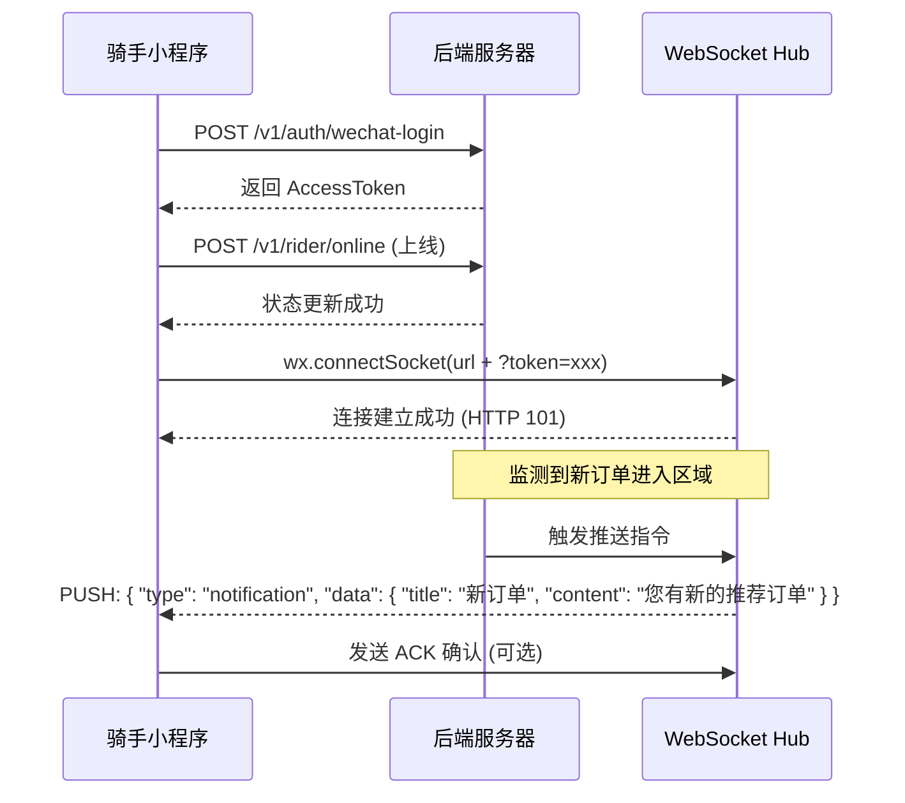
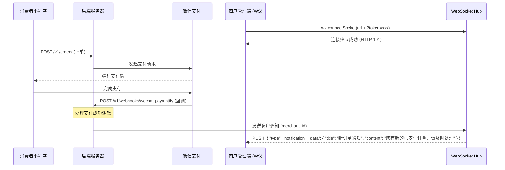

# WebSocket 接入与业务流文档

本文档旨在指导前端开发人员如何正确连接到 LocalLife 项目的 WebSocket 服务，并理解相关的业务流程。

## 1. 连接方式

由于微信小程序 `wx.connectSocket` 对自定义 Header (如 `Authorization`) 的支持存在限制，后端已适配支持通过 **Query Parameter** 传递 Token。

### **连接 URL**
```
ws://<your-domain>/v1/ws?token=<ACCESS_TOKEN>
```

-   **验证方式**：在 URL 后添加 `token` 参数。
-   **协议升级**：后端会识别 `Upgrade: websocket` 自动进行身份验证。

---

## 2. 角色与准入条件

WebSocket 主要用于接收实时通知。目前仅开放给以下角色：

| 角色 | 准入条件 | 用途 |
| :--- | :--- | :--- |
| **骑手 (Rider)** | 必须是已审核通过的骑手，且状态必须为 **在线 (Online)** | 接收新订单推荐、派单通知、调度指令 |
| **商户 (Merchant)** | 必须是已入驻的商户管理员 | 接收新订单提醒、催单通知、库存预警 |
| **平台运营 (Platform)** | 拥有管理员或运营权限的人员 | 接收系统告警（如支付超时、系统错误） |

> [!IMPORTANT]
> **骑手注意**：如果骑手未在 API 调用 `POST /v1/rider/online` 上线，WebSocket 连接将被拒绝。

---

## 3. 消息协议 (JSON)

所有交互均采用 JSON 格式。

### **3.1 基础消息结构**
```json
{
  "type": "notification",
  "data": { ... },
  "timestamp": "2023-10-27T10:00:00Z"
}
```

### **3.2 心跳机制 (Keep-alive)**
-   **Ping (服务端 -> 客户端)**: 服务端会每隔 54 秒发送一个标准的 WebSocket Ping 帧。
-   **Pong (客户端 -> 服务端)**: 客户端应自动响应 Pong（微信小程序底层通常会自动处理），或在应用层收到 `type: "ping"` 时回复 `type: "pong"` 以保持连接活跃。
-   **超时限制**: 60 秒内无任何数据交互，连接将被服务端断开。

### **3.3 消息确认 (ACK)**
为了确保重要通知（如新订单）送达，建议客户端在收到消息后发送确认：
```json
{
  "type": "ack",
  "data": {
    "message_id": "unique-id"
  }
}
```

---

## 4. 业务流示例

### 4.1 骑手订单推送


### 4.2 商户订单提醒


---

## 5. 微信小程序参考实现

```javascript
// WebSocket 链接管理
let socketTask = null;

function connectWebSocket(token) {
  socketTask = wx.connectSocket({
    url: `ws://api.example.com/v1/ws?token=${token}`,
    success: () => {
      console.log('WebSocket 连接发起成功');
    }
  });

  socketTask.onOpen(() => {
    console.log('WebSocket 已连接');
  });

  socketTask.onMessage((res) => {
    const msg = JSON.parse(res.data);
    console.log('收到服务器消息:', msg);
    
    // 处理不同类型的消息
    if (msg.type === 'notification') {
      wx.showToast({ title: msg.data.title, icon: 'none' });
      // 可以在此处播放提示音
    }
  });

  socketTask.onClose((res) => {
    console.log('WebSocket 已断开', res);
    // 实施重连机制
    setTimeout(() => connectWebSocket(token), 3000);
  });

  socketTask.onError((err) => {
    console.error('WebSocket 错误', err);
  });
}
```

---

## 6. 常见错误处理

-   **401 Unauthorized**: Token 无效或已过期。由于 WebSocket 握手只有一次，Token 过期后需重新发起连接。
-   **403 Forbidden**: 权限不足。通常是普通用户尝试连接（目前仅限商户/骑手）。
-   **1006 Abnormal Closure**: 通常是网络波动或心跳丢失，请检查小程序端的重连逻辑。
